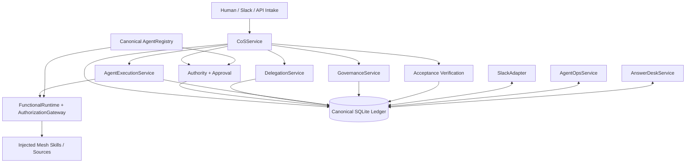
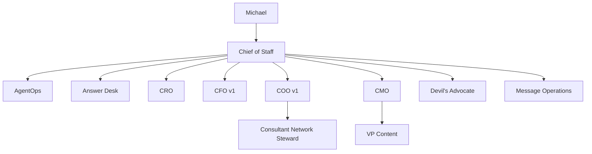
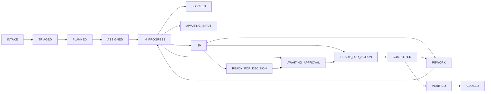
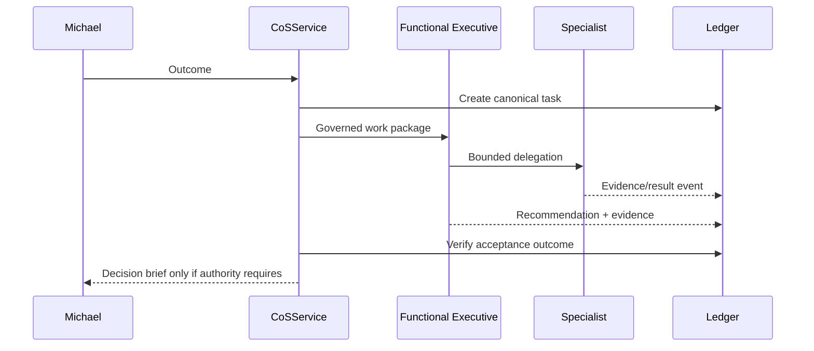
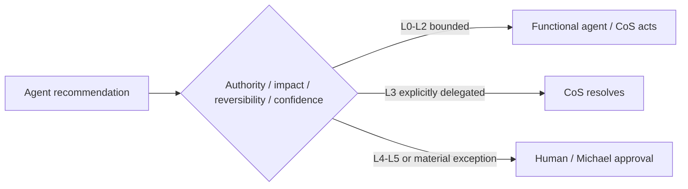
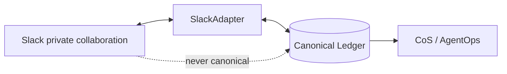
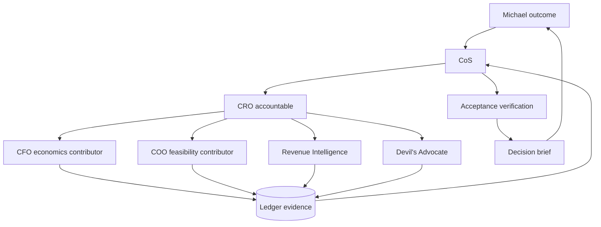

# Architecture

Phase 1 is a typed Python modular monolith with a SQLite canonical operating ledger. The architecture intentionally keeps the runtime surface small while preserving strong contracts, durable state, explicit authority, auditability, idempotency, and a clean path to managed persistence later.

## Runtime layers

The ledger persists tasks, events, delegations, approvals, decisions, conflicts, performance events, scorecards, registry changes, verification results, Slack mappings, metrics, idempotency state, and work leases.

## Agent hierarchy

## Canonical contracts

Nine versioned contracts define the consequential operating objects: AgentRecord, TaskRecord, Delegation, AgentEvent, Decision, Conflict, Approval, PerformanceEvent, and PerformanceScorecard. Runtime persistence validates versioned objects against these schemas.

`agents/registry.json` is the canonical agent-definition source. Runtime health changes are overlays persisted in the ledger and audited rather than silently rewriting the source file.

## Task lifecycle

`COMPLETED` is an execution assertion. `VERIFIED` requires an acceptance evaluator to execute and persist a pass/fail record with evidence. Failed verification routes back to remediation.

## Agent interaction

## Human escalation

L4 and L5 approval records remain canonical outside Slack. Message Operations cannot execute consequential external sends without a recorded approval reference.

## Functional execution

`FunctionalRuntime` composes injected real Mesh capabilities rather than duplicating them. `AuthorizationGateway` checks the canonical registry before each invocation for agent health, allowed tool/skill, and source authorization. Missing production invokers fail as unavailable rather than being represented as connected.

## Slack relationship

The adapter implements Slack Web API posting, v0 signature verification, durable duplicate-event suppression, and one-task/one-thread mapping. The current agent-operations channel is `#mesh-agent-ops` / `C0BRL4GCL3A`.

## AgentOps and observability

AgentOps consumes durable tasks, performance events, metrics, and health history. Versioned scoring policy lives in `config/performance-policy.v1.json`. AgentOps recommendations can change workload/routing within bounded authority; material authority expansion remains Michael-exclusive.

## Pursuit example

## Persistence boundary

SQLite is appropriate for Phase 1/local or single-instance operation. Multi-instance or horizontally scaled deployment should migrate behind the existing persistence boundary rather than changing the operating contracts or authority model.
