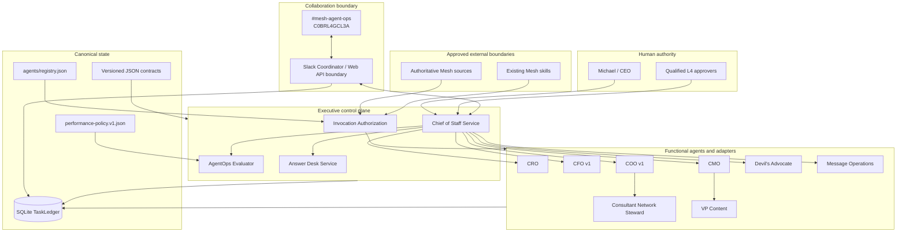
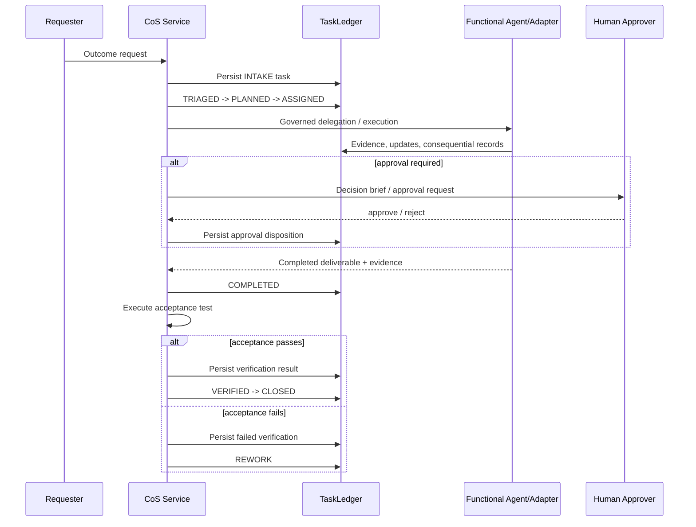

# Architecture

## Purpose

Phase 1 is a governed executive control plane for a bounded hybrid organization of agents, reusable Mesh capabilities, authoritative data sources, and human decision owners. The architecture is intentionally a Python modular monolith with a narrow persistence boundary rather than a distributed agent swarm.

## Runtime topology

## Canonical state

`TaskLedger` is the authoritative runtime persistence boundary. It stores tasks plus durable consequential records through typed record categories, audit events, idempotency claims, and Slack task/thread mappings. Slack messages and agent conversations are views of state, not state itself.

Canonical sources of operating truth:

1. `agents/registry.json` for agent identity, hierarchy, authority, source/tool policy, delegation permissions, prohibited actions, confidentiality, and runtime health.
2. `contracts/*.schema.json` for versioned data contracts.
3. `TaskLedger` for task lifecycle and consequential records.
4. `config/performance-policy.v1.json` for versioned AgentOps weighting and thresholds.

## Chief of Staff execution loop

## Delegation architecture

Delegation is contractual and bounded. A delegated work package cannot widen authority, drop parent approval obligations, create circular ownership, exceed the normal two-level depth below CoS, or define overlapping permitted and prohibited actions. Delegation records are durable.

## Slack architecture

`#mesh-agent-ops` is the private agent-operations coordination channel. The Slack boundary implements request-signature verification, durable event idempotency, task/thread mapping, structured message rendering, and a Web API client boundary. Live Slack calls remain configuration-dependent on the bot token and signing secret.

The separate Answer Desk channel is intentionally not inferred. Its channel ID must be supplied before team-facing Slack operation is activated.

## Security architecture

All source, tool, and action calls must pass runtime authorization from registry policy. Retrieved content is treated as untrusted data. L4 actions fail closed pending qualified human approval, and L5 authority remains Michael-exclusive. The kill switch and quarantine controls remain part of the Phase 1 safety model.

## Deployment boundary

The repository is implementation-ready for Phase 1 control-plane behavior, but production operation depends on credentials, source permissions, approval-owner mapping, and runtime infrastructure. SQLite is appropriate for Phase 1/local operation and should be revisited before multi-instance deployment.
