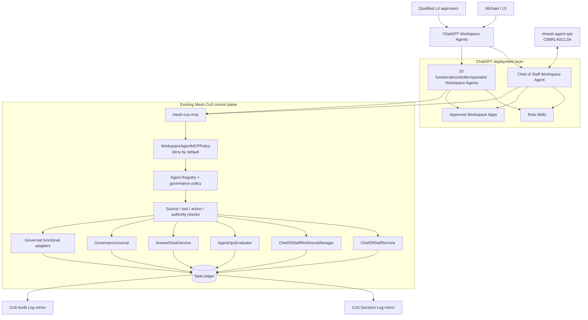
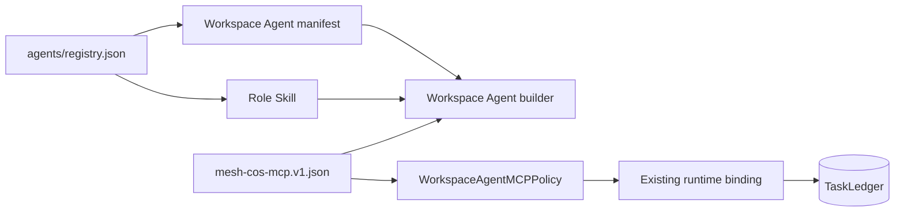
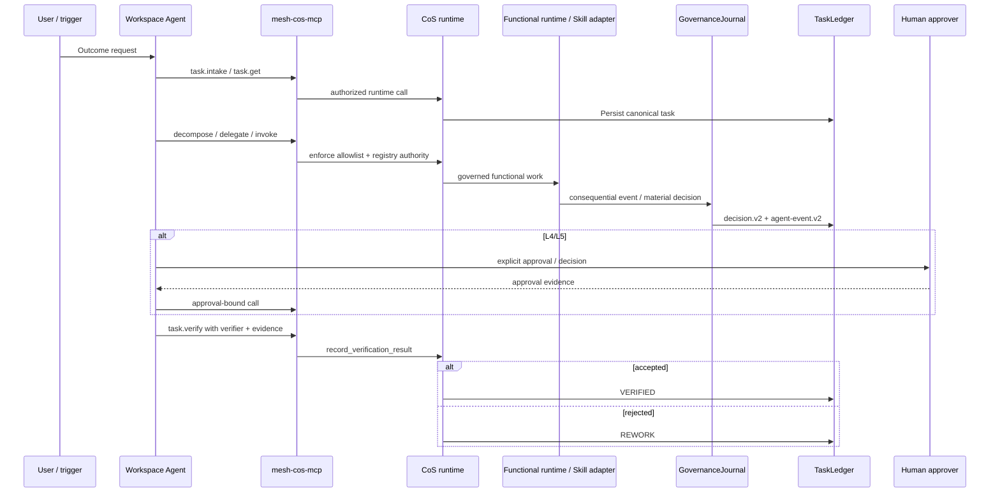

# Architecture

## Purpose

Phase 1 is a governed executive control plane for a bounded hybrid organization of agents, reusable Mesh skills, authoritative data sources, and explicit human decision owners. The core runtime remains a Python modular monolith with SQLite behind the `TaskLedger` persistence boundary. ChatGPT Workspace Agents are a deployment and interaction layer on top of that control plane, not a replacement for it.

## End-to-end topology

The trust direction is deliberate. Workspace Agent instructions and app configuration can narrow behavior but cannot expand the canonical registry. `mesh-cos-mcp` applies per-agent allowlists before invoking existing runtime services, then the runtime applies registry authority, approval, source, tool, and action controls.

## Stable role identity model

Organizational role identity and software version are separate concerns. `display_name` is a stable organizational identity. The registry `version` field carries the agent implementation version using `MAJOR.MINOR.PATCH`; repository releases carry the control-plane release version. Accountable domain, source authority, permitted/prohibited actions, approval rules, and delegation rules express scope. Runtime registry validation rejects display names that embed a version token.

Canonical Phase 1 organizational names are `Chief of Staff`, `AgentOps Controller`, `Answer & Decision Desk`, `CRO`, `CFO`, `COO`, `Consultant Network Steward`, `CMO`, `VP Content`, `Devil's Advocate`, and `Message Operations`.

## ChatGPT Workspace Agent packaging model

Release `0.2.0` maps every canonical agent into three coordinated artifacts:

1. `chatgpt/skills/<skill>/SKILL.md` contains the reusable role workflow and non-obvious operating rules.
2. `chatgpt/workspace-agents/<agent_id>.json` contains exact Workspace Agent builder configuration, model preference/fallback, knowledge files, apps, channels, write approvals, connector constraints, starter prompts, and MCP allowlist.
3. `chatgpt/mcp/mesh-cos-mcp.v1.json` maps approved Workspace Agent tool calls onto existing Python runtime bindings.

The Skill is not the system of record and the Workspace Agent is not a prompt-only persona. The Skill drives repeatable role behavior, the manifest configures the product surface, and the MCP boundary supplies controlled canonical execution.

## Functional accountability boundaries

- **CRO:** commercial strategy, opportunity qualification, pipeline health, pursuit prioritization, buyer dynamics, proposal commercial architecture, next-best action, expansion, and commercial-risk framing. Revenue Intelligence remains authoritative where designated.
- **CFO:** Engagement Finance / FP&A only, including engagement economics, pricing scenarios, cost-to-serve, contribution economics, margins, supported working-capital implications, forecast-versus-actual, margin leakage, assumption management, scenario comparison, and financial-risk recommendations. No enterprise-accounting, treasury, tax, audit, or unrestricted finance authority is implied.
- **COO:** delivery feasibility, delivery configuration, capacity, POD/resource composition, dependency readiness, partner capacity, delivery-risk sensing, operational constraints, and staffing recommendations. The CoS retains enterprise work-graph orchestration.
- **Consultant Network Steward:** consultant identification/matching, fit, freshness, validation timestamp, rate, availability, readiness gaps, refresh, and contracting-readiness evidence under COO authority.
- **CMO:** marketing strategy, audience/ICP, category positioning, campaign/demand architecture, distribution, brand governance, campaign optimization, editorial priorities, and marketing-commercial feedback.
- **VP Content:** editorial planning/calendar, evidence assembly, drafting, channel adaptation, derivatives, repurposing, Mesh IP reuse, inventory, editorial QA, and performance feedback under CMO authority.
- **Devil's Advocate:** independent challenge only, never final decision ownership.
- **Message Operations:** controlled execution of approved communications only.

## Work-management loop

Remote Workspace Agents cannot pass Python callbacks. `ChiefOfStaffService.record_verification_result()` is the MCP-safe verification path. A passing result requires a named verifier and explicit evidence references; otherwise verification fails closed without mutating the task to `VERIFIED`.

## MCP security and authorization

`mesh_cos.mcp_policy.WorkspaceAgentMCPPolicy` validates the checked-in MCP contract and enforces per-agent allowlists server-side. Unknown agents, unknown tools, and tools absent from an agent allowlist are denied. Every declared runtime binding is checked for resolvability. Consequential tools must be auditable.

MCP authorization is layered:

1. authenticate the Workspace Agent or approved service identity,
2. resolve canonical `agent_id`,
3. enforce the checked-in MCP tool allowlist,
4. enforce registry source/tool/action permissions and L0-L5 authority,
5. fail closed on required human approval,
6. invoke the existing runtime service,
7. persist canonical state first,
8. emit explainable decision/audit records as required.

Builder allowlists and Connector Action Constraints are defense in depth. They are not the sole security boundary.

## Workspace apps and channel boundaries

Apps are least-privilege and role-specific. Read access does not create functional authority. Key Phase 1 constraints include:

- CoS and AgentOps Slack writes are limited to internal `#mesh-agent-ops` coordination.
- Answer Desk Slack remains disabled until a dedicated channel ID is configured.
- CRO Apollo access is research/enrichment only; Gmail and LinkedIn are non-outbound.
- CMO and VP Content LinkedIn access is non-publishing; AuthoredUp is analytics/draft preparation only.
- CFO, COO, and Consultant Network Steward use approved evidence sources read-only.
- Message Operations is the only outbound execution role and requires a matching recorded approval plus Workspace **Always ask** before consequential sends.

## Canonical source-of-truth map

| Subject | Canonical authority |
|---|---|
| Agent identity, domain and authority | `agents/registry.json` plus shared governance policy |
| Workspace Agent deployment settings | `chatgpt/workspace-agents/*.json`, subordinate to the registry |
| Workspace Agent role workflow | `chatgpt/skills/*/SKILL.md`, subordinate to the registry |
| Workspace MCP permissions | `chatgpt/mcp/mesh-cos-mcp.v1.json` + `WorkspaceAgentMCPPolicy` |
| Task/work graph and outcomes | `TaskLedger` |
| Explainable decisions | `TaskLedger` `decision_v2`; CoS Decision Log is a mirror |
| Auditable consequential events | `TaskLedger` `audit_event_v2`; CoS Audit Log is a mirror |
| Conflicts and approvals | `TaskLedger` typed records linked to decision/audit records |
| Performance | performance events/scorecards plus versioned performance policy |
| Slack state | TaskLedger mappings and idempotency records, not Slack history |

## Governance and reliability

`GovernanceJournal` persists `decision.v2` and `agent-event.v2`. The audit stream is tamper-evident through its SHA-256 hash chain. Private chain-of-thought, hidden reasoning traces, credentials, tokens, and unnecessary personal data are prohibited from governance records.

Runtime reliability includes idempotent intake, bounded retries, timeouts, execution leases, failure records, explicit replay, human override, supersession, stalled-work remediation, the emergency kill switch, and acceptance verification. Workspace Agent deployment does not bypass any of these controls.

## Deployment boundary

The repository contains Workspace Agent-ready Skills, exact manifests, MCP contract, tests, and builder handoff instructions. It does not fabricate a live MCP endpoint or workspace credentials. Production still requires an approved HTTPS MCP deployment, `MESH_COS_MCP_SERVER_URL`, workspace app authentication, a dedicated Answer Desk Slack channel ID, production approval-owner mapping, and preview testing in the target ChatGPT workspace. SQLite should be revisited before multi-instance or high-availability runtime deployment.
