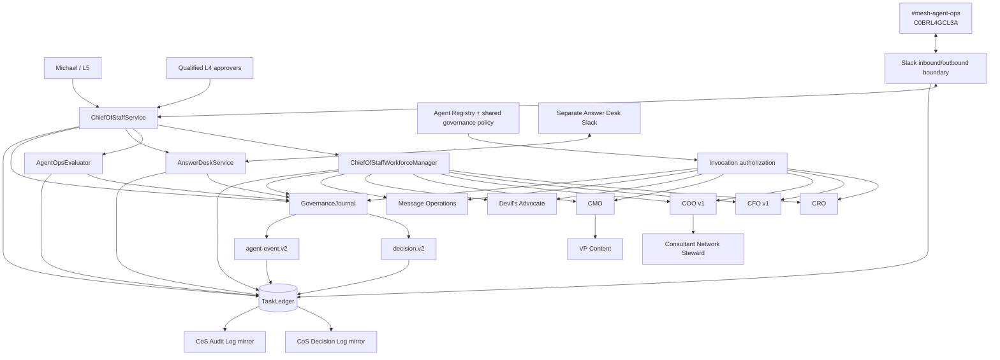
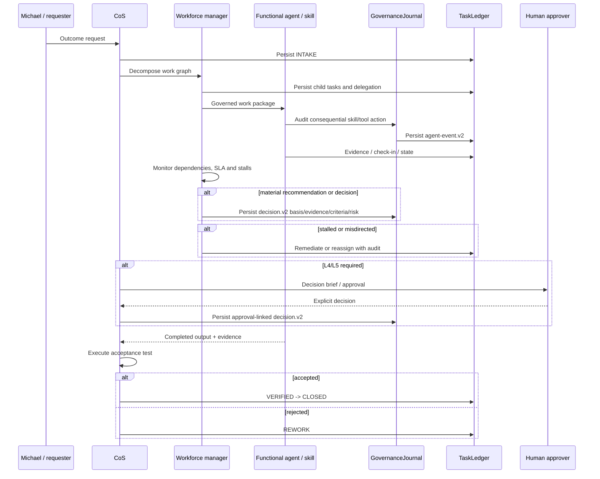

# Architecture

## Purpose

Phase 1 is a governed executive control plane for a bounded hybrid organization of agents, reusable Mesh skills, authoritative data sources, and explicit human decision owners. It is a Python modular monolith with SQLite behind a narrow persistence boundary. It deliberately avoids swarms, brokers, and unnecessary microservices.

## Runtime topology

## Work-management loop

## Canonical source-of-truth map

| Subject | Canonical authority |
|---|---|
| Agent definition and authority | `agents/registry.json`, normalized by `mesh_cos.registry` plus `config/governance-policy.v1.json` |
| Task/work graph and outcomes | `TaskLedger` |
| Explainable decisions | `TaskLedger` `decision_v2` records; CoS Decision Log is a mirror |
| Auditable consequential events | `TaskLedger` `audit_event_v2` records; CoS Audit Log is a mirror |
| Conflicts and approvals | `TaskLedger` typed records linked to decision/audit records |
| Performance | performance-event/scorecard records plus versioned performance policy |
| Slack state | TaskLedger task/thread and event-idempotency records, not Slack history |
| Financial calculations | CFO v1 within supported engagement-finance sources |
| Commercial/account evidence | Revenue Intelligence where available |
| Delivery/resource feasibility | COO v1 and approved resource sources |

## Structured contracts

The repository retains the original v1 contract set for compatibility and adds richer `mesh.cos.decision.v2` and `mesh.cos.agent-event.v2` governance contracts. Contracts reject undeclared fields. Runtime records are validated through `mesh_cos.contracts`, and CI runs a runtime/documentation drift check.

`decision.v2` captures explainable basis, evidence, alternatives, criteria, confidence, risk, authority, approval, reversibility, provenance, lineage, and outcome validation. `agent-event.v2` captures fully auditable actor/action/result/provenance metadata plus a tamper-evident SHA-256 hash chain.

## Cross-agent governance policy

`config/governance-policy.v1.json` applies at registry load to every registered agent. It adds the shared `governance-journal` tool and v2 governance output contracts without changing functional authority. Audit logging is required for consequential actions. Decision logging is required when an agent decides or recommends.

`TaskLedger.record_event()` bridges existing v1 `AuditEvent` producers into the v2 governance stream during migration. `GovernedAdapterRegistry` can emit v2 events directly for skill/tool invocations.

## Google Sheets mirror boundary

`config/governance-logs.v1.json` identifies the two non-secret human-readable operational mirrors:

- CoS Decision Log: `1IJcwPuulqsNAa1lCW2MsmNgH6Vm5INPqTlcH4NR0xpw`
- CoS Audit Log: `1T8vKx4gaUJdeG8kSc18MsBbXpY4EbDF3exZ0RGpvND0`

Writes are canonical-first. Mirror failures are persisted, not silently ignored. Sheets do not become decision authority or system of record.

## Functional execution boundary

`GovernedAdapterRegistry` maps only registered skills/tools to the agent allowed to invoke them. It composes existing Mesh capabilities instead of reimplementing them. External executors remain configuration-dependent until credentials and connectivity are supplied.

## Slack boundary

The Slack layer verifies request signatures and timestamps, rejects stale replayed requests, deduplicates event IDs durably, parses structured messages, persists one-task/one-thread mappings, and posts approval notifications. `#mesh-agent-ops` remains an observable collaboration surface, never canonical state. The Answer Desk uses a separate configurable Slack boundary.

## Reliability and governance

The runtime includes idempotent intake, bounded retries, timeouts, execution leases, failure records, explicit replay, human override, task supersession, stalled-work remediation, invocation allowlists, prompt-injection boundaries, L4/L5 fail-closed approval, explainable decisions, tamper-evident audit events, health restrictions, and the emergency kill switch.

Private chain-of-thought, hidden reasoning traces, credentials, tokens, and unnecessary personal data are prohibited from governance records. Evidence should be referenced rather than copied when a protected pointer is sufficient.

## Deployment boundary

Phase 1 operating logic is complete at the repository boundary. Production use still requires Slack credentials, the Answer Desk channel ID, approved source/skill credentials, approval-owner configuration, deployment infrastructure, and a runtime adapter with authenticated Google Sheets write capability if automatic mirroring is enabled. SQLite should be revisited before multi-instance or high-availability deployment.
