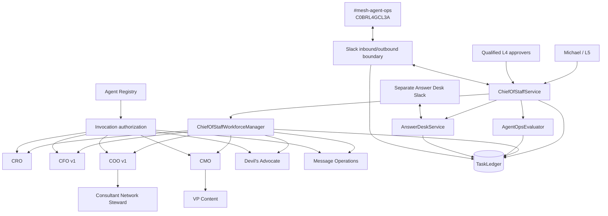
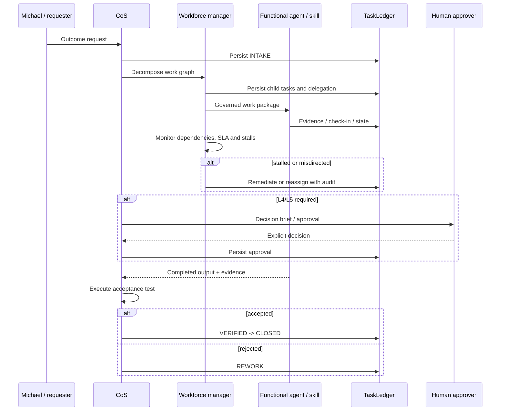

# Architecture

## Purpose

Phase 1 is a governed executive control plane for a bounded hybrid organization of agents, reusable Mesh skills, authoritative data sources, and explicit human decision owners. It is a Python modular monolith with SQLite behind a narrow persistence boundary. It deliberately avoids swarms, brokers, and unnecessary microservices.

## Runtime topology

## Work-management loop

## Canonical source-of-truth map

| Subject | Canonical authority |
|---|---|
| Agent definition and authority | `agents/registry.json`, normalized by `mesh_cos.registry` |
| Task/work graph and outcomes | `TaskLedger` |
| Decisions, conflicts, approvals | `TaskLedger` typed records and audit events |
| Performance | performance-event/scorecard records plus versioned performance policy |
| Slack state | TaskLedger task/thread and event-idempotency records, not Slack history |
| Financial calculations | CFO v1 within supported engagement-finance sources |
| Commercial/account evidence | Revenue Intelligence where available |
| Delivery/resource feasibility | COO v1 and approved resource sources |

## Structured contracts

Nine versioned JSON schemas define AgentRecord, TaskRecord, Delegation, AgentEvent, Decision, Conflict, Approval, PerformanceEvent, and PerformanceScorecard. Contracts reject undeclared fields. Runtime records are validated through `mesh_cos.contracts`, and CI runs a runtime/documentation drift check.

## Functional execution boundary

`GovernedAdapterRegistry` maps only registered skills/tools to the agent allowed to invoke them. It composes existing Mesh capabilities instead of reimplementing them. External executors remain configuration-dependent until credentials and connectivity are supplied.

## Slack boundary

The Slack layer verifies request signatures and timestamps, rejects stale replayed requests, deduplicates event IDs durably, parses structured messages, persists one-task/one-thread mappings, and posts approval notifications. `#mesh-agent-ops` remains an observable collaboration surface, never canonical state. The Answer Desk uses a separate configurable Slack boundary.

## Reliability and governance

The runtime includes idempotent intake, bounded retries, timeouts, execution leases, failure records, explicit replay, human override, task supersession, stalled-work remediation, invocation allowlists, prompt-injection boundaries, L4/L5 fail-closed approval, audit events, health restrictions, and the emergency kill switch.

## Deployment boundary

Phase 1 operating logic is complete at the repository boundary. Production use still requires Slack credentials, the Answer Desk channel ID, approved source/skill credentials, approval-owner configuration, and deployment infrastructure. SQLite should be revisited before multi-instance or high-availability deployment.
