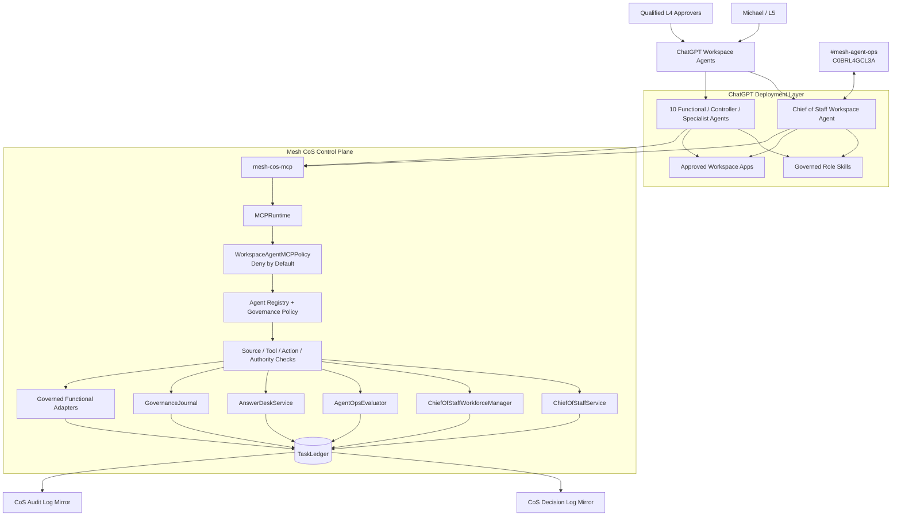
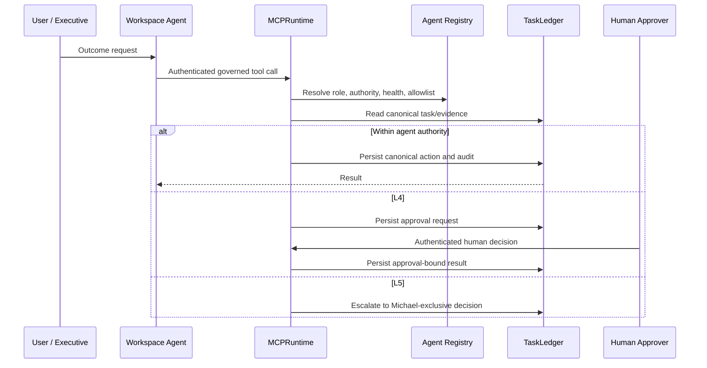
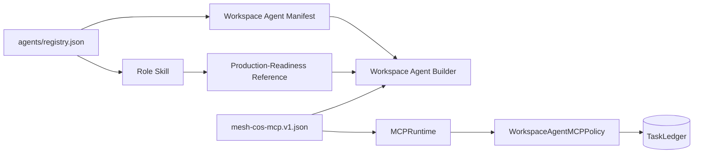
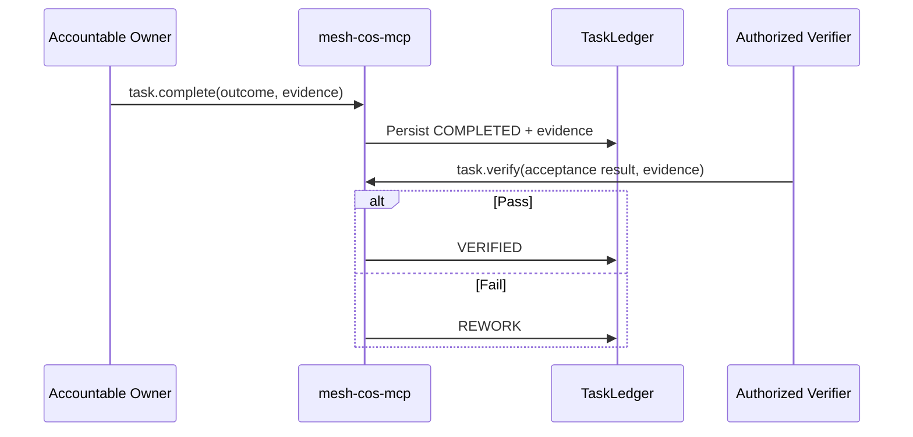
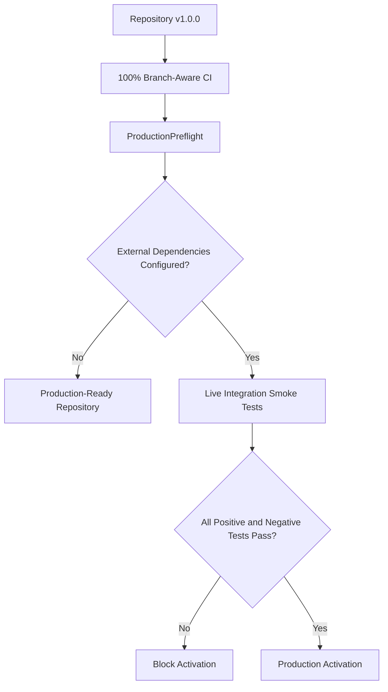

# Architecture

## Purpose

Release `v1.0.0` is the production-ready repository architecture for the Mesh AI Chief of Staff. It is a governed executive control plane for a bounded hybrid organization of agents, reusable Mesh Skills, authoritative sources, and explicit human decision owners. The runtime remains a Python modular monolith with SQLite behind the `TaskLedger` persistence boundary. ChatGPT Workspace Agents are a governed deployment and interaction layer, not a replacement for the control plane.

## End-to-end topology

The trust direction is deliberate. Workspace Agent instructions and app configuration can narrow behavior but cannot expand the canonical registry. `MCPRuntime` dispatches only the fixed contract surface, `WorkspaceAgentMCPPolicy` applies per-agent allowlists, and the runtime then applies source, tool, action, authority, approval, idempotency, audit, and reliability controls.

## Serialized MCP boundary

`mesh_cos.mcp_runtime.MCPRuntime` is the production composition root behind the remote `mesh-cos-mcp` transport. The transport supplies an authenticated principal, tool name, and JSON arguments. The runtime does not execute client-supplied Python, import paths, callable names, shell commands, or source-text instructions.

Human-only tools are separated from agent tools. `approval.record_decision` and `reliability.human_override` require an authenticated human principal. L4 actions fail closed without qualified human approval evidence. L5 remains Michael-exclusive.

## Stable role identity model

Organizational role identity and software version are separate. `display_name` is stable. The registry `version` field carries role implementation version using `MAJOR.MINOR.PATCH`. Repository release `1.0.0` identifies the production-readiness release of the control plane and deployment contract. Accountable domain, source authority, permitted/prohibited actions, approvals, and delegation rules express scope.

Canonical Phase 1 roles remain `Chief of Staff`, `AgentOps Controller`, `Answer & Decision Desk`, `CRO`, `CFO`, `COO`, `Consultant Network Steward`, `CMO`, `VP Content`, `Devil's Advocate`, and `Message Operations`.

## Workspace Agent packaging model

Release `1.0.0` maps every canonical role into coordinated artifacts:

1. `chatgpt/skills/<skill>/SKILL.md` contains reusable role workflow and non-obvious operating rules.
2. `chatgpt/skills/<skill>/references/production-readiness.md` adds the shared production-readiness contract.
3. `chatgpt/workspace-agents/<agent_id>.json` contains exact Builder configuration, model preference/fallback, knowledge files, apps, channels, write approval, connector constraints, starter prompts, and MCP allowlist.
4. `chatgpt/mcp/mesh-cos-mcp.v1.json` defines the serialized tool contract and human-only operations.

The Skill is not the system of record and the Workspace Agent is not a prompt-only persona. The Skill drives repeatable behavior, the manifest configures the product surface, and the MCP boundary supplies controlled canonical execution.

## Functional accountability boundaries

- **CRO:** commercial strategy, opportunity qualification, pipeline health, pursuit prioritization, buyer dynamics, proposal commercial architecture, next-best action, expansion, and commercial-risk framing. Revenue Intelligence remains authoritative where designated.
- **CFO:** Engagement Finance / FP&A only. No enterprise-accounting, treasury, tax, audit, or unrestricted finance authority is implied.
- **COO:** delivery feasibility, configuration, capacity, POD/resource composition, dependency readiness, partner capacity, delivery-risk sensing, operational constraints, and staffing recommendations. The CoS retains enterprise work-graph orchestration.
- **Consultant Network Steward:** consultant identification/matching, fit, freshness, validation timestamp, rate, availability, readiness gaps, refresh, and contracting-readiness evidence under COO authority.
- **CMO:** marketing strategy, audience/ICP, category positioning, demand architecture, distribution, brand governance, campaign optimization, editorial priorities, and marketing-commercial feedback.
- **VP Content:** editorial planning/calendar, evidence assembly, drafting, adaptation, derivatives, repurposing, Mesh IP reuse, inventory, editorial QA, and performance feedback under CMO authority.
- **Devil's Advocate:** independent challenge only, never final decision ownership.
- **Message Operations:** controlled execution of approved communications only.

## Completion and verification separation

Remote accountable owners use `task.complete` to persist finished outcome evidence. Verification is separate.

`COMPLETED` never implies `VERIFIED`. Verification requires explicit verifier identity and acceptance evidence.

## Reliability architecture

Runtime reliability includes idempotent intake, atomic Slack/governance-event idempotency, bounded retries, timeouts, execution leases, durable failure records, server-owned replay executors, explicit human override, stalled-work remediation, supersession, kill switch, and acceptance verification.

Consequential record listing preserves insertion chronology so audit-chain predecessor selection and rolling evidence windows remain deterministic. Legacy naive timestamps are normalized to UTC for comparisons.

## Canonical source-of-truth map

| Subject | Canonical authority |
|---|---|
| Agent identity, domain, authority, health | `agents/registry.json` plus shared governance policy |
| Workspace Agent deployment settings | `chatgpt/workspace-agents/*.json`, subordinate to registry |
| Role workflows | `chatgpt/skills/*/SKILL.md`, subordinate to registry |
| MCP permissions and human-only tools | `chatgpt/mcp/mesh-cos-mcp.v1.json` + `WorkspaceAgentMCPPolicy` |
| Serialized remote execution | `mesh_cos.mcp_runtime.MCPRuntime` |
| Task/work graph and outcomes | `TaskLedger` |
| Explainable decisions | `TaskLedger` `decision_v2`; CoS Decision Log is a mirror |
| Consequential events | `TaskLedger` `audit_event_v2`; CoS Audit Log is a mirror |
| Conflicts and approvals | `TaskLedger` typed records |
| Performance | performance events/scorecards plus versioned policy |
| Slack state | TaskLedger mappings/idempotency, not Slack history |

## Production-readiness boundary

The repository contains production-ready Skills, manifests, MCP contract, serialized runtime, tests, preflight, documentation, and Builder instructions. Live activation still requires an approved HTTPS MCP deployment, `MESH_COS_MCP_SERVER_URL`, Workspace app authentication, applicable Slack credentials, a dedicated Answer Desk channel, production approval-owner mapping, approved source credentials, deployment infrastructure, secrets management, and private-preview testing. SQLite should be revisited before multi-instance or high-availability deployment.
