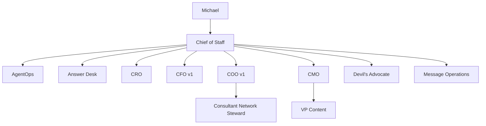
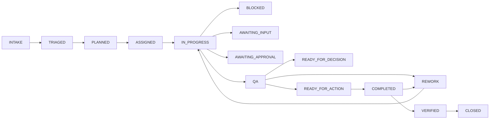
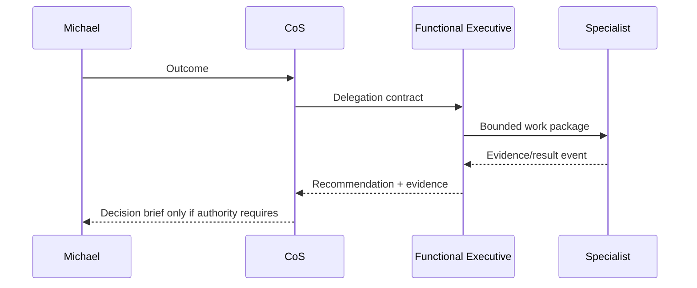
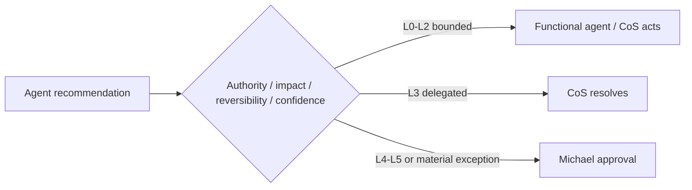
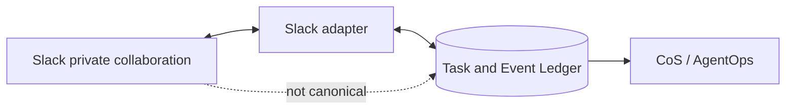
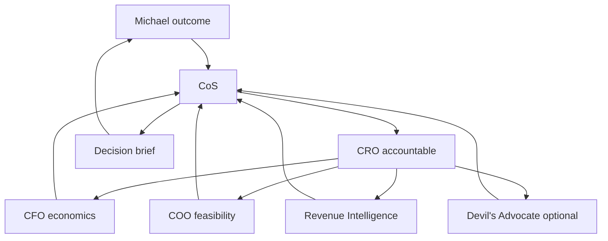

# Architecture

Phase 1 is a typed Python modular monolith with a SQLite task/event ledger. This keeps the operating surface small while preserving strong contracts, auditability, idempotency, and a clean path to managed persistence later.

## Agent hierarchy

## Task lifecycle

## Agent interaction

## Human escalation

## Slack relationship

## Pursuit example

