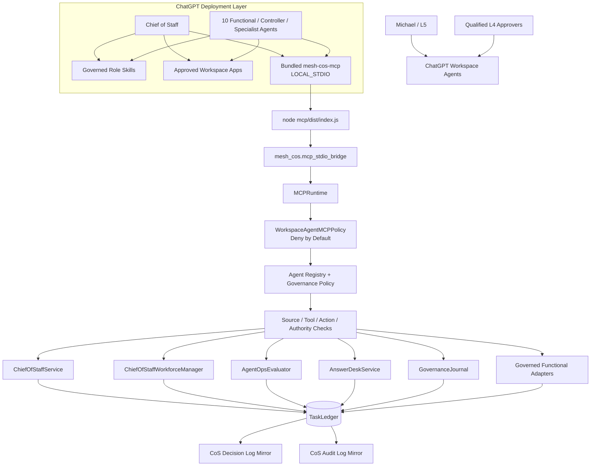
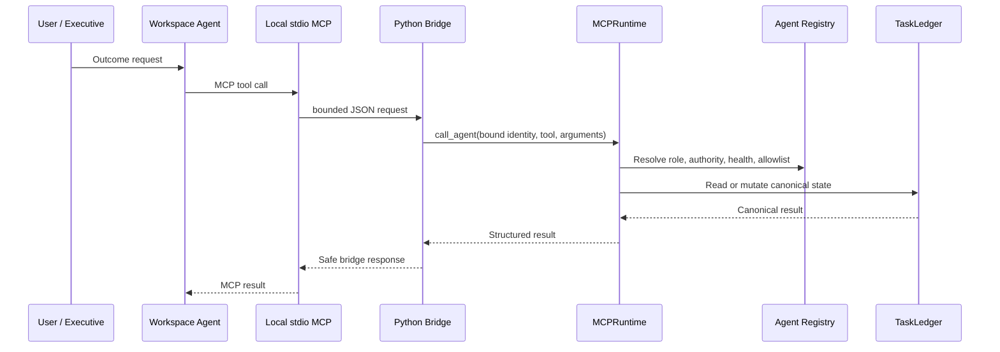

# Architecture

## Purpose

Release `v1.1.0` preserves the governed Mesh AI Chief of Staff control plane and moves the ChatGPT MCP execution boundary into the ChatGPT environment through a bundled `LOCAL_STDIO` transport. The control plane remains a Python modular monolith with SQLite behind the `TaskLedger` persistence boundary.

Material recommendations use `decision.v2`; consequential actions use `agent-event.v2`.

## End-to-end topology



The TypeScript layer is intentionally thin. It implements MCP transport, tool projection, argument bounds, safe error handling, and process bridging. It does not duplicate task, authority, approval, governance, reliability, or source-control logic from Python.

## Local identity and state binding

Each Workspace Agent launches the same MCP package with an explicit identity:

```text
MESH_COS_AGENT_ID=<agent-id>
MESH_COS_LEDGER_PATH=.mesh-cos/task-ledger.sqlite3
MESH_COS_PYTHON_BIN=python
```

`MESH_COS_AGENT_ID` must match a registered agent. Prompt text, retrieved documents, connector output, and MCP arguments cannot select or modify agent identity. All 11 agents in one operating universe use the same approved ledger path so tasks, decisions, approvals, audit events, and performance state remain coherent.

## Serialized execution boundary



Human-only tools are not projected into agent catalogs. `approval.record_decision` and `reliability.human_override` require a separately authenticated human-principal path. L4 fails closed without qualified approval; L5 remains Michael-exclusive.

## Workspace Agent packaging model

Release `1.1.0` maps every canonical role into coordinated artifacts:

1. `chatgpt/skills/<skill>/SKILL.md` defines reusable role workflow.
2. `chatgpt/skills/<skill>/references/production-readiness.md` defines the shared local-MCP readiness contract.
3. `chatgpt/workspace-agents/<agent_id>.json` defines exact ChatGPT configuration and local MCP launch settings.
4. `chatgpt/mcp/mesh-cos-mcp.v1.json` defines tool contracts, per-agent allowlists, local runtime metadata, human-only operations, and deployment mode.
5. `mcp/` is the bundled stdio transport package.
6. `mesh_cos.mcp_stdio_bridge` bridges bounded JSON into the existing `MCPRuntime`.

## Canonical source-of-truth map

| Subject | Canonical authority |
|---|---|
| Agent identity, domain, authority, health | `agents/registry.json` plus shared governance policy |
| Workspace Agent deployment settings | `chatgpt/workspace-agents/*.json`, subordinate to registry |
| Role workflows | `chatgpt/skills/*/SKILL.md`, subordinate to registry |
| MCP permissions and human-only tools | `chatgpt/mcp/mesh-cos-mcp.v1.json` + `WorkspaceAgentMCPPolicy` |
| ChatGPT MCP transport | `mcp/` using `LOCAL_STDIO` |
| Serialized business/governance execution | `mesh_cos.mcp_runtime.MCPRuntime` |
| Task/work graph and outcomes | `TaskLedger` |
| Explainable decisions | `decision.v2` in `TaskLedger`; CoS Decision Log is a mirror |
| Consequential events | `agent-event.v2` in `TaskLedger`; CoS Audit Log is a mirror |
| Conflicts and approvals | `TaskLedger` typed records |
| Performance | performance events/scorecards plus versioned policy |

## Functional accountability boundaries

The local MCP refactor does not expand role authority. CRO remains commercial; CFO remains Engagement Finance / FP&A only; COO remains delivery feasibility and resource readiness; Consultant Network Steward remains a COO specialist; CMO owns marketing strategy; VP Content owns editorial production under CMO; Devil's Advocate remains advisory; Message Operations remains controlled approved communication execution; AgentOps remains operational governance; Answer & Decision Desk remains permission-aware knowledge/routing; CoS remains the orchestration control plane.

## Completion, verification, and reliability

`task.complete` persists accountable-owner outcome evidence. `task.verify` remains a separate acceptance action. `COMPLETED` never implies `VERIFIED`.

Runtime reliability continues to include idempotent intake, bounded retries, execution leases, durable failure records, server-owned replay executors, explicit human override, stalled-work remediation, kill switch, and acceptance verification. The local MCP layer cannot introduce client-supplied code execution, import paths, replay callables, shell commands, or source-text instructions.

## Deployment boundary

The ChatGPT-local path does not require an HTTPS MCP service or `MESH_COS_MCP_SERVER_URL`. A managed remote MCP transport may be added as a separate deployment option, but it must preserve the same `MCPRuntime`, registry, allowlists, authority, approval, audit, and canonical-state controls.

SQLite should be revisited before multi-instance or high-availability deployment.
