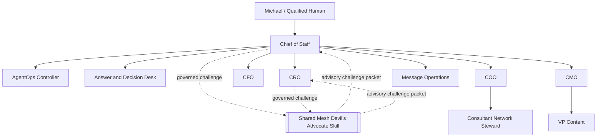
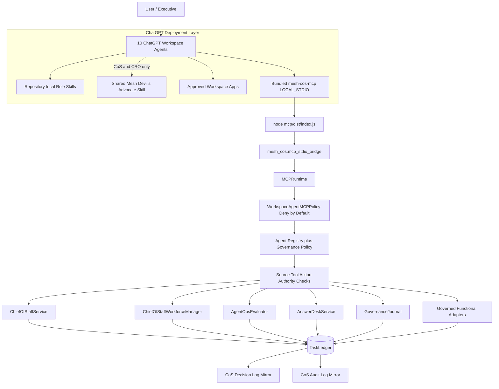
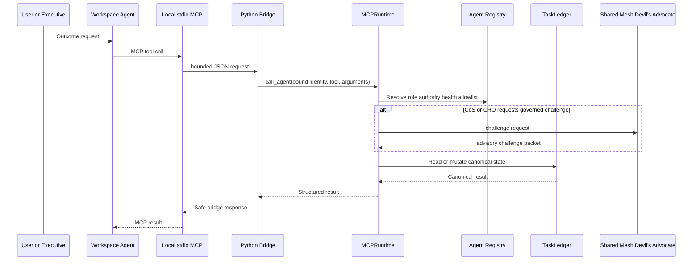

# Architecture

## Purpose

Release `v2.0.0` preserves the governed Mesh AI Chief of Staff control plane, keeps ChatGPT execution on the bundled `LOCAL_STDIO` MCP path, and changes the workforce topology from 11 agent principals to a **10-agent** organization plus the shared **Mesh Devil's Advocate** Skill.

The control plane remains a Python modular monolith with SQLite behind the `TaskLedger` persistence boundary. Material recommendations use `decision.v2`; consequential actions use `agent-event.v2`.

## Workforce topology



`mesh-devils-advocate` is a shared capability, not a separately registered agent, delegated owner, Workspace Agent, or repository-local role Skill. Chief of Staff and CRO may invoke it through `skills.invoke_governed`. Its request contract is `mesh.devils-advocate.challenge-request.v1`; its response contract is `mesh.devils-advocate.challenge-packet.v1`.

The shared challenge function is **advisory**. It cannot change canonical facts, scores, stages, diagnoses, task ownership, commitments, approvals, or external actions. It returns decision authority to the owning agent or qualified human.

## End-to-end execution topology



The TypeScript layer is intentionally thin. It implements MCP transport, tool projection, argument bounds, safe error handling, and process bridging. It does not duplicate task, authority, approval, governance, reliability, or source-control logic from Python.

## Local identity and state binding

Each Workspace Agent launches the same MCP package with explicit identity and shared canonical state:

```text
MESH_COS_AGENT_ID=<agent-id>
MESH_COS_LEDGER_PATH=.mesh-cos/task-ledger.sqlite3
MESH_COS_PYTHON_BIN=python
```

`MESH_COS_AGENT_ID` must match one of the 10 registered agents. Prompt text, retrieved documents, connector output, and MCP arguments cannot select or modify agent identity. All 10 agents in one operating universe use the same approved ledger path so tasks, decisions, approvals, audit events, and performance state remain coherent.

The shared Mesh Devil's Advocate does not receive its own `MESH_COS_AGENT_ID` because it is not an agent principal.

## Serialized execution boundary



Human-only tools are not projected into agent catalogs. `approval.record_decision` and `reliability.human_override` require a separately authenticated human-principal path. L4 fails closed without qualified approval; L5 remains Michael-exclusive.

## Workspace packaging model

Release `2.0.0` maps each canonical agent role into coordinated artifacts:

1. `chatgpt/skills/<skill>/SKILL.md` defines the repository-local role workflow.
2. `chatgpt/skills/<skill>/references/production-readiness.md` defines local-MCP readiness for that agent role.
3. `chatgpt/workspace-agents/<agent_id>.json` defines exact ChatGPT configuration and local MCP launch settings.
4. `chatgpt/mcp/mesh-cos-mcp.v1.json` defines tool contracts, 10 per-agent allowlists, local runtime metadata, human-only operations, and deployment mode.
5. `mcp/` is the bundled stdio transport package.
6. `mesh_cos.mcp_stdio_bridge` bridges bounded JSON into `MCPRuntime`.
7. `agents/registry.json` separately declares `mesh-devils-advocate` as an `EXTERNAL_SHARED_SKILL` entitled only to `cos` and `cro`.

## Canonical source-of-truth map

| Subject | Canonical authority |
|---|---|
| Agent identity, domain, authority, health | `agents/registry.json` plus shared governance policy |
| Shared capability entitlement | `agents/registry.json` `shared_capabilities` |
| Workspace Agent deployment settings | `chatgpt/workspace-agents/*.json`, subordinate to registry |
| Repository-local role workflows | `chatgpt/skills/*/SKILL.md`, subordinate to registry |
| Mesh Devil's Advocate challenge logic | installed shared `mesh-devils-advocate` Skill, advisory only |
| MCP permissions and human-only tools | `chatgpt/mcp/mesh-cos-mcp.v1.json` plus `WorkspaceAgentMCPPolicy` |
| ChatGPT MCP transport | `mcp/` using `LOCAL_STDIO` |
| Serialized business/governance execution | `mesh_cos.mcp_runtime.MCPRuntime` |
| Task/work graph and outcomes | `TaskLedger` |
| Explainable decisions | `decision.v2` in `TaskLedger`; CoS Decision Log is a mirror |
| Consequential events | `agent-event.v2` in `TaskLedger`; CoS Audit Log is a mirror |
| Conflicts and approvals | `TaskLedger` typed records |
| Performance | performance events/scorecards plus versioned policy |

## Functional accountability boundaries

CRO remains commercial and owns Revenue Intelligence interpretation within its bounded authority. CFO remains Engagement Finance / FP&A only. COO remains delivery feasibility and resource readiness. Consultant Network Steward remains a COO specialist. CMO owns marketing strategy. VP Content owns editorial production under CMO. Message Operations remains controlled approved communication execution. AgentOps remains operational governance. Answer & Decision Desk remains permission-aware knowledge/routing. Chief of Staff remains the orchestration control plane.

Mesh Devil's Advocate supplies independent challenge but is not accountable for any functional outcome. For Revenue Intelligence, it preserves account IDs, evidence classes, scores, stage, lifecycle, queue state, and activation readiness while challenging interpretation, route, assumptions, capacity, evidence sufficiency, and decision logic.

## Completion, verification, and reliability

`task.complete` persists accountable-owner outcome evidence. `task.verify` remains a separate acceptance action. `COMPLETED` never implies `VERIFIED`.

Runtime reliability continues to include idempotent intake, bounded retries, execution leases, durable failure records, server-owned replay executors, explicit human override, stalled-work remediation, kill switch, and acceptance verification. The local MCP layer cannot introduce client-supplied code execution, import paths, replay callables, shell commands, or source-text instructions.

## Deployment boundary

The ChatGPT-local path does not require an HTTPS MCP service or `MESH_COS_MCP_SERVER_URL`. A managed remote MCP transport may be added as a separate deployment option, but it must preserve the same `MCPRuntime`, registry, allowlists, authority, approval, audit, and canonical-state controls.

SQLite should be revisited before multi-instance or high-availability deployment.
