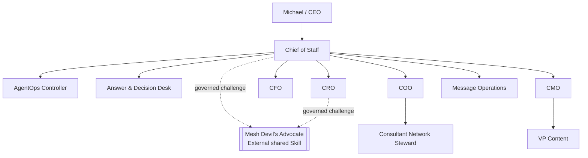
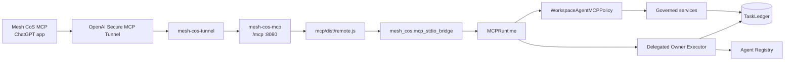
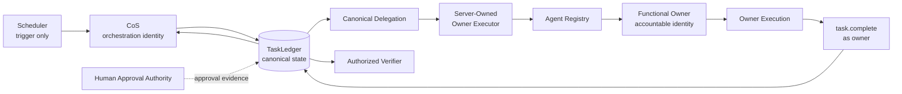
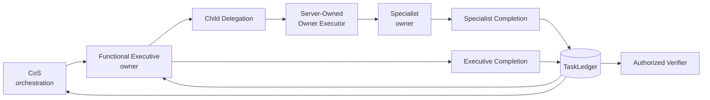
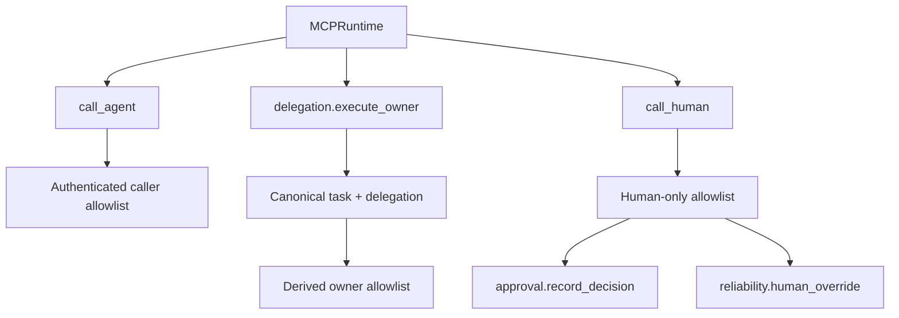
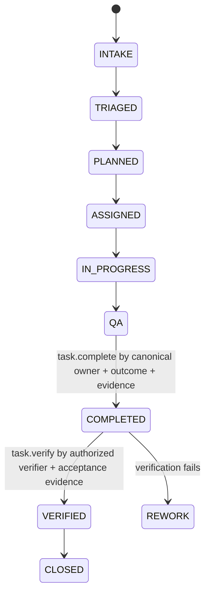

# Architecture

## Purpose

The canonical Phase 1 authority/runtime contract remains release **`4.0.0`**, defining **10 registered agents** plus one external governed shared Skill, Mesh Devil's Advocate. Candidate repository/QNAP deployment release **`v4.3.0`** repairs PF-057 by adding registry-driven, identity-aware delegated owner execution without transferring identity or weakening human authority.

`TaskLedger` remains canonical state.

## Workforce topology



The topology is read from the canonical Agent Registry. It is not a hard-coded execution router.

## Production runtime topology



The external production MCP process remains immutably bound to `MESH_COS_AGENT_ID=cos`. Cross-agent execution does not rewrite that principal. The internal delegated-owner executor derives the authoritative owner from canonical TaskLedger/delegation/registry state and dispatches under that owner's bounded MCP policy.

Prompt content, MCP request content, headers, retrieved data, task text, delegated instructions, connector output, Slack text, Skill output, and model output cannot select or modify an acting principal.

## Direct delegation and owner execution



The scheduler triggers work. It does not make every downstream operation execute under `cos`.

The executor resolves:

```text
authenticated delegator
-> delegation_id
-> canonical delegation
-> canonical task
-> accountable owner
-> registry record
-> owner allowlist
-> task-scoped operation
```

The caller may request an owner-allowed operation. The caller cannot choose the owner identity.

## Nested delegation



Current permitted registry paths include:

- `cos -> cmo -> vp-content`
- `cos -> coo -> consultant-network-steward`

Specialists with `max_delegation_depth=0` cannot delegate further. Future governed agents use the same registry-driven protocol without new principal-specific plumbing.

## Delegation as a closed-loop protocol

A valid delegation is not ownership metadata alone.

```text
DELEGATION_CREATED
-> OWNER_ROUTABLE
-> OWNER_EXECUTING
-> OWNER_RESULT_RECORDED
-> OWNER_COMPLETED
-> PARENT_OBSERVABLE
-> VERIFICATION_ELIGIBLE
```

Delegation creation fails closed unless the target owner is ACTIVE/routable and exposes the required owner lifecycle path.

## Authority projection



`approval.record_decision` and `reliability.human_override` never appear in an agent-executable catalog and cannot be invoked through delegated owner execution.

The candidate CoS catalog contains 28 governed agent tools, adding only `delegation.execute_owner` to the previous 27-tool surface. This transport does not create new business or human decision authority.

## Owner lifecycle semantics

Authoritative task lifecycle writes require the canonical accountable owner. A parent orchestrator cannot directly transition, check in, or complete child work merely because it created the child task or delegation.

Lifecycle audit attribution uses the actual owner identity. Delegated-owner audit evidence separately records the orchestration identity so orchestration and functional execution cannot be conflated.

## Completion and verification



`task.complete` is the canonical accountable-owner completion action. It cannot set `VERIFIED`.

`task.verify` is separate. In Phase 1 only Chief of Staff is exposed that agent operation. Child completion does not verify a parent and parent completion does not verify a child.

## Idempotency and concurrency

Delegated owner execution persists an idempotent claim before the owner operation. A SHA-256 fingerprint binds the idempotency key to delegation, task, operation, and validated arguments.

Exact successful retry returns the canonical cached response. Changed requests under the same key are denied. Ambiguous failed execution is not automatically replayed.

## Scheduled execution

Scheduled occurrences use deterministic `task.intake.idempotency_key` values and resume canonical work. Where work is delegated, CoS routes owner operations through `delegation.execute_owner`, observes the owner result, coordinates dependencies, and performs separate verification where authorized.

Scheduled orchestration therefore traverses agent boundaries without changing the scheduler's authenticated process identity or impersonating child owners.

## Canonical state and evidence

`TaskLedger` remains canonical for tasks, work graph, delegations, owner routes, owner execution records, approval records, conflicts, verification, governance events, performance evidence, failures, and idempotency records.

Slack, ChatGPT transcripts, connectors, shared-Skill packets, Sheets, prompts, and model output cannot replace canonical state or confer identity.

## Production runtime and QNAP boundary

Production continues to use the OpenAI Secure MCP Tunnel, no published host MCP port, least-privilege containers, protected secrets, canonical SQLite state, transactional release promotion, image provenance checks, deterministic bundles, and governed post-deploy verification.

The deployment release and authority contract remain separate version domains:

```text
mcp_version: 4.0.0
deployment_release: 4.3.0
agent_id: cos
transport: SECURE_MCP_TUNNEL
```

Release metadata is observability and deployment-integrity evidence only. It cannot select identity, tools, approval, delegation, or canonical state.

## Production readiness

Production readiness now includes a registry-driven invariant: every ACTIVE downstream agent eligible to own delegated work must have a validated owner execution and completion path under its own authority. `scripts/check-owner-execution-readiness.py` enforces this in CI.

The full PF-057 architecture, failure model, and recovery contract are documented in `pf-057-cross-agent-owner-execution.md`. The full authority-boundary threat model is documented in `security-review-v4.3.0-cross-agent-owner-execution.md`.

## Historical architecture

Historical release documents remain release-train evidence. They do not override this current architecture. In particular, documents describing delegation as functional while only ownership metadata was persisted are superseded by the closed-loop delegated-owner execution protocol above.
