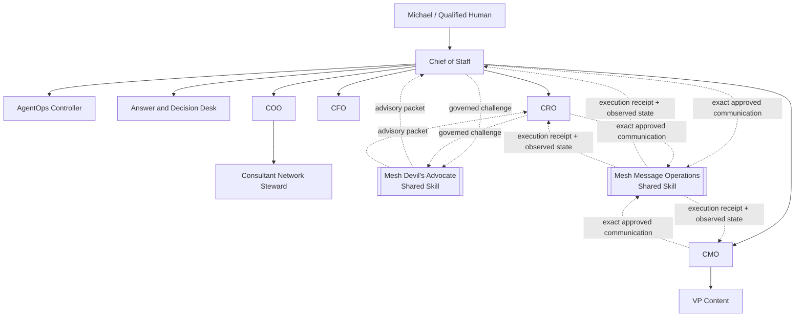
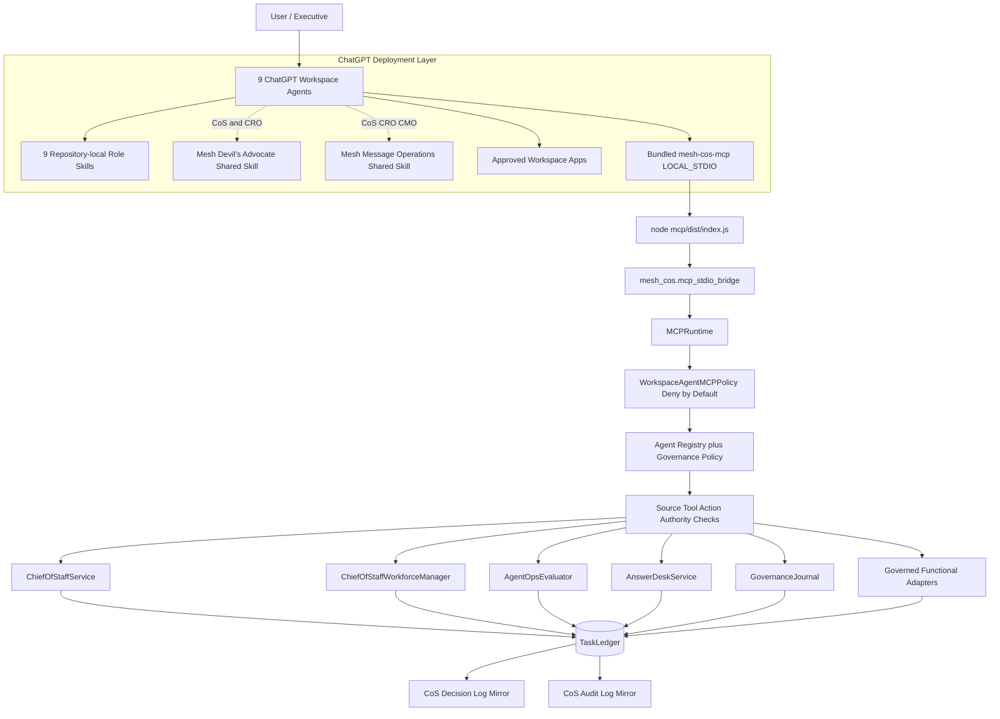
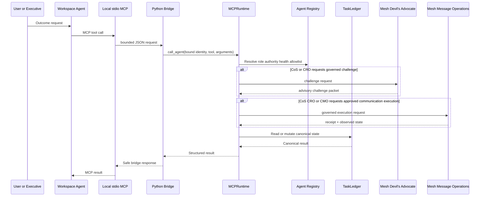

# Architecture

## Purpose

Release `v3.0.0` preserves the governed Mesh AI Chief of Staff control plane, keeps ChatGPT execution on the bundled `LOCAL_STDIO` MCP path, and changes the workforce topology from 10 agent principals to a **9-agent** organization plus two governed external shared Skills: **Mesh Devil's Advocate** and **Mesh Message Operations**.

The control plane remains a Python modular monolith with SQLite behind the `TaskLedger` persistence boundary. Material recommendations use `decision.v2`; consequential actions use `agent-event.v2`.

## Workforce topology



Neither shared Skill is a registered agent, delegated owner, Workspace Agent, repository-local duplicate Skill, or MCP principal. Both are invoked through `skills.invoke_governed` and remain subordinate to caller authority and canonical registry policy.

`mesh-devils-advocate` is advisory only and available to Chief of Staff and CRO. It cannot change canonical facts, scores, stages, diagnoses, task ownership, commitments, approvals, or external actions.

`mesh-message-operations` is approval-bound execution only and available to Chief of Staff, CRO, and CMO. It cannot create strategy or copy, select recipients, set pricing, make contractual commitments, make consent/legal determinations, or define publishing policy. VP Content remains drafting/editorial-production only.

## End-to-end execution topology



The TypeScript layer is intentionally thin. It implements MCP transport, tool projection, argument bounds, safe error handling, and process bridging. It does not duplicate task, authority, approval, governance, reliability, or source-control logic from Python.

## Local identity and state binding

Each Workspace Agent launches the same MCP package with explicit identity and shared canonical state:

```text
MESH_COS_AGENT_ID=<agent-id>
MESH_COS_LEDGER_PATH=.mesh-cos/task-ledger.sqlite3
MESH_COS_PYTHON_BIN=python
```

`MESH_COS_AGENT_ID` must match one of the 9 registered agents. Prompt text, retrieved documents, connector output, shared-Skill output, and MCP arguments cannot select or modify agent identity. All 9 agents in one operating universe use the same approved ledger path so tasks, decisions, approvals, audit events, and performance state remain coherent.

Neither shared Skill receives its own `MESH_COS_AGENT_ID`.

## Serialized execution boundary



Human-only tools are not projected into agent catalogs. `approval.record_decision` and `reliability.human_override` require a separately authenticated human-principal path. L4 fails closed without qualified approval; L5 remains Michael-exclusive.

## Message Operations execution contract

Mesh Message Operations receives only an approved draft packet and preserves the controlled execution boundary:

1. verify packet version and immutable payload hash;
2. preflight sender, recipients, purpose, channel, jurisdiction, consent, suppressions, links, attachments, merge fields, reply-to, unsubscribe, authentication, and delivery window;
3. render the exact preview and surface any differences;
4. run seed/test send when required;
5. bind explicit current approval to exact payload, audience, sender, channel, purpose, jurisdiction, consent basis, suppression/frequency controls, test result, approvers, and execution window;
6. immediately recheck cancellation and kill-switch state;
7. execute only through a documented connector action with a unique idempotency key;
8. capture provider result, identifiers, timestamps, counts, errors, and per-attempt receipts;
9. re-read provider state and record observed delivery/response evidence;
10. invalidate approval and return to preflight for any material change.

Preview, silence, previous approval, a draft request, a calendar event, connector capability, or approval of a different version is not approval. Requested, scheduled, sent, delivered, and replied are distinct states.

## Workspace packaging model

Release `3.0.0` maps each canonical agent role into coordinated artifacts:

1. `chatgpt/skills/<skill>/SKILL.md` defines one of 9 repository-local role workflows.
2. `chatgpt/skills/<skill>/references/production-readiness.md` defines local-MCP readiness for that agent role.
3. `chatgpt/workspace-agents/<agent_id>.json` defines one of 9 exact ChatGPT configurations and local MCP launch settings.
4. `chatgpt/mcp/mesh-cos-mcp.v1.json` defines tool contracts, 9 per-agent allowlists, local runtime metadata, human-only operations, and deployment mode.
5. `mcp/` is the bundled stdio transport package.
6. `mesh_cos.mcp_stdio_bridge` bridges bounded JSON into `MCPRuntime`.
7. `agents/registry.json` declares `mesh-devils-advocate` and `mesh-message-operations` as `EXTERNAL_SHARED_SKILL` capabilities with governed consumer sets.

## Canonical source-of-truth map

| Subject | Canonical authority |
|---|---|
| Agent identity, domain, authority, health | `agents/registry.json` plus shared governance policy |
| Shared capability entitlement | `agents/registry.json` `shared_capabilities` |
| Workspace Agent deployment settings | `chatgpt/workspace-agents/*.json`, subordinate to registry |
| Repository-local role workflows | `chatgpt/skills/*/SKILL.md`, subordinate to registry |
| Mesh Devil's Advocate challenge logic | installed shared `mesh-devils-advocate` Skill, advisory only |
| Mesh Message Operations execution logic | installed shared `mesh-message-operations` Skill, approval-bound execution only |
| MCP permissions and human-only tools | `chatgpt/mcp/mesh-cos-mcp.v1.json` plus `WorkspaceAgentMCPPolicy` |
| ChatGPT MCP transport | `mcp/` using `LOCAL_STDIO` |
| Serialized business/governance execution | `mesh_cos.mcp_runtime.MCPRuntime` |
| Task/work graph and outcomes | `TaskLedger` |
| Explainable decisions | `decision.v2` in `TaskLedger`; CoS Decision Log is a mirror |
| Consequential events | `agent-event.v2` in `TaskLedger`; CoS Audit Log is a mirror |
| Conflicts and approvals | `TaskLedger` typed records |
| Performance | performance events/scorecards plus versioned policy |

## Functional accountability boundaries

CRO remains commercial and owns Revenue Intelligence interpretation within its bounded authority. CFO remains Engagement Finance / FP&A only. COO remains delivery feasibility and resource readiness. Consultant Network Steward remains a COO specialist. CMO owns marketing strategy. VP Content owns editorial production under CMO. AgentOps remains operational governance. Answer & Decision Desk remains permission-aware knowledge/routing. Chief of Staff remains the orchestration control plane.

Chief of Staff, CRO, and CMO may invoke Mesh Message Operations only for exact approved communications inside their existing authority boundaries. CRO cannot use it to bypass pricing, scope, contractual, or commercial approval gates. CMO cannot use it to bypass strategy, consent, policy, or publication approval gates. CoS cannot infer approval or mutate the approved payload.

## Completion, verification, and reliability

`task.complete` persists accountable-owner outcome evidence. `task.verify` remains a separate acceptance action. `COMPLETED` never implies `VERIFIED`.

A successful connector attempt also does not prove business outcome or delivery. Message Operations must first record observed provider state, then the owning workflow applies normal TaskLedger acceptance rules.

Runtime reliability continues to include idempotent intake, bounded retries, execution leases, durable failure records, server-owned replay executors, explicit human override, stalled-work remediation, kill switch, and acceptance verification. The local MCP layer cannot introduce client-supplied code execution, import paths, replay callables, shell commands, or source-text instructions.

## Deployment boundary

The ChatGPT-local path does not require an HTTPS MCP service or `MESH_COS_MCP_SERVER_URL`. A managed remote MCP transport may be added as a separate deployment option, but it must preserve the same `MCPRuntime`, registry, allowlists, authority, approval, audit, and canonical-state controls.

SQLite should be revisited before multi-instance or high-availability deployment.

## Historical release note

Release `v2.0.0` established the prior 10-agent architecture and moved Mesh Devil's Advocate to the external shared-Skill model. Those references are historical. The current architecture is `v3.0.0`, with a 9-agent workforce and Mesh Message Operations also externalized as a governed shared Skill.
