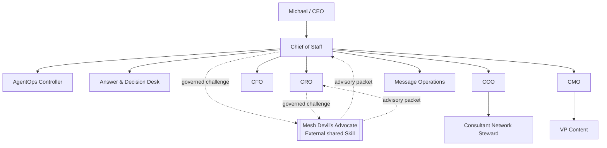
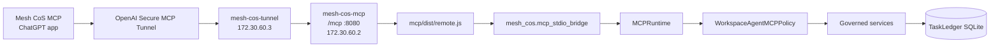
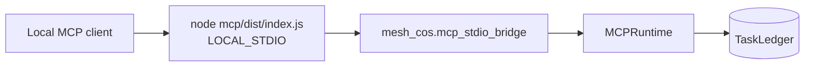
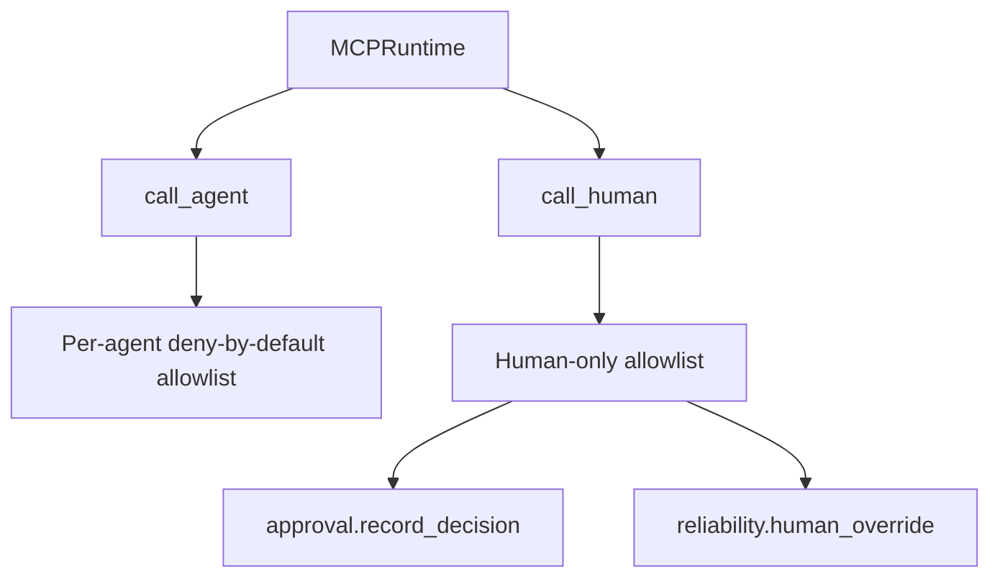
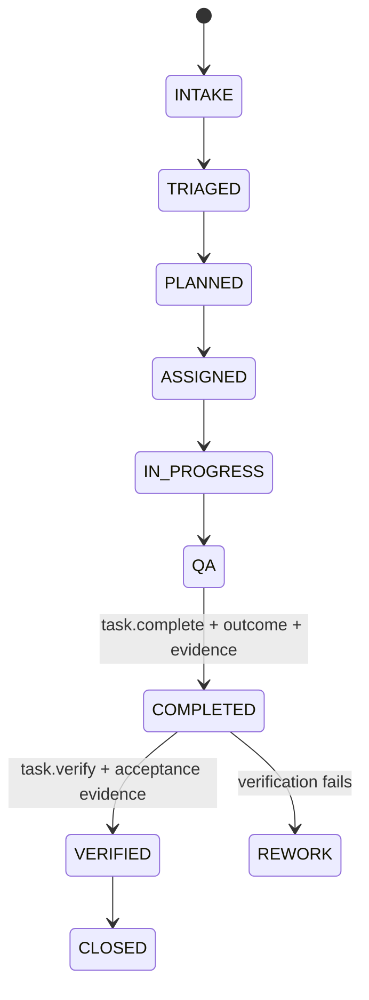

# Architecture

## Purpose

The canonical Phase 1 authority/runtime contract remains release **`4.0.0`**, defining **10 registered agents** plus one external governed shared Skill, Mesh Devil's Advocate. Repository/QNAP deployment release **`v4.1.6`** packages that authority model for the published **Mesh CoS MCP** ChatGPT app through the **OpenAI Secure MCP Tunnel** and adds serving-release observability without changing authority.

`TaskLedger` remains canonical state.

## Workforce topology



The normal agent delegation depth is CoS -> functional executive -> specialist. `Michael -> CoS -> COO -> Consultant Network Steward` is legal. Consultant Network Steward is terminal and cannot create a further delegation.

## Production runtime topology



The QNAP application also has LAN identity `192.168.7.60` for operator health/readiness access, but the production Compose model publishes no host MCP port. `/mcp` accepts only the configured tunnel-sidecar private source identity while `MCP_AUTH_MODE=tunnel` is active.

The production MCP process is immutably bound to `MESH_COS_AGENT_ID=cos`. `MESH_COS_DEPLOYMENT_RELEASE=4.1.6` is required before the remote process listens. Prompt content, MCP request content, headers, retrieved data, task text, delegated instructions, connectors, and Skill output cannot change these bindings or widen the tool catalog.

## Local certification topology



Local stdio remains the deterministic engineering/certification path and shares the same canonical MCP contract and runtime services.

## Dual release identity

The deployment train and authority contract are separate version domains:

```text
mcp_version: 4.0.0
deployment_release: 4.1.6
agent_id: cos
transport: SECURE_MCP_TUNNEL
```

Successful governed production tool envelopes report `mcp_version`, `deployment_release`, and `agent_id`. `/healthz` and `/readyz` additionally report the transport. Release metadata is observability only; it cannot select identity, tools, approval, delegation, or canonical state.

## Authority projection

The MCP runtime contains both agent and human operations, but the catalogs are disjoint where required:



`approval.record_decision` and `reliability.human_override` never appear in an agent-executable catalog. `call_agent` rejects them before ordinary agent authorization. `call_human` requires a separately authenticated human principal. The production CoS catalog remains exactly 27 governed tools.

## Completion and verification



`task.complete` is the canonical accountable-owner completion action. A valid completion requires a non-empty outcome, supporting evidence, and a valid lifecycle transition. It cannot set `VERIFIED`.

`task.verify` is a separate verifier action. In Phase 1 only Chief of Staff is exposed that agent operation. Verification requires acceptance evidence and a completed task. Child completion does not verify a parent.

## Shared Devil's Advocate

Mesh Devil's Advocate is an external `EXTERNAL_SHARED_SKILL`, available only to Chief of Staff and CRO. It is `ADVISORY_ONLY`, cannot modify canonical facts, cannot execute external actions, and does not become a principal in the Agent Registry or MCP agent allowlists.

## Message Operations

Message Operations is the tenth registered agent. It is a controlled execution boundary for explicitly approved communications. It may inspect approval state but cannot decide its own approval. Consequential sends remain human-gated and Always Ask remains defense in depth at the Workspace layer.

## Canonical state and evidence

`TaskLedger` is the canonical source for tasks, work graph, approval records, conflicts, verification, governance events, performance evidence, and idempotency records. Slack, ChatGPT transcripts, connectors, shared-Skill packets, and Sheets cannot replace canonical state.

## Production readiness

`/readyz` requires active bound-agent state, valid governance audit chain, and successful current MCP `server/discover`. The published ChatGPT app is then verified independently through the documented ten-call sequential hosted acceptance path.

## Historical architecture

Release `v3.0.0` documented a 9-agent topology with Message Operations externalized as a second shared Skill. That release record remains historical and is superseded by the canonical v4.0.0 10-agent authority model. The v4.1.x deployment train does not alter that workforce topology.
