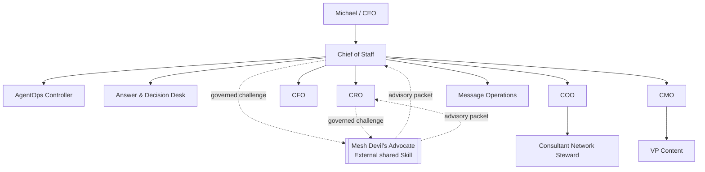
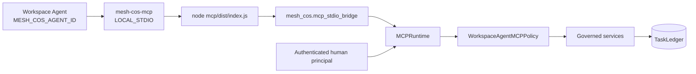
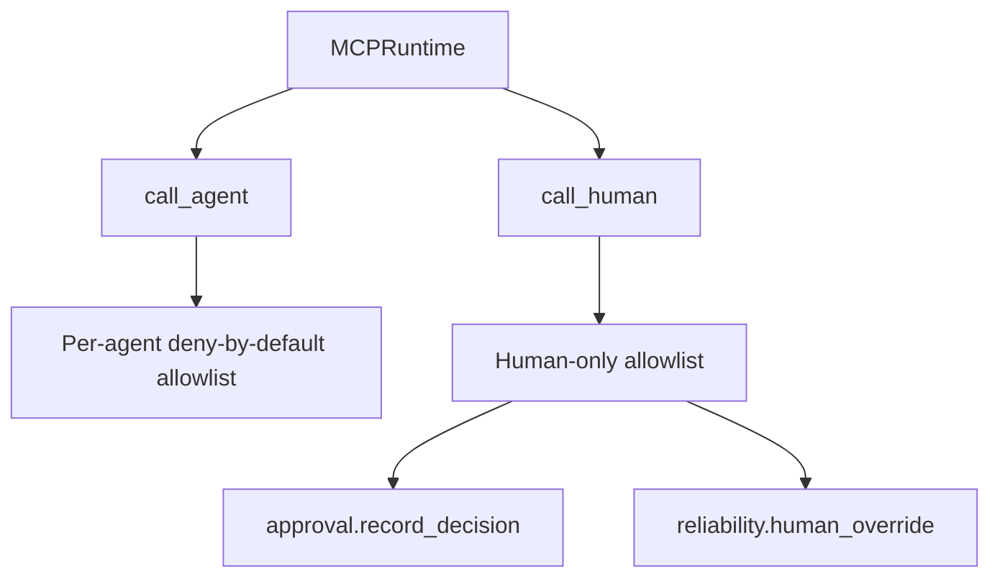
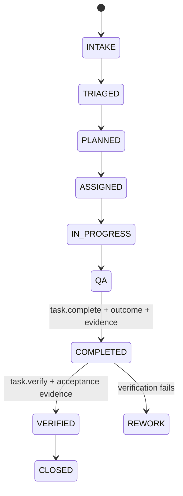

# Architecture

## Purpose

Release `v4.0.0` defines the current Phase 1 operating topology as **10 registered agents** plus one external governed shared Skill, Mesh Devil's Advocate. `TaskLedger` remains canonical state and ChatGPT continues to use the bundled `LOCAL_STDIO` MCP path.

## Workforce topology

The normal agent delegation depth is CoS -> functional executive -> specialist. `Michael -> CoS -> COO -> Consultant Network Steward` is legal. Consultant Network Steward is terminal and cannot create a further delegation.

## Runtime topology

Each Workspace Agent process is bound to exactly one registered identity through `MESH_COS_AGENT_ID`. The 10 agents in one operating universe share the same approved `MESH_COS_LEDGER_PATH`. Content cannot modify these bindings.

## Authority projection

The MCP runtime contains both agent and human operations, but the catalogs are disjoint where required:

`approval.record_decision` and `reliability.human_override` never appear in an agent-executable catalog. `call_agent` rejects them before ordinary agent authorization. `call_human` requires a separately authenticated human principal.

## Completion and verification

`task.complete` is the canonical accountable-owner completion action. A valid completion requires a non-empty outcome, supporting evidence, and a valid lifecycle transition. It cannot set `VERIFIED`.

`task.verify` is a separate verifier action. In Phase 1 only Chief of Staff is exposed that agent operation. Verification requires acceptance evidence and a completed task. Child completion does not verify a parent.

## Shared Devil's Advocate

Mesh Devil's Advocate is an external `EXTERNAL_SHARED_SKILL`, available only to Chief of Staff and CRO. It is `ADVISORY_ONLY`, cannot modify canonical facts, cannot execute external actions, and does not become a principal in the Agent Registry or MCP agent allowlists.

## Message Operations

Message Operations is the tenth registered agent. It is a controlled execution boundary for explicitly approved communications. It may inspect approval state but cannot decide its own approval. Consequential sends remain human-gated and Always Ask remains defense in depth at the Workspace layer.

## Canonical state and evidence

`TaskLedger` is the canonical source for tasks, work graph, approval records, conflicts, verification, governance events, performance evidence, and idempotency records. Slack, ChatGPT transcripts, connectors, shared-Skill packets, and Sheets cannot replace canonical state.

## Historical architecture

Release `v3.0.0` documented a 9-agent topology with Message Operations externalized as a second shared Skill. That release record remains historical. It is superseded by the current v4.0.0 10-agent architecture.