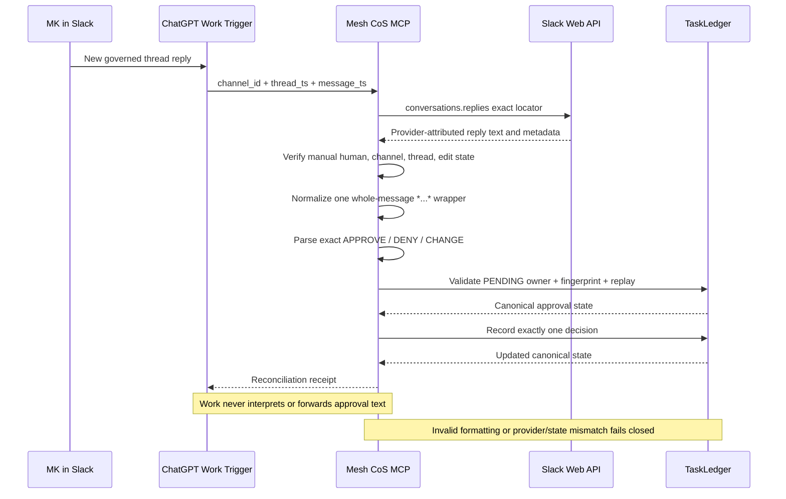

# ChatGPT / Slack Production Acceptance v4.2.1

Status: **REQUIRED AFTER DEPLOYMENT, BEFORE CONSEQUENTIAL USE**

## Preconditions

- QNAP runtime is deployed from the immutable v4.2.1 release bundle.
- `mesh-cos-mcp` and `mesh-cos-tunnel` are healthy.
- runtime reports `mcp_version=4.0.0`, `deployment_release=4.2.1`, `slack_hitl_mode=CHATGPT_NATIVE_EVENT_TRIGGER`, and `slack_hitl_ready=true`.
- no xapp Socket Mode credential is mounted or configured.
- the single ChatGPT Work task **Mesh Slack HITL Dispatcher** is enabled.
- trigger remains Slack / `#mesh-agent-ops` / author MK / `New messages and thread replies`.
- dispatcher prompt release label has been updated to `v4.2.1` and still passes only `thread_ts` and `message_ts`.

## Acceptance sequence

The Mermaid source above was validated through Mermaid Chart before release preparation.

## Priority incident replay

The first acceptance case must reproduce the v4.2.0 failure shape before moving to the broader matrix:

1. Create a synthetic, non-consequential PENDING L4 approval owned by `michael`.
2. Post the governed approval notice through the dedicated Slack bot.
3. From MK's Slack account, reply in the bound thread using Slack bold formatting so the provider text is `*APPROVE*`.
4. Confirm the Work task records a run for that Slack event.
5. Confirm Mesh CoS MCP returns successful reconciliation rather than `INVALID_ARGUMENT / execution_failed`.
6. Confirm the canonical approval is `APPROVED` and the task is `READY_FOR_ACTION` exactly once.
7. Confirm the audit chain remains valid.

If this incident replay fails, stop acceptance and leave the dispatcher enabled only if the failure is demonstrably fail-closed and non-consequential; otherwise disable it while remediating.

## Full acceptance matrix

Use synthetic, non-consequential approvals only.

| Test | Provider/action | Expected canonical result |
| --- | --- | --- |
| Incident replay | provider text `*APPROVE*` | APPROVED; task READY_FOR_ACTION; provider reconciliation receipt |
| Bare approve | `APPROVE` | same as incident replay |
| Case tolerance | `approve` | same as APPROVE |
| Bold deny | `*DENY*` | approval REJECTED; no consequential action |
| Bare deny | `DENY` | approval REJECTED; no consequential action |
| Bold change start | `*CHANGE*` | AWAITING_CHANGE_INPUT; original approval remains PENDING until follow-up |
| Bare change start | `CHANGE` | same as bold change start |
| Change detail | next manual human reply | old approval superseded/rejected for change; task IN_PROGRESS; new fingerprint required |
| Duplicate delivery | replay same channel/thread/message timestamps | same result returned; no second decision |
| Nested formatting | `**APPROVE**` | no canonical mutation |
| Partial formatting | `*APPROVE* extra` | no canonical mutation |
| Formatted unknown text | `*looks good*` | no canonical mutation |
| Wrong user | another Slack user replies APPROVE | canonical approval remains PENDING |
| Root message | MK posts APPROVE outside bound thread | no canonical mutation |
| Unbound thread | MK replies APPROVE in unrelated thread | no canonical mutation |
| App/bot message | bot emits APPROVE | no canonical mutation |
| Edited message | provider message is edited before reconciliation | no canonical mutation |
| Deleted/unavailable message | exact provider lookup cannot retrieve message | no canonical mutation |
| Fingerprint drift | approval payload changes after Slack binding | no canonical mutation |
| Slack unavailable | provider reconciliation fails | no canonical mutation |

## Evidence to retain

For each test capture, without secret values:

- deployment release and image identity;
- MCP runtime contract version;
- Work task run result;
- Slack channel ID, root thread timestamp, and reply timestamp;
- canonical approval ID and task ID;
- provider reconciliation disposition/status;
- TaskLedger before/after state;
- replay behavior where applicable;
- `governance.verify_audit_chain` result.

## Exit criteria

Production acceptance passes only when all positive cases create exactly the expected canonical state, all negative cases fail closed, duplicate delivery is idempotent, the observed ingress is the ChatGPT Work event trigger, no QNAP Slack WebSocket listener or xapp secret is active, Secure MCP Tunnel remains the sole remote MCP ingress, and the final TaskLedger audit chain verifies.

Repository CI and release publication alone do not satisfy this live acceptance gate.
