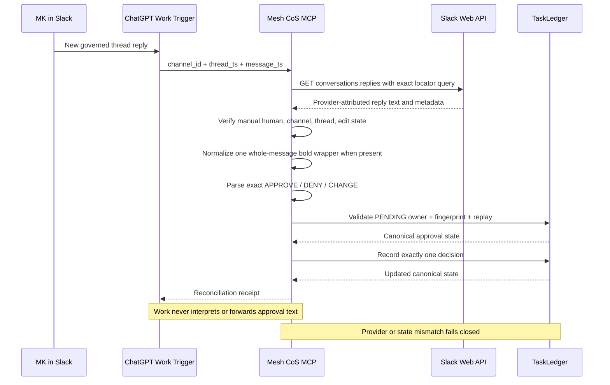

# ChatGPT / Slack Production Acceptance v4.2.2

Status: **REQUIRED AFTER DEPLOYMENT, BEFORE CONSEQUENTIAL HITL USE**

## Preconditions

- QNAP runtime is deployed from the immutable v4.2.2 release bundle.
- `mesh-cos-mcp` and `mesh-cos-tunnel` are healthy.
- runtime reports `mcp_version=4.0.0`, `deployment_release=4.2.2`, `slack_hitl_mode=CHATGPT_NATIVE_EVENT_TRIGGER`, and `slack_hitl_ready=true`.
- QNAP deployment verification passed the live Slack provider-read gate from the running container.
- the installed dedicated Slack bot has `chat:write` and `groups:history`, is a member of `#mesh-agent-ops`, and uses the provider-verified App ID `A0B49RNE4K0`.
- no xapp Socket Mode credential is mounted or configured.
- the single ChatGPT Work task **Mesh Slack HITL Dispatcher** is enabled.
- trigger remains Slack / `#mesh-agent-ops` / author MK / `New messages and thread replies`.
- dispatcher prompt remains version-family labeled `Mesh CoS MCP v4.x` and passes only `thread_ts` and `message_ts`.

## Acceptance sequence

This Mermaid source was validated with Mermaid Chart during release preparation.

## Priority incident replay

The first live case must close both production defects discovered during v4.2.0/v4.2.1 acceptance:

1. Create a fresh synthetic, non-consequential PENDING L4 approval owned by `michael` with a new payload fingerprint.
2. Post the governed approval notice through the dedicated Slack bot.
3. From MK's Slack account, reply in the bound thread using Slack bold formatting so provider text is `*APPROVE*`.
4. Confirm the Work dispatcher records a run for that exact Slack event.
5. Confirm Mesh CoS MCP succeeds rather than returning `execution_failed`.
6. Confirm QNAP retrieved the exact reply through provider reconciliation, not trigger text.
7. Confirm the canonical approval becomes `APPROVED` and the task becomes `READY_FOR_ACTION` exactly once.
8. Replay the exact same locators and confirm idempotent return with no second decision.
9. Confirm the audit chain remains valid.

If this case fails, stop the acceptance matrix and record the exact provider/runtime evidence. Do not treat a manual direct reconciliation as E2E acceptance.

## Full acceptance matrix

Use fresh synthetic, non-consequential approvals where state mutation is expected.

| Test | Provider/action | Expected canonical result |
| --- | --- | --- |
| Incident replay | provider text `*APPROVE*` | APPROVED; task READY_FOR_ACTION; provider reconciliation receipt |
| Bare approve | `APPROVE` | same as incident replay |
| Case tolerance | `approve` | same as APPROVE |
| Bold deny | `*DENY*` | approval REJECTED; task returns IN_PROGRESS; no consequential action |
| Bare deny | `DENY` | same as bold deny |
| Bold change start | `*CHANGE*` | AWAITING_CHANGE_INPUT; original approval remains PENDING until follow-up |
| Bare change start | `CHANGE` | same as bold change start |
| Change detail | next manual MK reply | old approval superseded/rejected for change; task IN_PROGRESS; new fingerprint required |
| Duplicate delivery | replay same channel/thread/message timestamps | same decision evidence; no second decision |
| Nested formatting | `**APPROVE**` | no canonical mutation |
| Partial formatting | `*APPROVE* extra` | no canonical mutation |
| Formatted unknown text | `*looks good*` | no canonical mutation |
| Wrong user | another Slack user replies APPROVE | approval remains PENDING |
| Root message | MK posts APPROVE outside bound thread | no MCP call from dispatcher / no canonical mutation |
| Unbound thread | MK replies APPROVE in unrelated thread | no canonical mutation |
| App/bot message | bot emits APPROVE | no canonical mutation |
| Edited message | provider message edited before reconciliation | no canonical mutation |
| Deleted/unavailable message | exact provider lookup cannot retrieve message | no canonical mutation |
| Fingerprint drift | approval payload changes after Slack binding | no canonical mutation |
| Provider auth/scope failure | Slack provider read rejected | no canonical mutation |
| Slack unavailable | provider reconciliation cannot complete | no canonical mutation |

## Provider-read deployment gate

Before the first approval, QNAP deployment verification must have called `conversations.history` from the running `mesh-cos-mcp` container using the mounted bot token and governed channel. This is not approval evidence; it is deployment evidence that the actual runtime credential can read the private channel.

If the verifier reports a provider-read failure, resolve bot scope/authorization/channel access before acceptance. Do not bypass the gate by manually querying Slack from a different credential.

## Evidence to retain

For each live case retain, without secret values:

- deployment release, merge SHA and image identity;
- MCP runtime contract version;
- Work dispatcher run result;
- Slack channel ID, root thread timestamp and reply timestamp;
- canonical approval ID and task ID;
- provider reconciliation disposition/status;
- TaskLedger before/after state;
- replay evidence where applicable;
- sanitized provider error code for negative provider cases;
- `governance.verify_audit_chain` result.

## Exit criteria

Production acceptance passes only when all positive cases create exactly the expected canonical state, all negative cases fail closed, duplicate delivery is idempotent, the observed wake-up is the ChatGPT Work event trigger, provider message text is independently reread by QNAP, no QNAP Slack WebSocket listener or xapp secret is active, Secure MCP Tunnel remains the sole remote MCP ingress, and the final TaskLedger audit chain verifies.

Repository CI and release publication alone do not satisfy this live acceptance gate.
