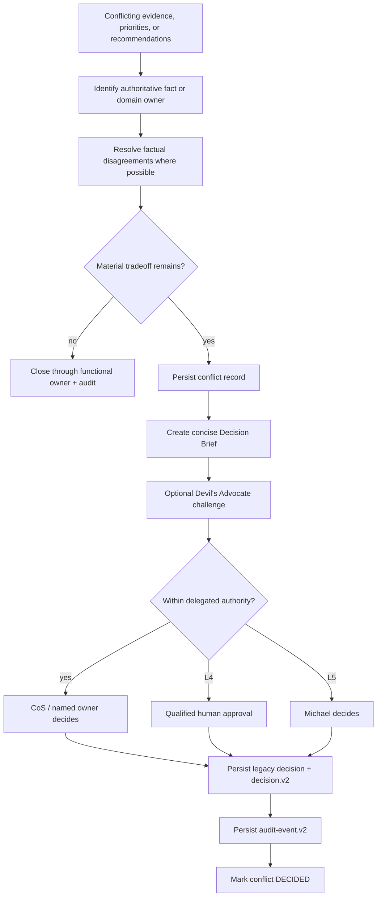

# Conflict Resolution

Phase 1 separates factual/source authority from cross-functional tradeoff authority. A conflict is a durable governance object, not a debate that disappears in chat history.

## Functional truth

Current domain authority mappings include:

- engagement finance and FP&A calculation -> CFO within supported source scope
- commercial evidence -> approved Mesh Revenue Intelligence source where designated
- account qualification evidence -> approved Mesh Revenue Intelligence source where designated
- commercial interpretation, pursuit strategy, and expansion recommendation -> CRO within delegated scope
- delivery feasibility, capacity, resource readiness, and staffing recommendation -> COO
- consultant-network readiness evidence -> Consultant Network Steward under COO
- marketing strategy and brand/demand architecture -> CMO
- editorial production -> VP Content under CMO intent

The CoS coordinates these truths but does not replace them.

## Conflict and decision flow

## Durable conflict record

A conflict record captures participants, uncontested and disputed facts, disputed recommendations, source authority, business consequence, options, agent positions, confidence, reversibility, Devil's Advocate review, CoS recommendation, reversal condition, decision owner, status and timestamps.

## Explainable decision record

During the compatibility period, `ConflictService.decide()` retains the existing `decision.v1` record and also writes the same decision ID as `mesh.cos.decision.v2`. The v2 record adds:

- task/correlation linkage,
- accountable decision owner and authority level,
- explicit human approval reference and approver for L4/L5,
- concise rationale as `decision_basis_summary`,
- conflict/evidence references and authoritative source systems,
- alternatives considered and selection criteria,
- confidence and risk,
- affected participants,
- reversibility and reversal condition,
- policy identifiers,
- model/skill provenance where applicable,
- outcome validation/status,
- canonical reference and integrity hash.

L4/L5 conflict decisions fail closed before conflict mutation if required approval evidence is absent.

## Decision Brief

When escalation is required, the CoS should compress the issue into:

- decision required,
- why now,
- known facts,
- material disagreement,
- options,
- CoS recommendation,
- primary risk,
- what would reverse the recommendation,
- approval/action requested.

The brief should reduce CEO cognitive load without hiding uncertainty or conflicting functional evidence. The durable `decision.v2` record is the machine-auditable counterpart to the human-readable brief.

## Role identity in conflict records

Conflict and decision records use stable agent IDs and canonical display names. Implementation provenance is carried separately through agent/model/skill version fields. A role name must not be altered to communicate implementation maturity or release state.

## Reversal and supersession

Reversal conditions are mandatory for material decisions. Reversal or supersession does not delete the original governance record. Decision lineage remains available for audit and outcome learning.

## Devil's Advocate

The Devil's Advocate is an independent challenge function. It may test assumptions, evidence quality, downside cases, and reversal conditions. It never becomes the final decision owner merely because it raised the challenge. Its material recommendation should itself be auditable and linked to the resulting decision record.

<!-- mesh-cos-v2-shared-da -->
## v2.0.0 current architecture

The live Phase 1 runtime is a **10-agent** organization. The former repository-local Devil's Advocate agent and duplicate role Skill are removed. **Mesh Devil's Advocate** is an external **shared Skill** available only to Chief of Staff and CRO through governed Skill invocation. It is **advisory** only, cannot overwrite **canonical facts**, cannot execute external actions, and returns decision authority to the owning role or qualified human. `TaskLedger` remains canonical state; ChatGPT uses `LOCAL_STDIO` through `MCPRuntime` with deny-by-default allowlists, human-only approval/override paths, `check-chatgpt-packages.py` drift enforcement, and the 100% branch-aware coverage gate. Historical references to an 11-agent roster or a local Devil's Advocate role describe superseded releases only.

