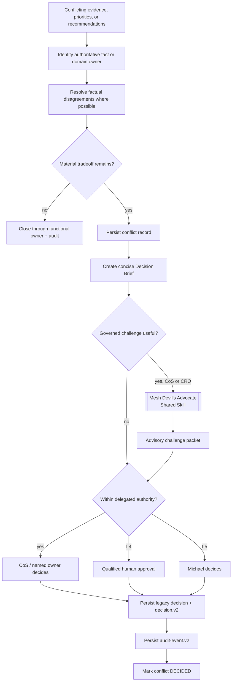

# Conflict Resolution

Phase 1 separates factual/source authority from cross-functional tradeoff authority. A conflict is a durable governance object, not a debate that disappears in chat history.

## Functional truth

Current domain authority mappings include:

- engagement finance and FP&A calculation -> CFO within supported source scope
- commercial evidence -> approved Mesh Revenue Intelligence source where designated
- account qualification evidence -> approved Mesh Revenue Intelligence source where designated
- commercial interpretation, pursuit strategy, and expansion recommendation -> CRO within delegated scope
- delivery feasibility, capacity, resource readiness, and staffing recommendation -> COO
- consultant-network readiness evidence -> Consultant Network Steward under COO
- marketing strategy and brand/demand architecture -> CMO
- editorial production -> VP Content under CMO intent

The CoS coordinates these truths but does not replace them. Mesh Devil's Advocate may challenge reasoning but cannot rewrite any canonical fact or become a functional truth owner.

## Conflict and decision flow

## Durable conflict record

A conflict record captures participants, uncontested and disputed facts, disputed recommendations, source authority, business consequence, options, agent positions, confidence, reversibility, optional shared Mesh Devil's Advocate challenge reference, CoS recommendation, reversal condition, decision owner, status, and timestamps.

The challenge reference is advisory evidence only. It cannot replace source authority, modify canonical facts, satisfy an L4/L5 approval, or make the shared Skill a conflict participant with independent decision rights.

## Explainable decision record

During the compatibility period, `ConflictService.decide()` retains the existing `decision.v1` record and also writes the same decision ID as `mesh.cos.decision.v2`. The v2 record adds:

- task/correlation linkage,
- accountable decision owner and authority level,
- explicit human approval reference and approver for L4/L5,
- concise rationale as `decision_basis_summary`,
- conflict/evidence references and authoritative source systems,
- alternatives considered and selection criteria,
- confidence and risk,
- affected participants,
- reversibility and reversal condition,
- policy identifiers,
- model/skill provenance where applicable,
- outcome validation/status,
- canonical reference and integrity hash.

L4/L5 conflict decisions fail closed before conflict mutation if required approval evidence is absent.

## Decision Brief

When escalation is required, the CoS should compress the issue into:

- decision required,
- why now,
- known facts,
- material disagreement,
- options,
- optional challenge findings,
- CoS recommendation,
- primary risk,
- what would reverse the recommendation,
- approval/action requested.

The brief should reduce CEO cognitive load without hiding uncertainty or conflicting functional evidence. The durable `decision.v2` record is the machine-auditable counterpart to the human-readable brief.

## Shared Mesh Devil's Advocate

Release `v2.0.0` removes the repository-local Devil's Advocate agent and duplicate role Skill. **Mesh Devil's Advocate** is an external **shared Skill** available only to Chief of Staff and CRO through governed Skill invocation.

Its role is independent challenge. It may test assumptions, evidence sufficiency, downside cases, strategic coherence, route logic, premortems, capacity, and reversal conditions. Its output is **advisory**. It never becomes the final decision owner, cannot own the underlying task, cannot execute an external action, and cannot overwrite canonical facts.

For commercial conflicts, Mesh Revenue Intelligence remains canonical for account identity, evidence classes, scores, stage, lifecycle, queue state, activation readiness, and prioritization. A challenge packet may dispute an interpretation of those facts, but not mutate them.

A material challenge packet should be auditable and may be linked as evidence to the resulting decision record.

## Role identity in conflict records

Conflict and decision records use stable registered agent IDs and canonical display names. The shared Mesh Devil's Advocate Skill is recorded as a capability/provenance reference rather than as a registered actor identity. Implementation provenance is carried separately through agent/model/skill version fields. A role name must not be altered to communicate implementation maturity or release state.

## Reversal and supersession

Reversal conditions are mandatory for material decisions. Reversal or supersession does not delete the original governance record. Decision lineage remains available for audit and outcome learning.
