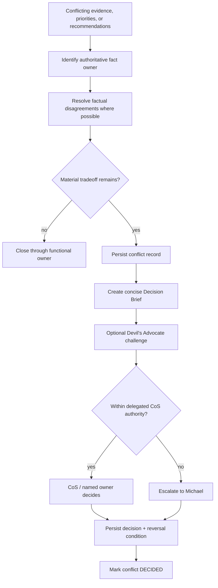

# Conflict Resolution

Phase 1 separates factual/source authority from cross-functional tradeoff authority. A conflict is a durable governance object, not a debate that disappears in chat history.

## Functional truth

Current domain authority mappings include:

- financial calculation -> CFO v1
- commercial evidence -> approved Mesh Revenue Intelligence source
- account qualification -> approved Mesh Revenue Intelligence source
- staffing feasibility -> COO v1
- marketing strategy -> CMO

The CoS coordinates these truths but does not replace them.

## Conflict and decision flow

## Durable records

A conflict record captures:

- conflict ID,
- task ID,
- summary,
- disputed points,
- status,
- creation time.

A decision record captures:

- decision ID,
- task ID and conflict link,
- decision owner,
- disposition,
- reversal condition,
- decision time.

Reversal conditions are mandatory for material decisions so the organization can distinguish a durable decision from an assumption that should be revisited when evidence changes.

## Decision Brief

When escalation is required, the CoS should compress the issue into:

- decision required,
- why now,
- known facts,
- material disagreement,
- options,
- CoS recommendation,
- primary risk,
- what would reverse the recommendation,
- approval/action requested.

The brief should reduce CEO cognitive load without hiding uncertainty or conflicting functional evidence.

## Devil's Advocate

The Devil's Advocate is an independent challenge function. It may test assumptions, evidence quality, downside cases, and reversal conditions. It never becomes the final decision owner merely because it raised the challenge.
