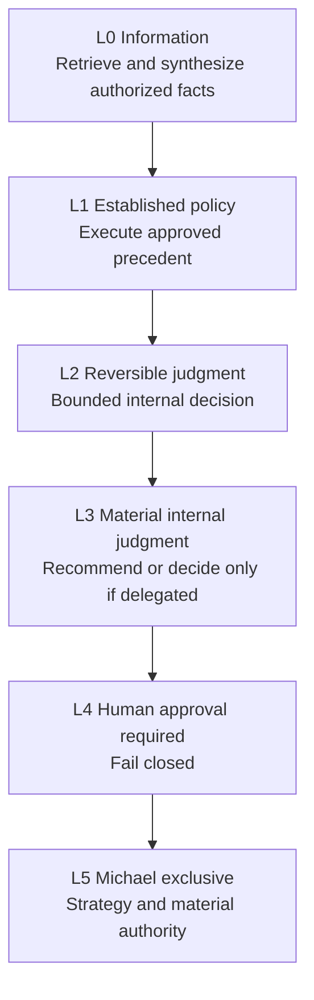
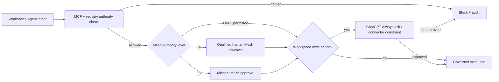
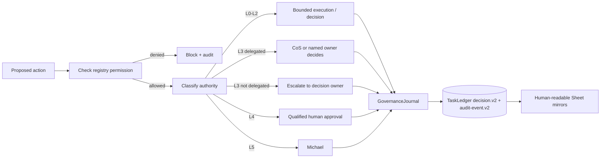

# Decision Rights

Phase 1 uses six authority levels, L0 through L5. Authority is explicit, cannot be self-expanded, and is enforced together with registry source/tool/action policy, approval requirements, explainable-decision logging, and Workspace Agent connector controls.

## Authority ladder

| Level | Default behavior | Decision logging |
|---|---|---|
| **L0** | Agent may retrieve/synthesize if source and requester permissions allow. | Audit the consequential access/action. Decision record only when a recommendation/choice is made. |
| **L1** | Agent may execute established approved policy and log the action. | Audit required; decision record when interpretation or recommendation is material. |
| **L2** | Agent may make reversible internal operating judgments inside explicit guardrails. | `decision.v2` required for material choices/recommendations. |
| **L3** | Agent recommends. CoS decides only where delegated; otherwise Michael or named owner decides. | `decision.v2` required, linked to evidence, alternatives, criteria, risk, confidence, and reversal conditions. |
| **L4** | Qualified human approval is required before execution. | `decision.v2` must include approval reference and named human approver before execution. |
| **L5** | Michael-exclusive unless the constitution is explicitly changed. | `decision.v2` must identify Michael as decision owner/approver and preserve the governance lineage. |

## Rules

- Authority is the maximum permission ceiling, not a requirement to exercise that authority.
- A delegated child cannot have more authority than its parent work package.
- Source or tool access never implies authority to make a consequential decision.
- Approval obligations cannot be delegated away.
- No agent may infer approval from historical preference or conversational tone.
- Monetary thresholds are not invented. If a threshold matters and is not configured, treat the action as approval-required.
- Devil's Advocate can challenge any material recommendation within scope but does not become the decision owner.
- Any agent that decides or makes a material recommendation must create an explainable `mesh.cos.decision.v2` record.
- Decision explainability records concise observable factors, evidence, alternatives, criteria, confidence, risk and reversal conditions, not hidden chain-of-thought.
- Superseding or reversing a decision does not delete its historical record.

## Workspace Agent write approvals

ChatGPT Workspace Agent write-action approval is an additional product-level control, not a substitute for Mesh decision rights. The checked-in Workspace Agent manifests default write actions to **Always ask**.

A Workspace approval click cannot grant authority that the Mesh registry denies, satisfy an L5 decision unless Michael is the authorized decision owner, remove an inherited approval obligation, or convert a prohibited action into a permitted one. Likewise, a recorded Mesh approval does not disable the Workspace Agent **Always ask** control unless a narrowly documented administrative exception is explicitly configured.

Connector Action Constraints in `chatgpt/workspace-agents/*.json` narrow app behavior further. For example, LinkedIn remains non-publishing for CRO/CMO/VP Content, Apollo is research-only for CRO, and Message Operations requires a matching recorded approval before any consequential send.

## Role identity, authority, and version provenance

Role identity, decision authority, and implementation version are independent governance dimensions:

- `agent_id` and canonical `display_name` identify who acted.
- `authority_level`, approval evidence, and registry policy establish what that role was allowed to decide or execute.
- `skill_agent_version`, model version, and repository release metadata establish which implementation produced the recommendation or action.
- A change in implementation version does not rename the organizational role or expand its authority.
- A change in accountable domain or authority must follow normal registry and L4/L5 change control, even if no software version changes.

For the Phase 1 functional executives, the stable names are CRO, CFO, COO, CMO, with Consultant Network Steward and VP Content as their defined specialist roles. Their current scopes are governed by `agents/registry.json`, not by title modifiers.

## Decision path

## Explainable decision minimum

For a material decision or recommendation, the record must identify:

1. the decision and accountable owner,
2. the authority level and approval evidence where applicable,
3. concise decision basis and authoritative evidence references,
4. viable alternatives and selection criteria,
5. confidence and risk,
6. affected entities and reversibility,
7. what would reverse or supersede the decision,
8. model/skill provenance for AI-generated recommendations,
9. outcome validation and current outcome state.

## Change control

Any authority or accountable-domain change requires corresponding registry, test, documentation, governance-policy, Workspace Agent manifest/Skill, MCP allowlist, and audit/version updates. Material authority expansion is itself a governed L5 decision and cannot be performed by the affected agent. Role-name changes are identity changes and must not be used as a shortcut for implementation versioning.

See `explainable-decisions-audit.md` for the canonical v2 fields and Google Sheets mirror controls.

<!-- mesh-cos-v2-shared-da -->
## v2.0.0 current architecture

The live Phase 1 runtime is a **10-agent** organization. The former repository-local Devil's Advocate agent and duplicate role Skill are removed. **Mesh Devil's Advocate** is an external **shared Skill** available only to Chief of Staff and CRO through governed Skill invocation. It is **advisory** only, cannot overwrite **canonical facts**, cannot execute external actions, and returns decision authority to the owning role or qualified human. `TaskLedger` remains canonical state; ChatGPT uses `LOCAL_STDIO` through `MCPRuntime` with deny-by-default allowlists, human-only approval/override paths, `check-chatgpt-packages.py` drift enforcement, and the 100% branch-aware coverage gate. Historical references to an 11-agent roster or a local Devil's Advocate role describe superseded releases only.

