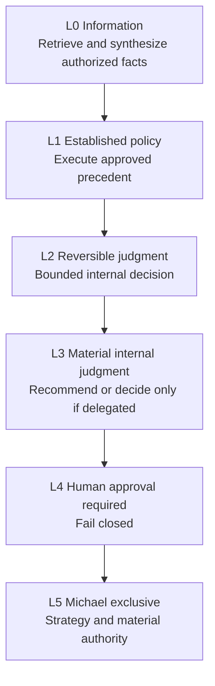
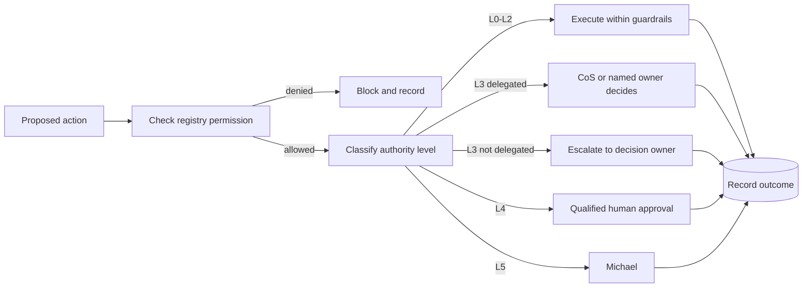

# Decision Rights

Phase 1 uses six authority levels, L0 through L5. Authority is explicit, cannot be self-expanded, and is enforced together with registry source/tool/action policy and approval requirements.

## Authority ladder

| Level | Default behavior | Examples |
|---|---|---|
| **L0** | Agent may act automatically if source and requester permissions allow. | Retrieval, factual synthesis, evidence collation. |
| **L1** | Agent may execute established approved policy and log the action. | Applying documented internal rules or precedent. |
| **L2** | Agent may make reversible internal operating judgments inside explicit guardrails. | Routing, sequencing, bounded prioritization. |
| **L3** | Agent recommends. CoS decides only where delegated; otherwise Michael or the named decision owner decides. | Material internal tradeoffs, pursuit recommendations. |
| **L4** | Qualified human approval is required before execution. | Consequential external/public action, material commercial commitments, personnel actions, destructive operations, sensitive legal/regulatory/security/privacy conclusions. |
| **L5** | Michael-exclusive unless the constitution is explicitly changed. | Firm strategy, major pivots/capital decisions, material client or partner exceptions, senior personnel decisions, CoS authority, decision-rights policy, material authority expansion. |

## Rules

- Authority is the maximum permission ceiling, not a requirement to exercise that authority.
- A delegated child cannot have more authority than its parent work package.
- Source or tool access never implies authority to make a consequential decision.
- Approval obligations cannot be delegated away.
- No agent may infer approval from historical preference or conversational tone.
- Monetary thresholds are not invented. If a threshold matters and is not configured, treat the action as approval-required.
- Devil's Advocate can challenge any material recommendation within scope but does not become the decision owner.

## Decision path

## Change control

Any authority change requires corresponding registry, test, documentation, and audit/version updates. Material authority expansion is itself a governed decision and cannot be performed by the affected agent.
