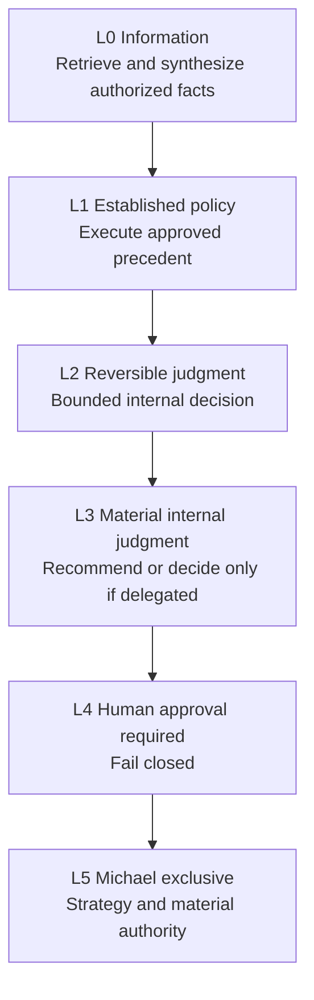
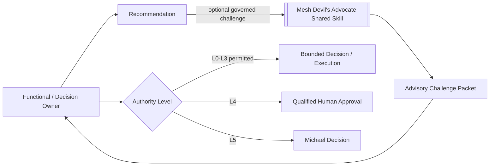
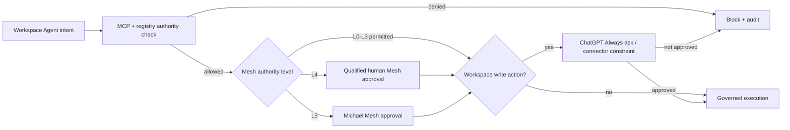
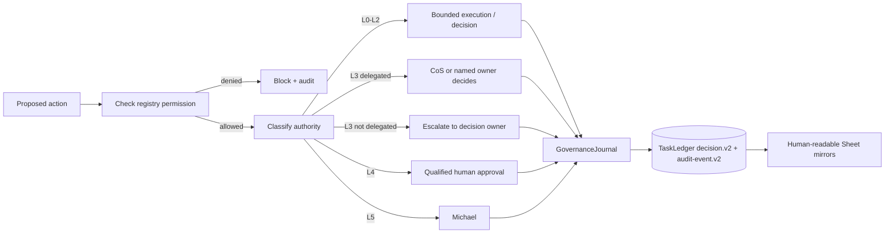

# Decision Rights

Phase 1 uses six authority levels, L0 through L5. Authority is explicit, cannot be self-expanded, and is enforced together with registry source/tool/action policy, approval requirements, explainable-decision logging, Workspace Agent connector controls, and shared-Skill boundaries.

## Authority ladder

| Level | Default behavior | Decision logging |
|---|---|---|
| **L0** | Agent may retrieve/synthesize if source and requester permissions allow. | Audit the consequential access/action. Decision record only when a recommendation/choice is made. |
| **L1** | Agent may execute established approved policy and log the action. | Audit required; decision record when interpretation or recommendation is material. |
| **L2** | Agent may make reversible internal operating judgments inside explicit guardrails. | `decision.v2` required for material choices/recommendations. |
| **L3** | Agent recommends. CoS decides only where delegated; otherwise Michael or named owner decides. | `decision.v2` required, linked to evidence, alternatives, criteria, risk, confidence, and reversal conditions. |
| **L4** | Qualified human approval is required before execution. | `decision.v2` must include approval reference and named human approver before execution. |
| **L5** | Michael-exclusive unless the constitution is explicitly changed. | `decision.v2` must identify Michael as decision owner/approver and preserve the governance lineage. |

## Rules

- Authority is the maximum permission ceiling, not a requirement to exercise that authority.
- A delegated child cannot have more authority than its parent work package.
- Source, tool, app, MCP, or shared-Skill access never implies authority to make a consequential decision.
- Approval obligations cannot be delegated away.
- No agent may infer approval from historical preference or conversational tone.
- Monetary thresholds are not invented. If a threshold matters and is not configured, treat the action as approval-required.
- The shared **Mesh Devil's Advocate** Skill may challenge a material recommendation only when invoked by Chief of Staff or CRO through the governed Skill path. It remains **advisory**, never becomes the task or decision owner, cannot modify canonical facts, cannot execute external actions, and cannot expand the caller's authority.
- Any registered agent that decides or makes a material recommendation must create an explainable `mesh.cos.decision.v2` record.
- Decision explainability records concise observable factors, evidence, alternatives, criteria, confidence, risk, and reversal conditions, not hidden chain-of-thought.
- Superseding or reversing a decision does not delete its historical record.

## Shared challenge and canonical fact ownership

Release `v2.0.0` contains **10 registered agent principals**. The former repository-local Devil's Advocate principal, role card, Workspace Agent manifest, MCP principal, and duplicate role Skill are removed. `mesh-devils-advocate` is an external shared capability for Chief of Staff and CRO only.

The challenge packet is evidence-bearing advisory input. It may test assumptions, interpretation, evidence sufficiency, routing, premortems, capacity, strategic coherence, and decision conditions. It does not create a competing source of truth.

For commercial work, Mesh Revenue Intelligence remains authoritative for canonical account identity, evidence classes, scores, stage, lifecycle, queue state, activation readiness, and prioritization. CFO remains authoritative for engagement finance and FP&A analysis. COO remains authoritative for delivery feasibility, capacity, and resource readiness. The shared challenge Skill cannot rewrite any of those functional facts.

## Workspace Agent write approvals

ChatGPT Workspace Agent write-action approval is an additional product-level control, not a substitute for Mesh decision rights. The checked-in Workspace Agent manifests default write actions to **Always ask**.

A Workspace approval click cannot grant authority that the Mesh registry denies, satisfy an L5 decision unless Michael is the authorized decision owner, remove an inherited approval obligation, or convert a prohibited action into a permitted one. Likewise, a recorded Mesh approval does not disable the Workspace Agent **Always ask** control unless a narrowly documented administrative exception is explicitly configured.

Connector Action Constraints in `chatgpt/workspace-agents/*.json` narrow app behavior further. For example, LinkedIn remains non-publishing for CRO/CMO/VP Content, Apollo is research-only for CRO, and Message Operations requires a matching recorded approval before any consequential send.

## Role identity, authority, and version provenance

Role identity, decision authority, and implementation version are independent governance dimensions:

- `agent_id` and canonical `display_name` identify who acted.
- `authority_level`, approval evidence, and registry policy establish what that role was allowed to decide or execute.
- `skill_agent_version`, model version, and repository release metadata establish which implementation produced the recommendation or action.
- A change in implementation version does not rename the organizational role or expand its authority.
- A change in accountable domain or authority must follow normal registry and L4/L5 change control, even if no software version changes.
- A shared Skill name does not create a durable agent identity or independent decision principal.

For the Phase 1 functional executives, the stable names are CRO, CFO, COO, CMO, with Consultant Network Steward and VP Content as their defined specialist roles. Their current scopes are governed by `agents/registry.json`, not by title modifiers.

## Decision path

## Explainable decision minimum

For a material decision or recommendation, the record must identify:

1. the decision and accountable owner,
2. the authority level and approval evidence where applicable,
3. concise decision basis and authoritative evidence references,
4. viable alternatives and selection criteria,
5. confidence and risk,
6. affected entities and reversibility,
7. what would reverse or supersede the decision,
8. model/skill provenance for AI-generated recommendations,
9. outcome validation and current outcome state.

A Devil's Advocate challenge packet may be referenced as supporting or dissenting evidence, but it is not itself an approval record or canonical-fact update.

## Change control

Any authority, accountable-domain, agent-principal, or shared-capability-entitlement change requires corresponding registry, test, documentation, governance-policy, Workspace Agent manifest/Skill, MCP allowlist, and audit/version updates. Material authority expansion is itself a governed L5 decision and cannot be performed by the affected agent. Role-name changes are identity changes and must not be used as a shortcut for implementation versioning.

See `explainable-decisions-audit.md` for the canonical v2 fields and Google Sheets mirror controls.
