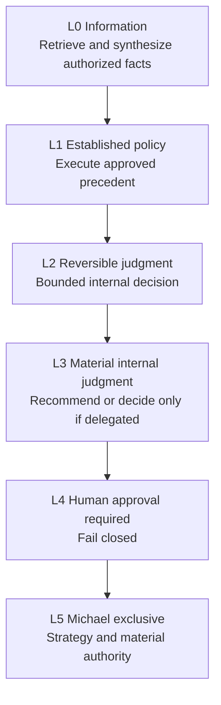
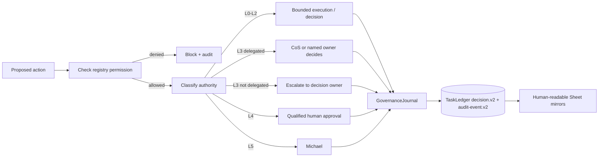

# Decision Rights

Phase 1 uses six authority levels, L0 through L5. Authority is explicit, cannot be self-expanded, and is enforced together with registry source/tool/action policy, approval requirements, and explainable-decision logging.

## Authority ladder

| Level | Default behavior | Decision logging |
|---|---|---|
| **L0** | Agent may retrieve/synthesize if source and requester permissions allow. | Audit the consequential access/action. Decision record only when a recommendation/choice is made. |
| **L1** | Agent may execute established approved policy and log the action. | Audit required; decision record when interpretation or recommendation is material. |
| **L2** | Agent may make reversible internal operating judgments inside explicit guardrails. | `decision.v2` required for material choices/recommendations. |
| **L3** | Agent recommends. CoS decides only where delegated; otherwise Michael or named owner decides. | `decision.v2` required, linked to evidence, alternatives, criteria, risk, confidence, and reversal conditions. |
| **L4** | Qualified human approval is required before execution. | `decision.v2` must include approval reference and named human approver before execution. |
| **L5** | Michael-exclusive unless the constitution is explicitly changed. | `decision.v2` must identify Michael as decision owner/approver and preserve the governance lineage. |

## Rules

- Authority is the maximum permission ceiling, not a requirement to exercise that authority.
- A delegated child cannot have more authority than its parent work package.
- Source or tool access never implies authority to make a consequential decision.
- Approval obligations cannot be delegated away.
- No agent may infer approval from historical preference or conversational tone.
- Monetary thresholds are not invented. If a threshold matters and is not configured, treat the action as approval-required.
- Devil's Advocate can challenge any material recommendation within scope but does not become the decision owner.
- Any agent that decides or makes a material recommendation must create an explainable `mesh.cos.decision.v2` record.
- Decision explainability records concise observable factors, evidence, alternatives, criteria, confidence, risk and reversal conditions, not hidden chain-of-thought.
- Superseding or reversing a decision does not delete its historical record.

## Decision path

## Explainable decision minimum

For a material decision or recommendation, the record must identify:

1. the decision and accountable owner,
2. the authority level and approval evidence where applicable,
3. concise decision basis and authoritative evidence references,
4. viable alternatives and selection criteria,
5. confidence and risk,
6. affected entities and reversibility,
7. what would reverse or supersede the decision,
8. model/skill provenance for AI-generated recommendations,
9. outcome validation and current outcome state.

## Change control

Any authority change requires corresponding registry, test, documentation, governance-policy, and audit/version updates. Material authority expansion is itself a governed L5 decision and cannot be performed by the affected agent.

See `explainable-decisions-audit.md` for the canonical v2 fields and Google Sheets mirror controls.
