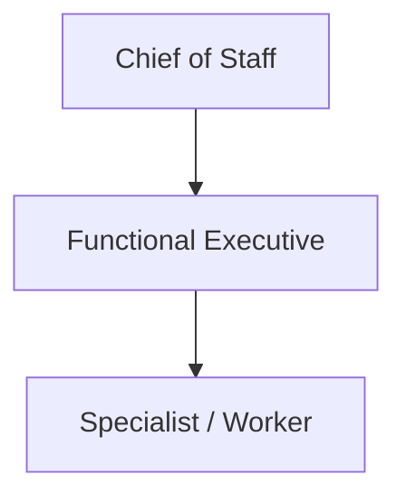
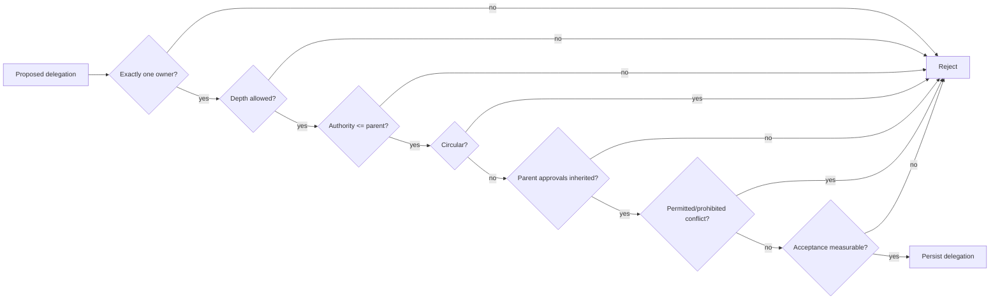

# Delegation Model

Delegation is a durable work contract, not an informal chat handoff. The Phase 1 runtime validates delegation rules before persisting a delegated work package.

## Normal hierarchy

Normal depth is limited to two levels below CoS. Deeper recursive agent trees and swarms are outside the Phase 1 operating model.

## Required contract content

A delegation must specify:

- delegation ID and task ID,
- delegating agent,
- exactly one accountable agent,
- business objective and expected outcome,
- deliverable,
- measurable success criteria,
- priority,
- authority level,
- acceptance test,
- parent task where applicable,
- contributors,
- deadline and next check where applicable,
- evidence supplied and unresolved evidence,
- constraints,
- permitted actions,
- prohibited actions,
- approval gates,
- dependencies,
- escalation condition.

## Enforcement rules

The service enforces the following constitutional rules:

1. An accountable agent is mandatory.
2. The accountable agent cannot also be listed as a contributor to the same delegation.
3. Delegation depth cannot exceed the Phase 1 limit.
4. Child authority cannot exceed parent authority.
5. Circular delegation is rejected.
6. Active ownership cannot be silently replaced when the validation context specifies the current owner.
7. Measurable success criteria and an acceptance test are required.
8. Parent approval obligations must be inherited.
9. The same action cannot be both permitted and prohibited.
10. The delegation record is persisted to canonical state after validation.

## Reassignment and remediation

Reassignment is not a deletion of history. Existing delegation and audit state must remain reconstructable. If verification fails, the work routes to `REWORK`; a new or revised delegation may be created with the same parent objective and preserved approval obligations.

## Authority and evidence

Delegation transfers responsibility for a bounded work package, not source authority. A functional worker may gather or analyze evidence, but the authoritative owner of a fact remains the source/domain owner defined by policy.

The shared **Mesh Devil's Advocate** capability is not a delegated agent. It is an external shared Skill invoked through governed Skill execution by Chief of Staff or CRO. Its challenge packet is advisory only, does not become a work owner, cannot overwrite canonical facts, and returns decision authority to the owning role or qualified human.

<!-- mesh-cos-v2-shared-da -->
## v2.0.0 current architecture

The live Phase 1 runtime is a **10-agent** organization. The former repository-local Devil's Advocate agent and duplicate role Skill are removed. **Mesh Devil's Advocate** is an external **shared Skill** available only to Chief of Staff and CRO through governed Skill invocation. It is **advisory** only, cannot overwrite **canonical facts**, cannot execute external actions, and returns decision authority to the owning role or qualified human. `TaskLedger` remains canonical state; ChatGPT uses `LOCAL_STDIO` through `MCPRuntime` with deny-by-default allowlists, human-only approval/override paths, `check-chatgpt-packages.py` drift enforcement, and the 100% branch-aware coverage gate. Historical references to an 11-agent roster or a local Devil's Advocate role describe superseded releases only.
