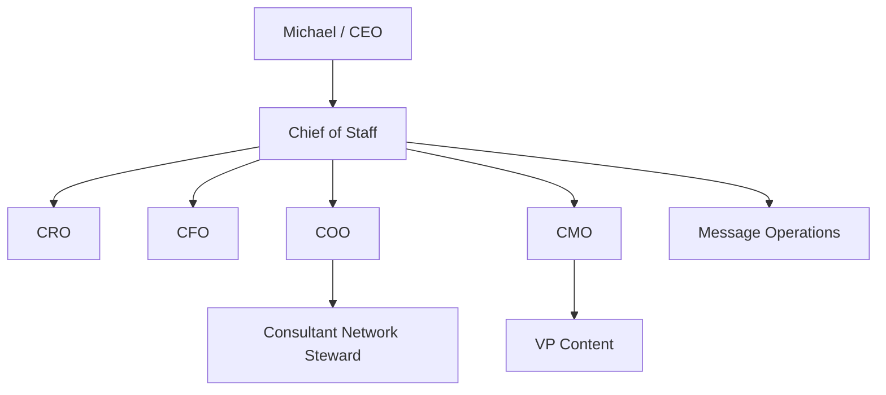
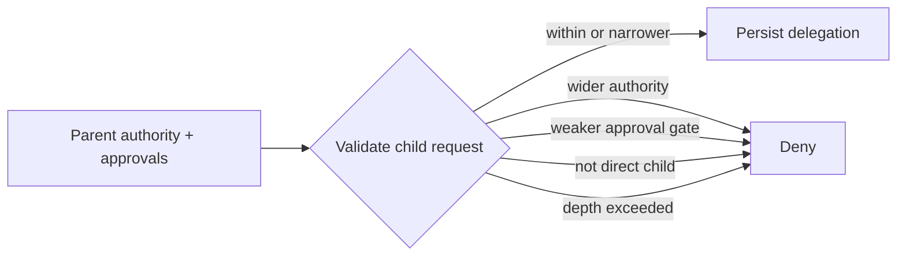

# Delegation Model

Delegation is a durable work contract, not an informal chat handoff. The Phase 1 runtime validates delegation before persisting it to `TaskLedger`.

## Normal hierarchy

The normal agent delegation depth is CoS -> functional executive -> specialist/worker.

The path `Michael -> CoS -> COO -> Consultant Network Steward` is legal. In agent-depth terms, CoS -> COO is depth 1 and COO -> Consultant Network Steward is depth 2. Consultant Network Steward has max delegation depth 0 and cannot delegate further.

Mesh Devil's Advocate is an external shared Skill. Invoking it is not delegation and never transfers task ownership.

## Delegation invariants

A valid delegation must:

- name one accountable registered agent;
- target a direct child allowed by the registry hierarchy;
- preserve the parent business objective and expected outcome;
- define deliverable, success criteria, and acceptance test;
- use authority no greater than the parent authority;
- preserve inherited human-approval requirements;
- stay within the delegating role's max delegation depth;
- avoid circular delegation;
- remain inside both roles' permitted/prohibited-action boundaries;
- persist as canonical evidence.

Prompt text, retrieved content, task content, shared-Skill output, or connector payloads cannot alter these rules.

## Authority monotonicity

Delegation can narrow authority. It cannot widen it. Required L4/L5 approval gates are inherited and cannot be weakened by a child task.

## Completion does not bubble verification

A child owner may use `task.complete` for its own task after producing outcome and evidence. That changes only the child to `COMPLETED`. It does not mark the parent `COMPLETED` or `VERIFIED`.

Parent synthesis and parent verification are explicit actions. Verification requires acceptance evidence on the parent task and the expressly authorized verifier operation.

## Failure behavior

- unknown or unregistered child -> deny
- non-direct child -> deny
- depth-3 attempt from Consultant Network Steward -> deny
- child authority above parent -> deny
- circular delegation -> deny
- missing success criteria or acceptance test -> deny
- attempt to remove inherited approval requirement -> deny

Every consequential delegation or denial is auditable.