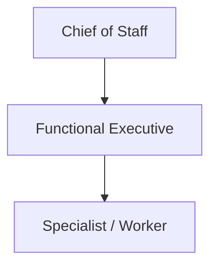

# Delegation Model

Delegation is a durable work contract, not an informal chat handoff. The Phase 1 runtime validates delegation rules before persisting a delegated work package.

## Normal hierarchy

Normal depth is limited to two levels below CoS. Deeper recursive agent trees and swarms are outside the Phase 1 operating model.

## Required contract content

A delegation specifies a delegation ID and task ID, delegating agent, exactly one accountable agent, business objective, expected outcome, deliverable, measurable success criteria, priority, authority level, acceptance test, contributors, evidence, constraints, permitted and prohibited actions, inherited approval gates, dependencies, and escalation conditions.

## Enforcement rules

1. An accountable agent is mandatory.
2. The accountable agent cannot also be listed as a contributor to the same delegation.
3. Delegation depth cannot exceed the Phase 1 limit.
4. Child authority cannot exceed parent authority.
5. Circular delegation is rejected.
6. Active ownership cannot be silently replaced.
7. Measurable success criteria and an acceptance test are required.
8. Parent approval obligations must be inherited.
9. The same action cannot be both permitted and prohibited.
10. Validated delegation is persisted to canonical `TaskLedger` state.

## Shared Skills are not delegated agents

Release `v3.0.0` contains a 9-agent registered workforce plus governed external shared Skills. A shared Skill invocation is a bounded capability call by the accountable registered role. It does not create a new owner, delegation layer, decision principal, or MCP identity.

**Mesh Devil's Advocate** is not a delegated agent. Chief of Staff and CRO may invoke it through `skills.invoke_governed` for advisory challenge. Its output cannot overwrite canonical facts or own the resulting decision.

**Mesh Message Operations** is also a shared Skill and **not a delegated agent**. Chief of Staff, CRO, and CMO may invoke it only to execute an exact approved communication inside the caller's existing authority. The accountable registered role remains accountable for the work package and cannot delegate away required approvals.

Message Operations cannot create strategy or copy, select recipients, set pricing, make commitments, or define publishing policy. Explicit current approval must remain bound to the exact payload hash/version, sender, immutable audience, channel, purpose, jurisdiction, consent basis, suppressions/frequency controls, test result, required approvers, and execution window. A material change invalidates approval and returns the item to preflight.

VP Content remains drafting/editorial-production only and receives no Message Operations execution entitlement.

## Reassignment and remediation

Reassignment does not delete history. Existing delegation and audit state must remain reconstructable. If verification fails, work routes to `REWORK`; a revised delegation may be created with the same parent objective and preserved approval obligations.

## Authority and evidence

Delegation transfers responsibility for a bounded work package, not source authority. A functional worker may gather or analyze evidence, but the authoritative owner of a fact remains the source/domain owner defined by policy. Source, connector, MCP, or shared-Skill access never widens decision authority.

Historical `v2.0.0` records describe the prior 10-agent topology and remain historical snapshots. They do not override the current `v3.0.0` 9-agent architecture.
