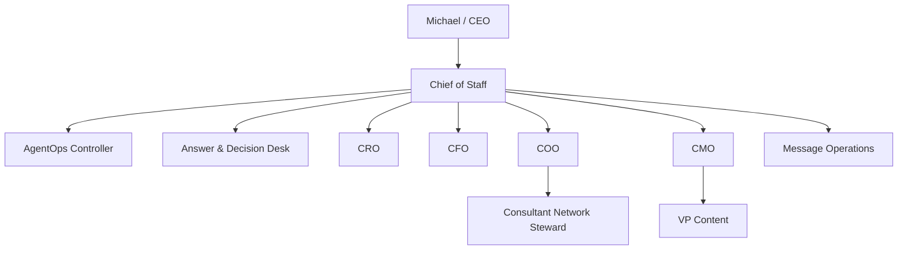
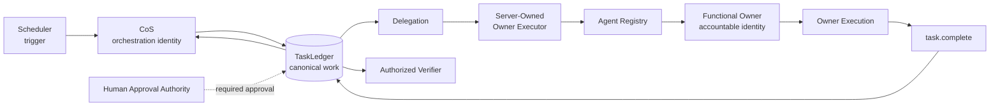
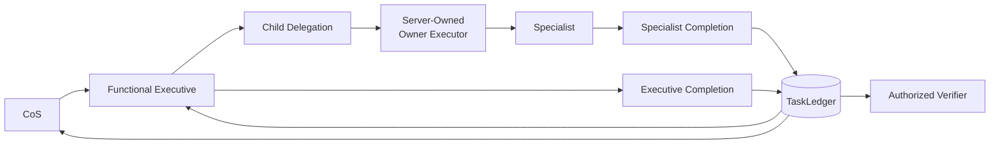
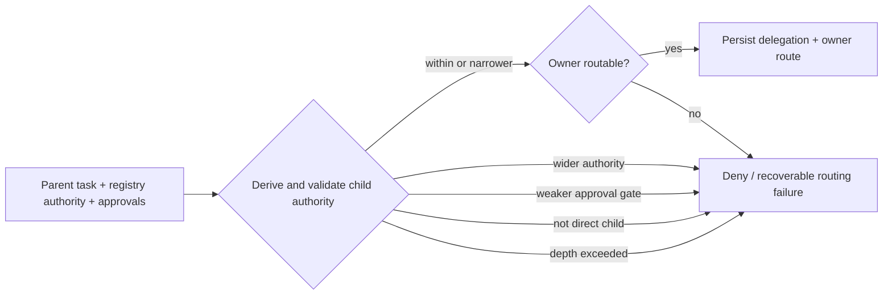

# Delegation Model

Delegation is a durable work and execution contract, not an informal chat handoff and not ownership metadata alone. The Phase 1 runtime validates both the canonical delegation relationship and the target owner's executable path before persistence.

## Normal hierarchy



The hierarchy is resolved from the canonical Agent Registry at runtime. The diagram describes the current registry, not a hard-coded router.

The normal agent delegation depth is CoS -> functional executive/controller/operations owner -> specialist/worker where the registry permits it.

The path `Michael -> CoS -> COO -> Consultant Network Steward` is legal. In agent-depth terms, CoS -> COO is depth 1 and COO -> Consultant Network Steward is depth 2. Consultant Network Steward has max delegation depth 0 and cannot delegate further.

Mesh Devil's Advocate is an external shared Skill. Invoking it is not delegation and never transfers task ownership.

## Closed-loop delegation protocol

A successful `delegation.create` must establish executable work, not merely a TaskLedger relationship.

```text
DELEGATION_CREATED
-> OWNER_ROUTABLE
-> OWNER_EXECUTING
-> OWNER_RESULT_RECORDED
-> OWNER_COMPLETED when task.complete succeeds
-> PARENT_OBSERVABLE
-> VERIFICATION_ELIGIBLE
```

Routing state supplements the canonical task lifecycle. It does not replace TaskLedger task state.

If the target owner cannot execute, delegation fails closed before persistence or produces an explicit recoverable owner-routing failure. The system does not silently create work that no authenticated owner can finish.

## Direct owner execution



The executor derives the acting owner from canonical delegation and task state. The caller cannot select an arbitrary principal.

## Nested owner execution



Current permitted examples include `cos -> cmo -> vp-content` and `cos -> coo -> consultant-network-steward`. The same registry-driven mechanism applies to future governed agents.

## Delegation invariants

A valid delegation must:

- name one accountable registered agent;
- target a direct child allowed by the canonical registry hierarchy;
- correspond to a canonical child task owned by that agent;
- correspond to a canonical parent task owned by the delegating agent;
- preserve the parent business objective and expected outcome;
- define deliverable, success criteria, and acceptance test;
- use task authority no greater than the parent authority;
- preserve inherited human-approval requirements;
- add the target owner's required approvals;
- stay within the delegating role's registry-derived max delegation depth;
- avoid circular delegation;
- remain inside the target owner's permitted actions and prohibited-action boundaries;
- verify the target owner is ACTIVE, routable, and has the owner lifecycle surface;
- persist as canonical evidence only after these controls pass.

Prompt text, retrieved content, task content, shared-Skill output, connector payloads, model output, and client-supplied identity hints cannot alter these rules.

## Authority monotonicity



Delegation can narrow authority. It cannot widen it. Required L4/L5 approval gates are inherited and cannot be weakened by a child task.

Client `depth`, `ancestry`, `parent_authority`, and `active_owner` values are compatibility assertions only. Where present, they must equal canonical server-derived state and cannot create authority.

## Identity invariant

Delegation transfers bounded work authority. Delegation does not transfer identity.

- CoS cannot impersonate a direct report.
- Functional executives cannot impersonate specialists.
- Specialists cannot inherit executive-only authority.
- Prompt/task/retrieved/model content cannot change the runtime principal.
- The server-owned executor derives the owner from canonical task/delegation state and re-applies that owner's MCP allowlist before execution.

Authoritative owner lifecycle writes require the canonical task owner. A parent orchestrator cannot directly transition, check in, or complete child work merely because it created the delegation.

## Completion does not bubble verification

A child owner may use `task.complete` for its own task after producing outcome and evidence. That changes only the child to `COMPLETED`. It does not mark the parent `COMPLETED` or `VERIFIED`.

Parent synthesis, parent completion, and independent verification are explicit actions. Verification requires acceptance evidence and an expressly authorized verifier operation.

`COMPLETED != VERIFIED` remains a mandatory invariant.

## Idempotency and replay

Owner execution uses a server-persisted idempotency claim. The key is bound to a fingerprint of delegation, task, operation, and validated arguments.

- exact retry after success returns the canonical prior result;
- same key with different request content is rejected;
- duplicate completion is not re-executed;
- ambiguous failed execution is not blindly retried.

This prevents retry from becoming a consequential duplicate-effect path.

## Failure behavior

- unknown or unregistered child -> deny
- non-direct child -> deny
- missing/mismatched canonical parent or child task -> deny
- child task owner differs from delegation owner -> deny
- depth attempt outside registry authority -> deny
- child authority above parent -> deny
- circular delegation -> deny
- missing success criteria or acceptance test -> deny
- attempt to remove inherited approval requirement -> deny
- attempt to grant target actions not present in target registry authority -> deny
- owner disabled/quarantined/unavailable -> fail closed with actionable routing classification
- owner lifecycle transport missing -> fail production readiness
- parent direct child completion -> deny
- caller-supplied principal substitution -> deny
- cross-task/cross-sibling executor use -> deny

Owner-routing failures record canonical task, parent task, delegation, orchestrator, accountable owner, expected/actual principal, state, attempted operation, authorization result, failure classification, retry eligibility, and remediation path.

Every consequential delegation and owner execution is auditable. See `pf-057-cross-agent-owner-execution.md` for the full architecture and recovery contract.
