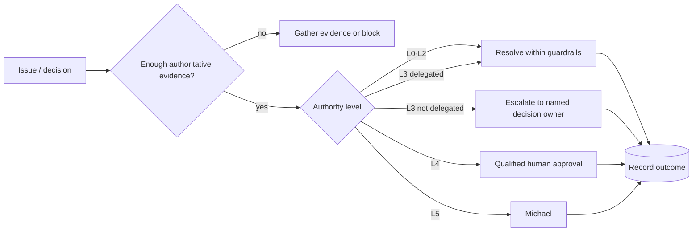

# Escalation Policy

Escalation exists to protect Michael's attention while ensuring material authority remains human-owned. The CoS should resolve bounded cross-functional operating issues independently and escalate only when the decision exceeds its authority, requires a human consequence boundary, or cannot be resolved from authoritative evidence.

## Escalation flow

## Escalate to Michael when

- the matter is L5 by policy,
- a material L3 decision has not been delegated to the CoS or another owner,
- a required L4 approval is specifically Michael's responsibility,
- conflicting functional truths create a strategic or material client/partner tradeoff beyond delegated authority,
- the agent organization would need a material authority expansion to proceed,
- evidence is materially incomplete and proceeding would create unacceptable consequence.

## Do not escalate merely because

- a task is routine but time-consuming,
- an agent is capable of completing authorized L0-L2 work,
- a reversible internal operating choice can be made inside guardrails,
- more analysis could make a recommendation cosmetically more complete,
- an agent is uncertain but can resolve the uncertainty from authorized sources.

## Decision Brief standard

Escalations should be compressed into a concise Decision Brief containing the decision required, why now, known facts, material disagreement, options, recommendation, primary risk, reversal condition, and explicit action/approval requested.

## Failure and performance escalation

AgentOps may recommend `WATCH`, `RESTRICT`, or `QUARANTINE` based on performance evidence. Critical-severity defects should be treated as a strong quarantine signal. Authority restoration or expansion follows governance and cannot be self-approved by the affected agent.
