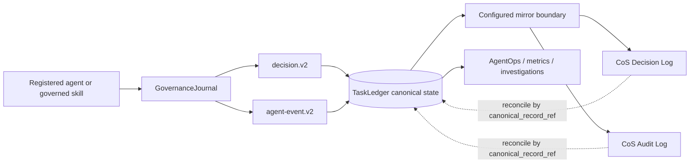
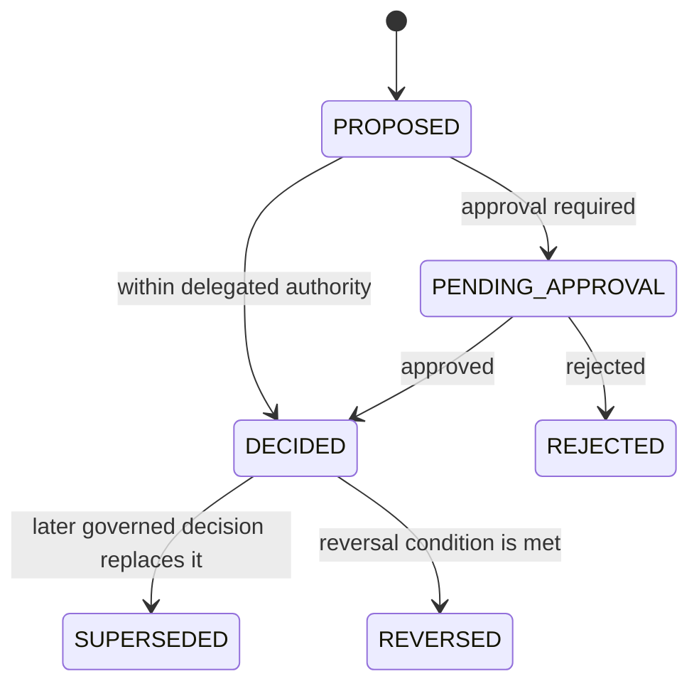

# Explainable Decisions and Audit Governance

## Purpose

Every registered agent operates under a shared governance policy for explainable decisions and auditable actions. The objective is accountability and traceability without persisting private chain-of-thought, secrets, raw credentials, or unnecessary personal data.

`TaskLedger` remains canonical. The Google Sheets **CoS Decision Log** and **CoS Audit Log** are human-readable operational mirrors for governance review, filtering, investigation, and reconciliation.

## Governance architecture

Canonical-first write order is mandatory. A mirror failure cannot erase or roll back a canonical governance record. Mirror failures are themselves persisted as governance failure records for remediation.

## Explainable decision contract

`mesh.cos.decision.v2` records the externally reviewable basis for a material decision or recommendation. It captures:

- decision identity, lifecycle status, type, title, task and correlation IDs,
- recommending/acting agent, accountable decision owner, and L0-L5 authority,
- human-approval requirement, approval reference, and approver where applicable,
- decision and disposition,
- concise decision-basis summary,
- evidence references and authoritative source systems,
- alternatives considered and selection criteria,
- calibrated confidence, risk, affected entities, and reversibility,
- reversal condition and applicable policy/rule identifiers,
- model, prompt-template, and skill/agent provenance when AI is involved,
- data classification, outcome validation, outcome status, review timing, and retention class,
- supersession lineage, canonical record reference, record hash, and record timestamp.

The basis summary describes observable factors and evidence. It must not contain hidden reasoning traces or private chain-of-thought.

## Audit event contract

`mesh.cos.agent-event.v2` is the common consequential-event envelope. It captures:

- globally unique event ID and monotonic sequence,
- UTC event timestamp, semantic event type/category, and action,
- actor type, actor ID, and actor role,
- task, correlation, decision, parent-event, and run identifiers,
- authority level and policy/rule IDs,
- capability/tool, target resource, and source system,
- concise input and output summaries,
- result status, before/after references, evidence and approval references,
- human approver where applicable,
- risk severity, data classification, error code/summary, and idempotency key,
- model and skill/agent provenance,
- environment and retention class,
- previous-event hash, event hash, canonical record reference, and record timestamp.

The hash chain is **tamper-evident**, not tamper-proof. `verify_audit_chain()` detects record mutation or chain discontinuity in the canonical event sequence.

## Identity and implementation provenance

Governance records keep organizational identity separate from implementation provenance:

- `agent_id` is the durable machine identity.
- `agent_role` and `actor_role` use the canonical stable organizational role name from the Agent Registry.
- `skill_agent_version` carries the agent or skill implementation version that produced the recommendation/action.
- `model_provider` and `model_id_version` carry model provenance independently.
- repository release metadata identifies the deployed control-plane release.

Do not encode software maturity or version labels into `agent_role`, `actor_role`, or the registry `display_name`. An implementation upgrade must remain attributable without making the same organizational role appear to be a different governance actor. A true role-identity change is a governed registry change and should itself generate an auditable change event.

## Cross-agent policy

`config/governance-policy.v1.json` is applied to every record returned by the runtime Agent Registry. Every registered agent therefore receives:

- `governance-journal` as a governed runtime tool,
- `agent-event.v2` as an output contract,
- `decision.v2` as an output contract,
- audit logging marked `REQUIRED`,
- decision logging marked `REQUIRED_WHEN_DECIDING_OR_RECOMMENDING`.

The governed skill adapter emits v2 audit events for successful and failed skill/tool invocations. Existing v1 audit producers are dual-written through the TaskLedger compatibility bridge so legacy code remains auditable while migration proceeds.

## Google Sheets operational mirrors

Configuration is versioned in `config/governance-logs.v1.json`.

### CoS Decision Log

Spreadsheet ID: `1IJcwPuulqsNAa1lCW2MsmNgH6Vm5INPqTlcH4NR0xpw`  
Primary tab: `Decision Log`  
Supporting tabs: `Schema`, `Reference`

The sheet mirrors `decision.v2` fields in a filterable, frozen-header register. It is intended for decision review, lineage, approval checks, outcome review, and governance reporting.

### CoS Audit Log

Spreadsheet ID: `1T8vKx4gaUJdeG8kSc18MsBbXpY4EbDF3exZ0RGpvND0`  
Primary tab: `Audit Log`  
Supporting tabs: `Schema`, `Reference`

The sheet mirrors `agent-event.v2` fields and includes the audit hash-chain metadata. It is intended for incident investigation, agent activity review, control verification, and reconciliation.

No Google credentials, OAuth tokens, service-account secrets, or personal authentication material may be committed in repository configuration.

## Decision lifecycle

L4/L5 decisions fail closed without explicit approval evidence. L5 remains Michael-exclusive under the existing decision-rights constitution.

## Privacy and explainability boundary

Persist concise rationale summaries, evidence references, source provenance, criteria, alternatives, confidence, risk, authority, approval evidence, and outcome evidence. Do not persist:

- private chain-of-thought or hidden reasoning traces,
- raw prompts containing sensitive context when a summary/reference is sufficient,
- passwords, API keys, OAuth tokens, signing secrets, or credentials,
- unnecessary personal data,
- copied restricted evidence when a governed reference is sufficient.

## Operations and reconciliation

1. Write the canonical decision/event to `TaskLedger`.
2. Compute and persist record/hash metadata.
3. Attempt the configured human-readable mirror.
4. If the mirror fails, preserve canonical state and create a durable mirror-failure record.
5. Reconcile sheet rows to the canonical record using `canonical_record_ref` and IDs.
6. Retain superseded/reversed decisions and historical audit events. Do not silently overwrite governance history.
7. AgentOps may use decision outcomes and audit events as evidence, but may not change authority through performance scoring.
8. Preserve stable role identity while recording implementation/model versions in their dedicated provenance fields.

## Standards alignment

The design follows the project's explicit accountability, provenance, least-privilege, approval, and audit principles and is informed by NIST AI Risk Management Framework transparency/accountability practices and NIST SP 800-53 Audit and Accountability controls. Repository policy remains authoritative for Mesh decision rights and operating boundaries.
