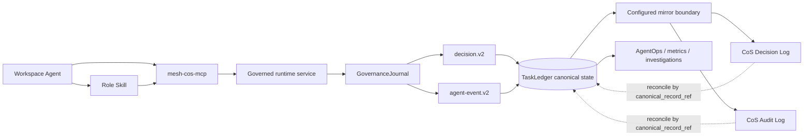
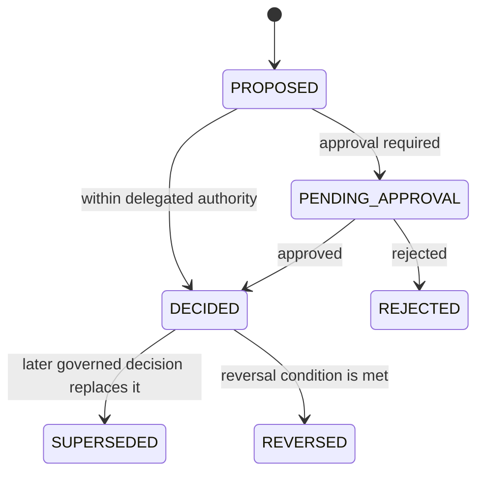

# Explainable Decisions and Audit Governance

## Purpose

Every registered agent operates under a shared governance policy for explainable decisions and auditable actions. This includes execution through the Python runtime, governed Mesh Skills, and ChatGPT Workspace Agents. The objective is accountability and traceability without persisting private chain-of-thought, secrets, raw credentials, or unnecessary personal data.

`TaskLedger` remains canonical. The Google Sheets **CoS Decision Log** and **CoS Audit Log** are human-readable operational mirrors for governance review, filtering, investigation, and reconciliation. ChatGPT conversations and Workspace Agent history are interaction surfaces, not canonical governance storage.

## Governance architecture

Canonical-first write order is mandatory. A Workspace Agent response, Slack post, or Sheet row must not be treated as proof that a canonical decision/event exists. Mirror or response-delivery failure cannot erase canonical governance records and should generate a durable failure record when consequential.

## Explainable decision contract

`mesh.cos.decision.v2` records the externally reviewable basis for a material decision or recommendation. It captures:

- decision identity, lifecycle state/type/title, task and correlation IDs,
- recommending/acting `agent_id`, stable `agent_role`, accountable decision owner, and L0-L5 authority,
- human-approval requirement, approval reference, and approver where applicable,
- decision/disposition and concise decision-basis summary,
- evidence references and authoritative source systems,
- alternatives considered and selection criteria,
- calibrated confidence, risk, affected entities, and reversibility,
- reversal condition and policy/rule identifiers,
- model, prompt-template, and Skill/agent implementation provenance,
- data classification, outcome validation/status, review timing, and retention class,
- supersession lineage, canonical record reference, record hash, and record timestamp.

The basis summary describes observable factors and evidence. It must not contain hidden reasoning traces or private chain-of-thought.

## Audit event contract

`mesh.cos.agent-event.v2` is the common consequential-event envelope. It captures:

- globally unique event ID and monotonic sequence,
- UTC event timestamp, semantic event type/category, and action,
- actor type, actor ID, and stable actor role,
- task, correlation, decision, parent-event, and run identifiers,
- authority level and policy/rule IDs,
- capability/tool, target resource, and source system,
- concise input/output summaries and result status,
- before/after references, evidence/approval references, and human approver where applicable,
- risk severity, data classification, error metadata, and idempotency key,
- model and Skill/agent implementation provenance,
- environment and retention class,
- previous-event hash, event hash, canonical record reference, and record timestamp.

The hash chain is **tamper-evident**, not tamper-proof. `verify_audit_chain()` detects record mutation or chain discontinuity in the canonical event sequence.

## Workspace Agent provenance

Workspace Agent execution adds product/runtime provenance without changing the decision schema's explainability boundary:

- `agent_id` remains the durable canonical actor identity from `agents/registry.json`.
- `agent_role` / `actor_role` remain the stable organizational role name.
- `skill_agent_version` identifies the role Skill or agent implementation version when available.
- `model_provider` and `model_id_version` capture model provenance independently.
- MCP tool/capability identity is captured in the audit event's capability/tool fields.
- Workspace Agent/API/Slack run or trigger identifiers should be preserved through `run_id`, `correlation_id`, or evidence references when available.
- Repository release `0.2.0` identifies the deployment-contract version that defined the Workspace Agent manifests and MCP surface.

Do not encode software maturity/version labels into `agent_role`, `actor_role`, or registry `display_name`. An implementation upgrade must remain attributable without creating a false new organizational actor.

## Workspace Agent decisions and actions

A Workspace Agent that makes a material recommendation must write `decision.v2` through `GovernanceJournal`/`mesh-cos-mcp` before treating the recommendation as governed state. Consequential MCP/app activity must be represented in `agent-event.v2` according to the shared policy.

For app writes, the audit record should include the target system/channel/resource, approval reference when required, result status, and enough evidence to reconstruct what happened without copying restricted content unnecessarily. Message Operations sends should link the exact canonical approval record and the approved outbound artifact.

ChatGPT Workspace **Always ask** approvals are defense in depth. They do not replace the canonical L4/L5 approval evidence required in `decision.v2` or approval records.

## Identity and implementation provenance

Governance records keep organizational identity separate from implementation provenance:

- `agent_id` is the durable machine identity.
- `agent_role` and `actor_role` use the canonical stable organizational role name from the Agent Registry.
- `skill_agent_version` carries the agent/Skill implementation version that produced the recommendation/action.
- model provenance remains separate.
- repository release metadata identifies the deployed control-plane/deployment-contract release.

A true role-identity change is a governed registry change and should itself generate an auditable change event.

## Cross-agent policy

`config/governance-policy.v1.json` is applied to every record returned by the runtime Agent Registry. Every registered agent receives:

- `governance-journal` as a governed runtime tool,
- `agent-event.v2` as an output contract,
- `decision.v2` as an output contract,
- audit logging marked `REQUIRED`,
- decision logging marked `REQUIRED_WHEN_DECIDING_OR_RECOMMENDING`.

Workspace Agent Skills/manifests repeat these requirements for product-layer clarity, but the runtime policy remains authoritative. The governed adapter emits v2 audit events for successful and failed Skill/tool invocations. Existing v1 audit producers continue through the compatibility bridge.

## Google Sheets operational mirrors

Configuration is versioned in `config/governance-logs.v1.json`.

### CoS Decision Log

Spreadsheet ID: `1IJcwPuulqsNAa1lCW2MsmNgH6Vm5INPqTlcH4NR0xpw`  
Primary tab: `Decision Log`  
Supporting tabs: `Schema`, `Reference`

The sheet mirrors `decision.v2` for decision review, lineage, approval checks, outcome review, and governance reporting.

### CoS Audit Log

Spreadsheet ID: `1T8vKx4gaUJdeG8kSc18MsBbXpY4EbDF3exZ0RGpvND0`  
Primary tab: `Audit Log`  
Supporting tabs: `Schema`, `Reference`

The sheet mirrors `agent-event.v2`, including audit hash-chain metadata, for incident investigation, agent activity review, control verification, and reconciliation.

No Google credentials, OAuth tokens, service-account secrets, or personal authentication material may be committed in repository configuration.

## Decision lifecycle

L4/L5 decisions fail closed without explicit approval evidence. L5 remains Michael-exclusive under the decision-rights constitution.

## Privacy and explainability boundary

Persist concise rationale summaries, evidence references, source provenance, criteria, alternatives, confidence, risk, authority, approval evidence, and outcome evidence. Do not persist:

- private chain-of-thought or hidden reasoning traces,
- raw prompts containing sensitive context when a summary/reference is sufficient,
- passwords, API keys, OAuth tokens, signing secrets, MCP credentials, or other credentials,
- unnecessary personal data,
- copied restricted evidence when a governed reference is sufficient.

## Operations and reconciliation

1. Write the canonical decision/event to `TaskLedger`.
2. Compute and persist record/hash metadata.
3. Return the governed result to the Workspace Agent and attempt configured mirrors.
4. If a mirror or consequential response delivery fails, preserve canonical state and record the failure.
5. Reconcile Sheet rows using `canonical_record_ref` and IDs.
6. Retain superseded/reversed decisions and historical audit events.
7. AgentOps may use decision outcomes/audit events as evidence but may not change authority through performance scoring.
8. Preserve stable role identity while recording model/Skill/implementation versions separately.

## Standards alignment

The design follows the project's accountability, provenance, least-privilege, approval, audit, and explainability principles and is informed by NIST AI Risk Management Framework transparency/accountability practices and NIST SP 800-53 Audit and Accountability controls. Repository policy remains authoritative for Mesh decision rights and operating boundaries.
