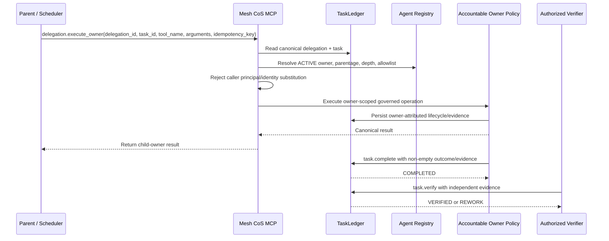

# Material Turn Record: Mesh CoS MCP v4.3.0

## Executive summary

Release `v4.3.0` is a material architecture turn that repairs PF-057 systemically. The prior system could persist delegated accountable ownership without establishing an executable authenticated path for that owner. In a CoS-bound runtime, downstream work could therefore become canonically assigned yet remain operationally stranded behind the CoS transport principal.

v4.3.0 introduces a server-owned, delegation-bound owner executor through governed MCP operation `delegation.execute_owner`. The caller cannot choose the owner or principal. Mesh CoS MCP derives the accountable owner from canonical TaskLedger and delegation state, revalidates the Agent Registry and owner allowlist, executes the requested operation in the owner-governed policy context, and preserves owner-only completion. Verification remains separate.

The canonical Phase 1 authority/runtime contract remains `4.0.0`, with exactly 10 registered agents. The release adds execution transport for existing authority; it does not add L4/L5, publishing, pricing, commercial commitment, staffing, verification, or human approval authority.

## Trigger and defect family

- PF-057: delegated ownership without owner execution transport
- PF-058: parent/CoS over-authorization of child lifecycle
- PF-059: hard-coded CoS audit attribution
- PF-060: certification did not prove production/nested routing
- PF-061: caller-supplied depth/ancestry/authority hints could influence authorization
- PF-062: ACTIVE registry state did not guarantee a valid execute-and-complete path

## Scope and non-scope

In scope: cross-agent delegated execution, owner-only lifecycle and completion, direct/nested delegation, canonical identity derivation, idempotency, audit attribution, fail-closed schemas/policy, registry-driven readiness, QNAP release packaging, Skill/package alignment, scheduled-workflow compatibility, documentation, release controls, and production recovery guidance.

Out of scope: changing the 10-agent roster, granting new human-only authority, changing Slack provider scopes, autonomous consequential external action, QNAP production deployment, and rewriting canonical production tasks to simulate recovery.

## Acceptance criteria

The turn is accepted only when:

1. CoS-owned work remains valid.
2. Every ACTIVE eligible downstream owner has a valid execute-and-complete path.
3. Direct-report delegation works across the registered owner set.
4. `cos -> cmo -> vp-content` and `cos -> coo -> consultant-network-steward` work without impersonation.
5. Caller-supplied owner/principal, ancestry, authority, depth, or active-owner hints cannot create authority.
6. Child-owned completion is owner-only and parent direct completion fails closed.
7. `COMPLETED != VERIFIED` remains enforced.
8. Owner execution is idempotent and at-most-once.
9. Disabled, quarantined, unroutable, orphaned, malformed, cross-task, or cross-sibling routes fail closed.
10. Approval inheritance and human-only exclusions remain intact.
11. Nested delegation cannot exceed registry relationships/depth.
12. CI fails if nested executor/decompose authority is granted to an agent without a registered ACTIVE child.
13. Release artifacts are bound to the exact integrated release commit.
14. Production recovery resumes stranded work in place rather than silently recreating it.

Executable behavior is defined by `specs/cross-agent-owner-execution.feature`, scenarios DLG-001 through DLG-017.

## Root cause

The first invalid state existed at delegation creation: canonical accountability could be persisted without an executable transport route for the new owner. The later completion error was a symptom.

Additional defects amplified the failure: in-process certification did not prove the CoS-bound production route; CoS could overreach into child lifecycle writes; audit attribution could falsely report CoS; nested child execution lacked the same authenticated path; and request hints could influence authorization rather than being fully re-derived from canonical state.

## Before and after

Before:

```text
CoS trigger
-> delegation persists child owner
-> task becomes child-owned
-> runtime remains CoS-bound
-> no authenticated child-owner execution transport
-> work can reach QA but cannot legitimately complete
```

After:

```text
CoS or canonical parent trigger
-> canonical task/delegation reread
-> server derives accountable owner
-> registry / allowlist / ancestry / depth / approval validation
-> owner-scoped governed operation
-> owner-only completion
-> canonical result returned
-> separate verification where authorized
```

## Architecture


The Mermaid source above was validated/rendered through the connected Mermaid Chart capability before integration.

### Delegated execution sequence



## Authority and trust boundaries

The external transport principal remains immutable. The server derives the functional execution principal only after canonical validation. The public request exposes no owner/principal selector. Prompt text, retrieved content, or caller metadata cannot manufacture identity.

Human-only operations remain excluded, including `approval.record_decision` and `reliability.human_override`.

Least privilege is explicit:

- CMO retains nested execution for VP Content.
- COO retains nested execution for Consultant Network Steward.
- CRO and CFO do not receive nested executor/decompose authority because the current registry has no ACTIVE child under them.

## Data, persistence, audit, reliability

TaskLedger remains canonical. Owner execution records preserve task/delegation identity, orchestrator, accountable owner, expected/actual principal, operation, authorization result, route status, failure classification, retry eligibility, idempotency fingerprint, canonical owner result, and actual audit actor.

Exact retries return the canonical prior result. Changed requests under the same idempotency key fail closed. Ambiguous failed executions are not blindly replayed. Concurrent claims permit one canonical winner. Cross-task and cross-delegation reuse is rejected.

## Security review

Security applicability: `FULL_REVIEW`.

Reviewed threats include impersonation, confused deputy behavior, owner-ID tampering, forged/stale delegation, replay, task substitution, auth/approval/depth bypass, privilege inheritance, capability exposure, source-authority leakage, disabled-owner execution, completion without evidence, fraudulent audit attribution, completion/verification conflation, prompt-driven identity, malicious retrieved/model content, concurrent races, duplicate completion, orphaned tasks, cycles, and schema-registry substitution.

Security disposition for the verified architecture: no unresolved blocking finding. Authoritative record: `docs/security-review-v4.3.0-cross-agent-owner-execution.md`.

## Updated ChatGPT Skills

Role-contract files changed for exactly eight Skills:

1. `mesh-chief-of-staff`
2. `mesh-agentops-controller`
3. `mesh-answer-decision-desk`
4. `mesh-cro`
5. `mesh-cfo`
6. `mesh-coo`
7. `mesh-cmo`
8. `mesh-message-operations`

VP Content and Consultant Network Steward participate in the new nested runtime path, but their Skill role-contract files were not modified.

Workspace-agent manifests were separately updated for `cos`, `agentops`, `answer-desk`, `cro`, `cfo`, `coo`, `cmo`, and `message-ops` so MCP allowlists and builder configuration align with the runtime contract.

`docs/skills-v4.3.0.md` is the authoritative Skill update manifest.

## Skill installation bundle

`scripts/build-chatgpt-skill-bundle-v4.3.0.sh` reproducibly packages the eight updated Skill directories into:

- `mesh-cos-chatgpt-skills-v4.3.0.zip`
- `mesh-cos-chatgpt-skills-v4.3.0.zip.sha256`

The ZIP includes the eight complete Skill directories plus `SKILLS-v4.3.0.md` and `MANIFEST.txt`. Workspace-agent manifests are intentionally excluded because they are application package artifacts, not ChatGPT Skill directories for manual installation.

The manifest is bound to `GITHUB_SHA`, source repository, release, Skill count, and installation mode. CI verifies all eight directories and the checksum before release.

## Compatibility and migration

The release is backward-compatible at the Phase 1 authority-contract level but is a deployment-level minor release because it adds a governed public MCP operation and closed schema.

The Slack application manifest remains v4.2.3 because provider scopes, event subscriptions, and bot identity do not change.

Active CoS scheduled orchestrator prompts that still assume v4.2.3 owner transport must migrate only after v4.3.0 production acceptance. Post-deploy prompts should use `delegation.execute_owner` for downstream-owned work.

## Production recovery

Known PF-057 recovery target during release preparation:

- Task: `task-b0b613daff51`
- Accountable owner: `cmo`
- State: `QA`
- Outcome/evidence: empty

After successful production acceptance, re-read the current canonical task, validate the CMO owner route, complete in place under CMO authority, then perform separate verification where required. A fresh read-only recovery inventory is mandatory immediately before recovery.

## Rollback

Rollback is software rollback, not canonical state rewriting. Preserve TaskLedger, task IDs, approvals, and protected credentials. Restore the prior immutable v4.2.3 release unit using the transactional QNAP rollback path. Do not recreate tasks or rewrite history to mimic an older software state.

## Verification evidence

The candidate architecture previously established:

- 471 Python tests passed.
- 100.00% statement/branch coverage: 3,199 statements, 1,078 branches, zero missing, zero partial.
- 18/18 Node tests passed.
- npm audit: zero vulnerabilities.
- Ruff, mypy, Bandit, compileall: passed.
- `OWNER_EXECUTION_READINESS=PASS checked=9`.
- QNAP POSIX regression suite: passed.
- Exact v4.3.0 QNAP bundle/checksum: passed.
- Production-container provenance: passed.
- Modern MCP discovery/sequential transport: passed.

Final documentation/release-control changes are reverified before merge. Final release evidence is rebound to the actual merged `main` SHA and semantic tag `v4.3.0`.

## Semantic version rationale

`4.3.0` is a minor release because it adds a backward-compatible governed MCP operation and execution protocol while preserving the canonical Phase 1 runtime/authority contract `4.0.0`.

## Release artifacts

The immutable GitHub Release contains four assets:

- `mesh-cos-mcp-qnap-v4.3.0.zip`
- `mesh-cos-mcp-qnap-v4.3.0.zip.sha256`
- `mesh-cos-chatgpt-skills-v4.3.0.zip`
- `mesh-cos-chatgpt-skills-v4.3.0.zip.sha256`

The semantic tag and release must resolve to the integrated `main` commit, not the pre-merge branch head.

## Release authorization and publication mechanism

`docs/release-authorization-v4.3.0.md` records explicit human authorization to document, commit/push, merge PR #58, close related PRs, create tag `v4.3.0`, and publish the GitHub Release.

Because the GitHub connector in this session does not expose a direct release-create/workflow-dispatch mutation, `.github/workflows/release-v4.3.0.yml` uses that version-specific authorization receipt as a one-time `main` push path trigger. The workflow reverifies the merged main SHA, rebuilds both release bundles from that SHA, then invokes `gh release create v4.3.0 --target "$GITHUB_SHA"`, creating the tag if absent and publishing the four assets.

This release authorization does not authorize QNAP production deployment, production task recovery, or consequential external business action.

## Production acceptance boundary

Repository integration and release publication do not prove live QNAP behavior. Production acceptance remains separate using `docs/chatgpt-published-app-production-acceptance-v4.3.0.md` and `deployment/qnap/CHATGPT-ACCEPTANCE.md`.

## Documentation affected by this turn

Current-release documentation includes `README.md`, `RELEASE.md`, `CHANGELOG-v4.3.0.md`, this material-turn record, the material-turn standard, Skill manifest, release-authorization receipt, PF-057 architecture record, architecture/delegation/registry/security/readiness/runbook documents, versioned security/verification/release/acceptance documents, QNAP deployment/install/upgrade/acceptance documents, and `specs/cross-agent-owner-execution.feature`.

## Decision log

- Chosen: trusted server-owned, delegation-bound owner executor.
- Rejected: caller-selected principal.
- Rejected: parent impersonation or CoS direct completion of child work.
- Preserved: immutable external transport principal, TaskLedger canonicality, 10-agent roster, human-only L4/L5/consequential authority, and `COMPLETED != VERIFIED`.
- Tightened: nested execution only for agents with registered ACTIVE children.
- Added: reproducible eight-Skill installation bundle.
- Release: semantic minor `v4.3.0`.
