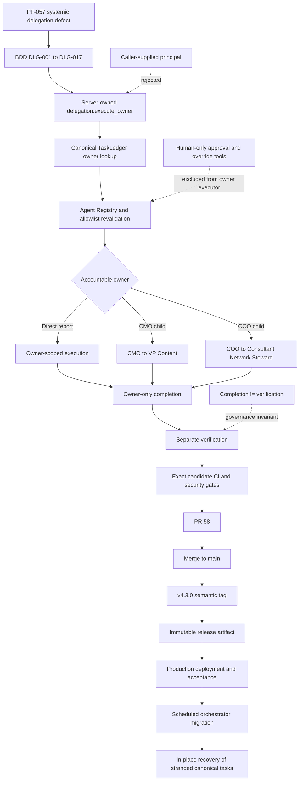
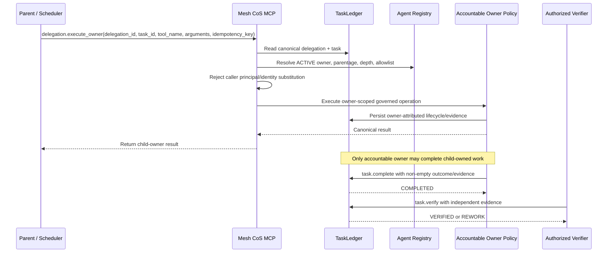

# Material Turn Record: Mesh CoS MCP v4.3.0

## Executive summary

Release `v4.3.0` is a material architecture turn that repairs PF-057 systemically. The prior system could persist delegated accountable ownership without establishing an executable authenticated path for that owner. In a CoS-bound runtime, child work could therefore become canonically assigned to CMO, COO, CRO, CFO, AgentOps, Answer Desk, Message Operations, VP Content, or Consultant Network Steward while remaining operationally stranded behind the CoS transport principal.

v4.3.0 introduces a server-owned, delegation-bound owner executor through governed MCP operation `delegation.execute_owner`. The caller cannot choose the owner or principal. Mesh CoS MCP derives the accountable owner from canonical TaskLedger and delegation state, revalidates the Agent Registry and owner allowlist, executes the requested operation in the owner-governed policy context, and preserves owner-only completion. Verification remains separate.

The canonical Phase 1 authority/runtime contract remains `4.0.0`, with exactly 10 registered agents. The release adds execution transport for existing authority; it does not add L4/L5, publishing, pricing, commercial commitment, staffing, verification, or human approval authority.

## Trigger and defect family

- PF-057: delegated ownership without owner execution transport
- PF-058: parent/CoS over-authorization of child lifecycle
- PF-059: hard-coded CoS audit attribution
- PF-060: certification did not prove production/nested routing
- PF-061: caller-supplied depth/ancestry/authority hints could influence authorization
- PF-062: ACTIVE registry state did not guarantee a valid execute-and-complete path

## Scope

In scope:

- cross-agent delegated execution;
- owner-only lifecycle writes and completion;
- direct-report and nested delegation;
- canonical identity derivation;
- idempotency and at-most-once owner execution;
- audit attribution;
- fail-closed schema and policy validation;
- registry-driven production-readiness gates;
- QNAP release packaging and modern MCP transport verification;
- current release documentation;
- ChatGPT Skill role-contract and workspace-agent package alignment;
- scheduled-workflow compatibility and post-deployment migration guidance;
- production recovery of stranded canonical tasks.

Out of scope:

- changing the 10-agent Phase 1 roster;
- granting new human-only authority;
- changing the Slack application manifest or provider scopes;
- autonomous publishing, messaging, pricing, staffing commitment, or verification authority;
- rewriting or recreating canonical production tasks to simulate recovery.

## Requirements and acceptance criteria

The turn is accepted only when:

1. CoS can continue performing CoS-owned work.
2. Every ACTIVE eligible downstream owner has a valid execute-and-complete path.
3. Direct-report delegation works across the registered owner set.
4. `cos -> cmo -> vp-content` works without CoS impersonating VP Content.
5. `cos -> coo -> consultant-network-steward` works without CoS impersonating Consultant Network Steward.
6. Caller-supplied owner/principal substitution is impossible.
7. Caller-supplied ancestry, authority, depth, or active-owner hints do not create authority.
8. Child-owned completion is owner-only.
9. Parent direct completion of child work fails closed.
10. `COMPLETED != VERIFIED` remains enforced.
11. Owner execution is idempotent and at-most-once.
12. Disabled, quarantined, unroutable, orphaned, or malformed routes fail closed.
13. Approval inheritance and human-only exclusions remain intact.
14. Nested delegation cannot exceed registry relationships or depth.
15. CI fails if an agent without a registered ACTIVE child receives nested executor/decompose authority.
16. Release artifacts are bound to the exact verified candidate.
17. Production recovery resumes stranded work in place rather than silently recreating it.

The executable specification is `specs/cross-agent-owner-execution.feature`, scenarios DLG-001 through DLG-017.

## Root cause

The first invalid state existed at delegation creation: canonical accountability could be persisted without an executable transport route for the new owner. The later completion error was a symptom, not the root cause.

Additional causal defects amplified the failure:

- earlier certification invoked child agents directly in-process and therefore did not prove the production CoS-bound route;
- task lifecycle handlers allowed owner-or-CoS writes, enabling parent over-authorization;
- audit attribution could report CoS even when the governed actor should have been the owner;
- nested child lifecycle behavior was not authenticated through the same canonical execution mechanism;
- request hints could influence authorization rather than being fully re-derived from canonical state.

## Before and after

Before:

```text
CoS trigger
-> delegation persists child owner
-> task becomes child-owned
-> runtime remains CoS-bound
-> no authenticated child-owner execution transport
-> work can reach QA but cannot legitimately complete
```

After:

```text
CoS or canonical parent trigger
-> canonical delegation and task reread
-> server derives accountable owner
-> registry / allowlist / ancestry / depth / approval validation
-> owner-scoped governed operation
-> owner-only completion
-> canonical result returned
-> separate verification where authorized
```

## Architecture



The Mermaid source above was validated and rendered through the connected Mermaid Chart capability before integration.

### Delegated execution sequence



## Authority and trust-boundary analysis

The external transport principal remains immutable. The trusted server-owned executor derives the functional execution principal only after canonical validation.

The public request does not expose an `owner`, `principal`, `actor`, or equivalent identity selector. Prompt text, retrieved content, or caller metadata cannot manufacture owner identity.

Human-only operations remain excluded from owner execution, including:

- `approval.record_decision`
- `reliability.human_override`

Least-privilege review narrowed nested executor/decompose authority:

- CMO retains nested execution for registered child VP Content.
- COO retains nested execution for registered child Consultant Network Steward.
- CRO and CFO do not receive nested executor/decompose authority because they have no registered ACTIVE child in the Phase 1 registry.

## Data, persistence, and audit implications

TaskLedger remains canonical. New owner execution route/result records preserve:

- task and delegation identity;
- orchestrator and accountable owner;
- expected and actual governed principal;
- requested operation;
- authorization outcome;
- route status;
- failure classification;
- retry eligibility;
- idempotency fingerprint;
- canonical owner result;
- audit event attribution.

No provider mirror or prompt state may replace canonical ownership or lifecycle state.

## Reliability and idempotency

The release adds request-bound idempotency fingerprints and at-most-once execution claims.

- Exact retries return the canonical prior result.
- A changed request under the same idempotency key fails closed.
- Ambiguous failed executions are not blindly replayed.
- Concurrent claims allow one canonical winner.
- Cross-task or cross-delegation reuse is rejected.

## Security review

Security applicability: `FULL_REVIEW`.

Threats explicitly reviewed include impersonation, confused deputy behavior, owner-ID tampering, forged/stale delegation, replay, cross-task reuse, task substitution, auth bypass, approval bypass, depth bypass, privilege inheritance, capability exposure, source-authority leakage, disabled-owner execution, completion without evidence, fraudulent audit attribution, completion/verification conflation, prompt-driven identity, malicious retrieved/model content, concurrent execution races, duplicate completion, orphaned tasks, cycles, and schema-registry substitution.

Security disposition for the verified candidate: no unresolved blocking finding.

Authoritative record: `docs/security-review-v4.3.0-cross-agent-owner-execution.md`.

## Updated Skills

The following ChatGPT Skill role contracts changed in v4.3.0:

1. `mesh-chief-of-staff`
2. `mesh-agentops-controller`
3. `mesh-answer-decision-desk`
4. `mesh-cro`
5. `mesh-cfo`
6. `mesh-coo`
7. `mesh-cmo`
8. `mesh-message-operations`

The updates align owner identity, lifecycle authority, delegated execution, no-impersonation behavior, completion boundaries, and exact MCP allowlists.

VP Content and Consultant Network Steward participate in the new nested runtime path but their Skill role-contract files were not modified in this turn.

Workspace-agent package manifests were also updated for `cos`, `agentops`, `answer-desk`, `cro`, `cfo`, `coo`, `cmo`, and `message-ops` so `mcp.allowed_tools` and builder configuration align with the governed contract.

## Compatibility and migration

The release is backward-compatible at the Phase 1 authority-contract level but requires deployment-level migration because it adds a governed public MCP operation and new closed schema.

The existing Slack application manifest remains v4.2.3 because no Slack provider scope, event subscription, bot identity, or app-level contract changes in v4.3.0.

Active CoS scheduled orchestrator prompts that still assume v4.2.3 owner transport must be migrated only after v4.3.0 production acceptance. Post-deploy prompts should use `delegation.execute_owner` whenever canonical work is owned by a downstream agent.

## Production recovery

Do not recreate stranded canonical tasks by default.

Known PF-057 recovery target at release preparation:

- Task: `task-b0b613daff51`
- Accountable owner: `cmo`
- State: `QA`
- Outcome/evidence: empty

Recovery sequence after successful production acceptance:

```text
re-read current canonical task
-> confirm CMO owner and eligible state
-> validate delegation/owner route
-> execute owner-governed completion in place
-> COMPLETED
-> separate verification where required
-> release dependent gates
```

A fresh read-only recovery inventory must be taken immediately before recovery because production state may change between release and deployment.

## Rollback

Rollback is software rollback, not canonical state rewriting.

- Preserve TaskLedger and task IDs.
- Preserve approvals and protected credentials.
- Restore the prior immutable v4.2.3 release unit using the existing transactional QNAP rollback path.
- Do not recreate tasks or mutate history to mimic an older software state.
- Re-run readiness and acceptance after rollback.

## Verification evidence

Verified candidate evidence before final documentation closeout:

- 471 Python tests passed.
- 100.00% statement and branch coverage: 3,199 statements, 1,078 branches, zero missing, zero partial.
- 18/18 Node tests passed.
- npm audit: zero vulnerabilities.
- Ruff, mypy, Bandit, compileall: passed.
- `OWNER_EXECUTION_READINESS=PASS checked=9`.
- QNAP POSIX regression suite: passed.
- Exact v4.3.0 bundle/checksum: passed.
- Production-container provenance: passed.
- Modern MCP discovery and sequential transport: passed.

Final integration/release evidence must be rebound to the actual merged `main` commit and semantic tag `v4.3.0` after merge.

## Semantic version rationale

`4.3.0` is a minor release rather than a patch because it adds a backward-compatible governed MCP operation and execution protocol. The canonical Phase 1 runtime/authority contract remains `4.0.0`.

## Release artifacts

Expected immutable release assets:

- `mesh-cos-mcp-qnap-v4.3.0.zip`
- `mesh-cos-mcp-qnap-v4.3.0.zip.sha256`

The semantic tag and GitHub Release must resolve to the integrated `main` commit, not the pre-merge branch head.

## Production acceptance boundary

Repository integration and release publication do not themselves prove live QNAP production behavior. Production acceptance remains a separate controlled activity using `docs/chatgpt-published-app-production-acceptance-v4.3.0.md` and `deployment/qnap/CHATGPT-ACCEPTANCE.md`.

## Residual constraints

- The production runtime remains on the prior deployment until v4.3.0 is explicitly deployed.
- Scheduled orchestrator prompt migration occurs only after successful production acceptance.
- Recovery targets must be re-read immediately before action.
- The server-owned executor creates authenticated owner-scoped policy execution; it does not imply a physically separate LLM process for each child agent.

## Documentation affected by this material turn

Current-release and architecture documentation updated or created for v4.3.0 includes:

- `README.md`
- `RELEASE.md`
- `CHANGELOG-v4.3.0.md`
- `docs/material-turn-documentation-standard.md`
- `docs/material-turn-v4.3.0.md`
- `docs/pf-057-cross-agent-owner-execution.md`
- `docs/architecture.md`
- `docs/delegation-model.md`
- `docs/agent-registry.md`
- `docs/security-governance.md`
- `docs/security-review-v4.3.0-cross-agent-owner-execution.md`
- `docs/verification-v4.3.0-cross-agent-owner-execution.md`
- `docs/production-readiness.md`
- `docs/runbook.md`
- `docs/release-4.3.0-cross-agent-owner-execution.md`
- `docs/chatgpt-published-app-production-acceptance-v4.3.0.md`
- `deployment/qnap/README-QNAP.md`
- `deployment/qnap/DEPLOYMENT-STEPS.md`
- `deployment/qnap/install-checklist.md`
- `deployment/qnap/upgrade-checklist.md`
- `deployment/qnap/CHATGPT-ACCEPTANCE.md`
- `specs/cross-agent-owner-execution.feature`

## Decision log

- Chosen architecture: trusted server-owned, delegation-bound owner executor.
- Rejected: caller-selected principal.
- Rejected: parent impersonation of child.
- Rejected: CoS direct completion of child work.
- Preserved: immutable external transport principal.
- Preserved: TaskLedger canonicality.
- Preserved: 10-agent Phase 1 roster.
- Preserved: human-only L4/L5 and consequential external authority.
- Preserved: `COMPLETED != VERIFIED`.
- Tightened: nested execution capability only for agents with registered ACTIVE children.
- Release: semantic minor `v4.3.0`.
