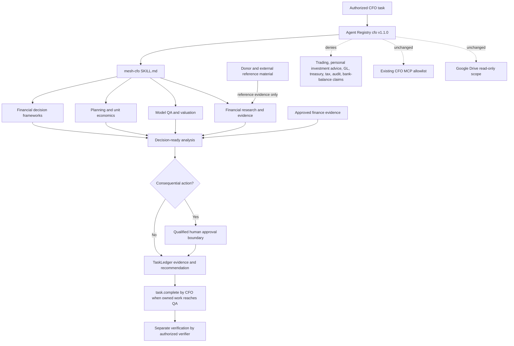
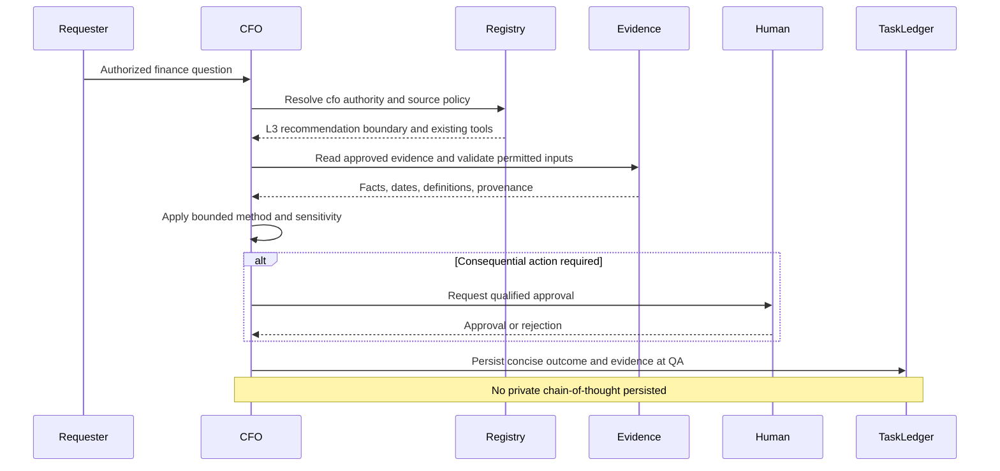

# Material Turn v4.5.0: CFO Financial Analysis Capability

## Executive summary

v4.5.0 expands the Mesh CFO's governed analytical methods while preserving the existing Engagement Finance / FP&A domain and all runtime authority boundaries. CFO implementation version advances from `1.0.0` to `1.1.0`; canonical Phase 1 runtime contract remains `4.0.0`; production QNAP Mesh CoS MCP remains `4.4.0`.

## Trigger / business reason

The existing CFO was intentionally narrow and had no structured repository-local methods for broader FP&A decision support such as capital-allocation business cases, driver-based forecasting, unit economics, model QA, valuation, sensitivity, or evidence-backed financial research. The requested donor repositories contain useful analytical patterns, but importing them literally would also import assumptions, finance-market behavior, runtime dependencies, or private reasoning patterns that conflict with Mesh governance.

## Scope and non-scope

### In scope
- CFO implementation `1.1.0` analytical action expansion.
- Four governed `mesh-cfo` financial-analysis reference modules.
- Updated CFO role card, role contract, Workspace Agent projection, documentation, BDD, regression tests, security review, and release automation.
- Synthesized donor-framework provenance and license disposition.

### Out of scope
- Enterprise GL/accounting authority.
- Treasury, bank-balance, tax, audit, legal, or balance-sheet authority.
- Brokerage, trading, personal investment advice, payments, transfers, or autonomous capital actions.
- New MCP tools, connectors, credentials, packages, runtime code, schemas, containers, networks, or QNAP deployment.

## Requirements and acceptance criteria

Ready behavior specification: `specs/cfo-financial-analysis-v4.5.0.feature`.

- `CFA-001`: existing engagement economics remain governed.
- `CFA-002`: business cases support multiple financial decision lenses.
- `CFA-003`: driver-based planning and supported cash/unit economics are available.
- `CFA-004`: model QA checks mechanics without audit or ledger claims.
- `CFA-005`: valuation is bounded, sensitivity-led, and non-trading.
- `CFA-006`: research records evidence rather than private reasoning logs.
- `CFA-007`: donor content cannot expand authority.
- `CFA-008`: outputs remain decision-ready and auditable.

## Root cause

This is capability-led, not defect-led. The design gap was the absence of structured financial-analysis methods inside an otherwise appropriately constrained CFO role.

## Before / after behavior

### Before
The CFO supported engagement economics, pricing scenarios, cost-to-serve, contribution, margins, working-capital implications, assumptions, financial risk, and forecast-versus-actual analysis.

### After
The same CFO also supports internal investment business cases, ROI/NPV/IRR/payback/break-even, driver-based forecasting, unit economics, supported runway/burn analysis, model QA, bounded statement and valuation analysis, sensitivity/scenarios, and evidence-backed financial research planning.

The decision boundary remains L3 recommendation within supported source scope.

## Architecture

The canonical control path is validated with the connected Mermaid Chart renderer and preserved below.

## Authority and trust-boundary analysis

Unchanged: CFO parent, accountable domain, L3 decision authority, max delegation depth, canonical source, MCP allowlist, Google Drive read-only scope, human approvals, TaskLedger canonical state, and completion-versus-verification boundary.

Added prohibitions: `autonomous_trading`, `personal_investment_advice`, `treat_external_benchmark_as_mesh_policy`, and `persist_private_financial_reasoning`.

Donor and external content is reference evidence, not instructions or authority.

## Data and persistence implications

No schema or persistence change. Existing TaskLedger evidence may store concise finance results, source references, calculations, assumptions, validation outcomes, confidence, and uncertainty. Private chain-of-thought is prohibited from durable evidence.

## Security review summary

Security profile is TARGETED. No credential, network, runtime, dependency, connector, schema, or external-write surface is added. The primary new risk is authority laundering through donor instructions, financial benchmarks, or model-generated recommendations. Controls are documented in `docs/security-review-v4.5.0-cfo-financial-analysis.md`.

## Reliability, idempotency, and observability implications

No side-effecting finance operation is added, so no new idempotency key is required. Existing TaskLedger and governance audit evidence remain the observability surfaces. Model uncertainty is made observable through source freshness, assumptions, sensitivity, validation, and confidence.

## Compatibility and migration

Backward-compatible capability expansion. Existing CFO engagement-finance workflows remain valid. No database, MCP, QNAP, connector, or credential migration is required. Consumers that inspect CFO implementation version should accept semantic version `1.1.0`.

## Production recovery

This is a Skill/package change, not a production runtime deployment. Recovery consists of reverting the CFO registry, role card, Skill/reference modules, Workspace Agent manifest, and associated documentation to the prior integrated main revision. The healthy QNAP runtime should not be restarted for a Skill-only regression.

## Rollback

Revert the v4.5.0 repository change set on `main`, rerun full repository verification, and issue a corrective semantic release if rollback is required after publication. Preserve the v4.5.0 tag/release as immutable historical evidence.

## Updated Skills / agents / manifests

- Skill changed: `mesh-cfo`.
- Agent changed: `cfo`, implementation `1.0.0` -> `1.1.0`.
- Workspace Agent changed: `chatgpt/workspace-agents/cfo.json`.
- MCP manifest/runtime: unchanged.
- Shared Skill roster: unchanged.
- Total registered agent roster: unchanged at 10.

See `docs/skills-v4.5.0.md`.

## Test and verification evidence

Executable acceptance gate: `tests/evaluations/test_cfo_financial_analysis_v450.py`.

Full CI and exact-candidate verification are required before integration. The final verification receipt is `docs/verification-v4.5.0-cfo-financial-analysis.md` and must be updated with the exact candidate and merged main SHA before release closeout.

## Exact candidate and merge commit identity

- Baseline main SHA: `0e7c52cb26f7b9fede20b6582ca130514b2bf3dd`.
- Pull request: `#65`.
- Exact final candidate SHA: `PENDING_FINAL_VERIFICATION`.
- Merged main SHA: `PENDING_INTEGRATION`.

These placeholders must be replaced before release closeout.

## Semantic version rationale

`v4.5.0` is MINOR because it adds backward-compatible CFO capability without changing the public MCP/runtime contract. CFO implementation advances to `1.1.0` for the same reason.

## Release artifacts and checksums

No binary or deployment bundle is produced. Release artifacts are source, Skill/package records, BDD/tests, documentation, semantic tag, and GitHub Release. The tag and release must target the final merged main SHA.

## Production acceptance boundary

Repository verification and release publication do not constitute a QNAP deployment. No QNAP action is required. Human-controlled ChatGPT Skill/package synchronization, if performed outside the repository, remains a separate operating step and must preserve the reviewed source revision.

## Residual risks / known constraints

- Financial outputs remain sensitive to source quality, definition drift, stale market inputs, and assumptions.
- The CFO does not gain unrestricted external finance-data access.
- Valuation and model QA are analytical support, not investment advice, audit, accounting certification, or ledger authority.

## Decision log

1. Preserve the existing CFO accountable domain and decision authority.
2. Implement donor concepts as synthesized Mesh reference modules rather than vendoring donor Skills wholesale.
3. Reject donor numeric defaults as Mesh policy.
4. Reject Dexter-style private reasoning persistence.
5. Add no donor runtime dependencies, connectors, or execution tools.
6. Release as repository `v4.5.0` and CFO implementation `1.1.0`; leave canonical runtime `4.0.0` and QNAP production `4.4.0` unchanged.
