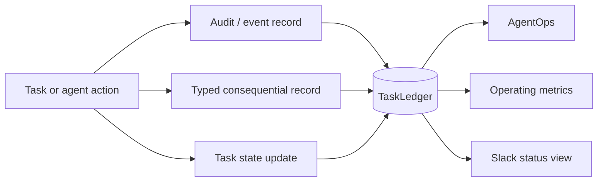

# Observability

Phase 1 observability is based on durable operating records rather than reconstructing behavior from conversation history. The goal is to make consequential work explainable, replayable at the state level, and measurable without turning Slack into the ledger.

## Observability model

## Durable evidence

The ledger supports:

- task state and outcome evidence,
- consequential typed records,
- audit/event records,
- delegation records,
- conflict and decision records,
- approval records,
- verification results,
- Answer Desk dispositions,
- registry-change and performance records where emitted,
- scorecards,
- Slack task/thread mappings,
- durable idempotency claims.

## Required audit questions

For a consequential action, the system should be able to answer:

1. What task/outcome was being pursued?
2. Who or what acted?
3. What authority and registry policy applied?
4. What evidence or source reference was used?
5. What decision, approval, or exception occurred?
6. What state changed?
7. What outcome and acceptance result followed?

## Metrics

Current deterministic metric support includes verified outcomes, CEO deflection, and CEO-time-avoided estimates when a methodology is explicitly present. Metrics must be derived from recorded state rather than guessed from narrative text.

## AgentOps signals

AgentOps also observes stalled work and coordination loops. A coordination loop is indicated when repeated cross-agent interactions produce neither state change nor evidence. These signals should lead to remediation or routing decisions rather than more status chatter.

## Slack

Slack is an observable collaboration layer. The user can inspect task coordination in `#mesh-agent-ops`, while the canonical task/thread relation and duplicate-event state remain in the ledger.
