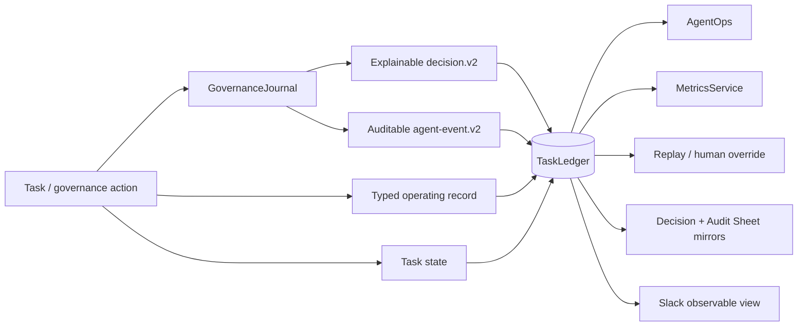

# Observability

Phase 1 observability is based on durable operating records, not conversation reconstruction. Consequential work must be explainable, auditable, replay-safe, and measurable while Slack remains non-canonical.

## Observability model

## Durable evidence

The canonical ledger contains task state, work graphs, delegations, check-ins, reassignments, supersessions, conflicts, explainable decisions, approvals, verification results, Answer Desk records, performance events, scorecards, registry/health changes, Slack mappings/events, execution failures, replays, human overrides, cost inputs, audit events, and governance-mirror failures.

## Decision observability

Material decisions and recommendations use `mesh.cos.decision.v2`. A record captures the accountable owner and authority level, approval evidence where required, concise decision basis, source/evidence references, alternatives and criteria, confidence, risk, affected entities, reversibility/reversal conditions, model/skill provenance, outcome validation, outcome state, lineage, record hash, and canonical reference.

This is an explainability record, not a private reasoning transcript. Hidden chain-of-thought and raw sensitive prompts are prohibited.

## Audit envelope

`mesh.cos.agent-event.v2` is the richer cross-agent audit envelope for consequential runtime activity. It includes event sequence/time/type/category/action, actor, task/correlation/decision/run links, authority/policy, capability/tool, target/source, concise input/output summaries, result, evidence/approval, error metadata, model/skill provenance, risk/classification, retention, canonical reference, and SHA-256 hash-chain fields.

Existing `mesh.cos.agent-event.v1` producers remain backward-compatible. `TaskLedger.record_event()` dual-writes successful v1 audit events into the v2 governance stream while services migrate. Governed skill/tool invocations also emit v2 events directly through `GovernedAdapterRegistry` when a `GovernanceJournal` is configured.

The hash chain is tamper-evident, not tamper-proof. `verify_audit_chain()` recomputes each event hash and verifies sequence continuity.

## Human-readable governance mirrors

The configured operational mirrors are:

- CoS Decision Log: `1IJcwPuulqsNAa1lCW2MsmNgH6Vm5INPqTlcH4NR0xpw`
- CoS Audit Log: `1T8vKx4gaUJdeG8kSc18MsBbXpY4EbDF3exZ0RGpvND0`

`TaskLedger` remains canonical. Mirror rows reconcile through IDs and `canonical_record_ref`. Mirror failures are preserved as canonical `governance_mirror_failure` records instead of silently dropping or rolling back state.

## Audit coverage

Audit coverage includes delegation, reassignment, state transitions, conflicts, decisions/recommendations, approval requests/decisions/rejections, completion, verification, functional invocation, Answer Desk dispositions/corrections, agent health changes, supersession, execution failure, replay/override, and governance mirror failures.

## Phase 1 metrics

`MetricsService` derives the original Phase 1 measurement set from durable records:

- percentage of work resolved without Michael,
- questions deflected from Michael,
- CEO touches per completed task,
- first-pass acceptance and rework,
- correct, false, and missed escalation rates,
- task cycle time and stalled-task rate,
- verified outcome rate,
- agent failure rate,
- approval cycle time,
- cross-agent conflict rate,
- agent conversation-loop rate,
- average contributors per task,
- cost per verified outcome when cost telemetry exists.

Answer Desk telemetry additionally tracks incorrect/corrected answers, access-control failures, and resolution time. No baseline or target value is fabricated. CEO-time-avoided estimates require explicit methodology.

## AgentOps signals

AgentOps observes rolling performance evidence, workload/concurrency, stalls, missed deadlines, rework, rejection reasons, execution error taxonomy, repeated tool failures, evidence defects, and high-cost/low-value signals where telemetry exists. Decision outcomes and v2 audit events can be used as governance evidence but cannot expand agent authority.

## Failure, replay, and override

`ReplayManager` stores failed effects before replay. Replays are explicit and idempotent at the effect record. A human override can close a failed effect with named actor, disposition, reason, and timestamp. These records preserve the difference between automated retry and authorized manual intervention.

## Slack

`#mesh-agent-ops` is inspectable coordination. The canonical task/thread relation, event dedupe, approval state, decision records, and audit records remain in `TaskLedger`. The Answer Desk uses a separate configurable Slack surface.
