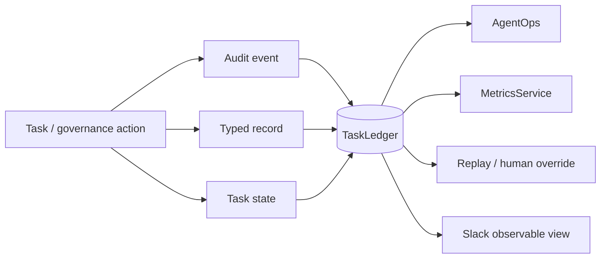

# Observability

Phase 1 observability is based on durable operating records, not conversation reconstruction. Consequential work must be explainable, auditable, replay-safe, and measurable while Slack remains non-canonical.

## Observability model

## Durable evidence

The canonical ledger contains task state, work graphs, delegations, check-ins, reassignments, supersessions, conflicts, decisions, approvals, verification results, Answer Desk records, performance events, scorecards, registry/health changes, Slack mappings/events, execution failures, replays, human overrides, cost inputs, and audit events.

## Audit envelope

Consequential actions use the versioned `mesh.cos.agent-event.v1` envelope with event ID/type/version, timestamp, actor, task/correlation IDs, source, authority level, optional before/after state, approval/evidence references, result/error, and idempotency key.

Audit coverage includes delegation, reassignment, state transitions, conflicts, approval requests/decisions/rejections, completion, verification, functional invocation, Answer Desk dispositions/corrections, agent health changes, supersession, and execution failure.

## Phase 1 metrics

`MetricsService` derives the original Phase 1 measurement set from durable records:

- percentage of work resolved without Michael,
- questions deflected from Michael,
- CEO touches per completed task,
- first-pass acceptance and rework,
- correct, false, and missed escalation rates,
- task cycle time and stalled-task rate,
- verified outcome rate,
- agent failure rate,
- approval cycle time,
- cross-agent conflict rate,
- agent conversation-loop rate,
- average contributors per task,
- cost per verified outcome when cost telemetry exists.

Answer Desk telemetry additionally tracks incorrect/corrected answers, access-control failures, and resolution time.

No baseline or target value is fabricated. CEO-time-avoided estimates require explicit methodology.

## AgentOps signals

AgentOps observes rolling performance evidence, workload/concurrency, stalls, missed deadlines, rework, rejection reasons, execution error taxonomy, repeated tool failures, evidence defects, and high-cost/low-value signals where telemetry exists.

## Failure, replay, and override

`ReplayManager` stores failed effects before replay. Replays are explicit and idempotent at the effect record. A human override can close a failed effect with named actor, disposition, reason, and timestamp. These records preserve the difference between automated retry and authorized manual intervention.

## Slack

`#mesh-agent-ops` is inspectable coordination. The canonical task/thread relation, event dedupe, approval state, and business records remain in `TaskLedger`. The Answer Desk uses a separate configurable Slack surface.
