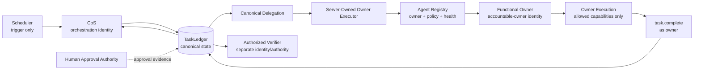
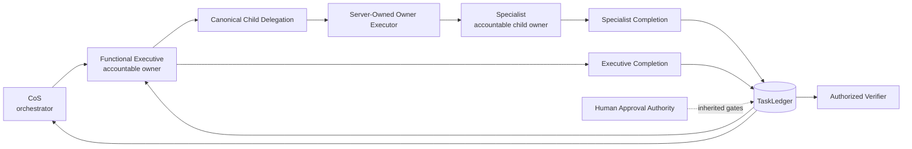

# PF-057 Systemic Delegation and Cross-Agent Owner Execution

## Status

PF-057 is a systemic delegation-transport defect, not a CMO-specific completion defect. This document defines the corrected architecture, owner-execution protocol, operational failure model, scheduled-execution behavior, and production recovery contract.

Canonical Phase 1 authority/runtime contract remains `4.0.0`. Candidate deployment release is `4.3.0`. Production predecessor is `4.2.3`.

## Causal root cause

Before remediation, `delegation.create` validated and persisted a delegation relationship and then returned. The operation changed canonical ownership but created no authenticated execution path for the accountable owner. A CoS-bound scheduler could therefore orchestrate work into QA while remaining authenticated as `cos`. At owner completion the platform correctly refused impersonation, but no transport existed through which the canonical child owner could complete the task.

The first invalid state was therefore not the final `task.complete` failure. It was the earlier creation of a canonical delegation without a validated executable owner route.

Related defects were identified:

- PF-058: parent-or-owner task-write semantics could allow CoS to mutate child-owned lifecycle state directly.
- PF-059: shared orchestration audit helpers could attribute functional-owner lifecycle events to `cos`.
- PF-060: certification tests supplied child principals directly and therefore did not prove CoS-bound production routing.
- PF-061: delegation depth, ancestry, parent authority, and active-owner hints could be caller supplied rather than derived from canonical server state.
- PF-062: an ACTIVE registry record did not prove an executable owner lifecycle route.

## Canonical delegated-work state machine

The repository lifecycle remains authoritative. Delegation adds an execution-routing protocol around that lifecycle rather than inventing replacement task states.

```text
INTAKE
-> TRIAGED
-> PLANNED
-> ASSIGNED
-> IN_PROGRESS
-> QA
-> owner task.complete
-> COMPLETED
-> separate task.verify
-> VERIFIED
-> CLOSED where applicable
```

A delegated work path additionally records routing state:

```text
DELEGATION_CREATED
-> OWNER_ROUTABLE
-> OWNER_EXECUTING
-> OWNER_RESULT_RECORDED
-> OWNER_COMPLETED when task.complete succeeds
-> PARENT_OBSERVABLE
-> VERIFICATION_ELIGIBLE
```

Routing state supplements TaskLedger task state. It never replaces it.

## Direct delegation architecture



Identity semantics:

- Scheduler initiates an occurrence. It does not become the organization.
- CoS remains the orchestration identity.
- TaskLedger names exactly one accountable owner.
- The executor derives the executing principal from canonical state.
- The functional owner performs authoritative owner operations under its own role policy.
- Human approval remains separate.
- Verification remains separate from completion.

## Nested delegation architecture



Supported current examples are registry-driven:

- `cos -> cmo -> vp-content`
- `cos -> coo -> consultant-network-steward`

No routing logic is keyed to these names. The Agent Registry determines valid parentage, depth, health, permissions, approvals, and owner capability.

## Owner execution contract

The server-owned `delegation.execute_owner` boundary resolves:

```text
authenticated delegator
+ delegation_id
-> canonical delegation
-> canonical task
-> accountable_owner
-> canonical Agent Registry record
-> owner MCP allowlist
-> task-scoped operation
```

The request may select an operation from the owner allowlist. It cannot select an owner principal.

The executor verifies:

1. delegation exists;
2. authenticated caller is the canonical delegator;
3. task locator matches the delegation;
4. task still names the delegation owner;
5. owner is ACTIVE and routable;
6. owner has the required owner lifecycle surface;
7. requested operation is allowlisted for the owner;
8. operation arguments stay inside the canonical task or permitted nested descendant;
9. human-only operations are excluded;
10. idempotency key is bound to the exact request fingerprint.

## Delegation creation contract

A delegation is not considered operationally valid unless the target owner is executable at creation time.

The runtime derives or verifies against canonical state:

- direct-child relationship;
- parent-task ownership;
- child-task ownership;
- task/delegation parent relationship;
- task authority;
- registry lineage;
- canonical delegation depth;
- delegator max depth;
- target permitted actions;
- target prohibited actions;
- inherited approval gates;
- target required approvals;
- target runtime health;
- target owner-lifecycle tool surface.

Client-supplied depth, ancestry, parent authority, or active-owner values are compatibility hints only and must exactly match canonical state. They cannot create authority.

## Owner lifecycle and audit attribution

Authoritative owner writes require the canonical task owner. CoS cannot directly call child `task.transition`, `task.check_in`, or `task.complete` merely because it is the parent orchestrator.

Lifecycle audit events identify the actor that actually owns/performs the operation. Owner-execution audit records separately capture:

- orchestrating agent;
- accountable owner;
- expected execution principal;
- executing principal;
- task;
- delegation;
- operation;
- authorization result;
- result/failure classification.

This prevents orchestration identity from being confused with functional execution identity.

## Completion and verification

Owner completion remains evidence-bound:

```text
QA + acceptance test + non-empty outcome + outcome evidence
-> task.complete under owner authority
-> COMPLETED
```

Completion never implies verification.

```text
COMPLETED
-> task.verify by expressly authorized verifier
-> VERIFIED or REWORK
```

Phase 1 continues to expose agent verification authority only to CoS. Human authority remains separately governed.

## Scheduled execution

Scheduled execution is an orchestration trigger, not a universal CoS execution identity.

A scheduled occurrence must:

1. derive a stable occurrence idempotency key;
2. intake or resume the canonical parent task;
3. determine the functional owner from canonical work and registry state;
4. create/resume the canonical delegation;
5. route owner lifecycle operations through `delegation.execute_owner`;
6. observe the canonical owner result;
7. coordinate dependencies and approvals;
8. separately verify where authorized;
9. resume existing canonical state on retry.

A synthetic scheduled integration test proves a CoS-triggered occurrence can route a CMO-owned child through transition and completion under `cmo`, retry the completion idempotently, and then verify separately under CoS.

## Production-readiness invariant

Every ACTIVE agent eligible to become an accountable delegated owner must have a validated mechanism to execute and complete its authorized canonical work under its own authority.

The mandatory CI checker `scripts/check-owner-execution-readiness.py` generates this validation from the live repository Agent Registry and MCP policy. A future registered owner without a compatible path fails production readiness.

## Failure classification

Owner-routing failures record actionable diagnostics rather than only the final failed operation. Supported distinctions include:

- `OWNER_RUNTIME_UNAVAILABLE`;
- `OWNER_EXECUTION_TRANSPORT_UNAVAILABLE`;
- disabled/quarantined owner;
- invalid canonical delegation;
- identity mismatch;
- task/delegation mismatch;
- authorization denial;
- invalid lifecycle state;
- owner capability failure;
- idempotency conflict;
- already-claimed execution;
- audit/persistence failures through existing persistence controls.

The system never substitutes another principal simply to make progress.

## Retry semantics

A successful owner execution can be safely replayed only when the same idempotency key is reused for the exact same request fingerprint. The cached canonical response is returned.

A reused key with changed task, delegation, operation, or arguments is rejected. Failed or ambiguous executions are not blindly repeated. Governed remediation must establish whether retry is safe.

## Existing canonical-work recovery

Do not recreate tasks solely because the prior transport was defective.

Recovery inventory queries should identify:

- delegated tasks in QA awaiting owner completion;
- owner-routing/transport failures;
- tasks where accountable owner differs from the orchestration principal;
- delegated tasks stalled after successful execution;
- open dependencies caused by incomplete delegated predecessors;
- repeated scheduled occurrences returning the same blocked canonical task.

For `task-b0b613daff51`, the intended recovery is:

```text
existing canonical task
-> existing QA state
-> validated canonical CMO owner route
-> task.complete under cmo authority
-> COMPLETED
-> separate verification where required
-> dependent gate release
```

Production recovery occurs only after human release authorization and deployment of an independently verified candidate.

## Rollback

Rollback restores the previously authorized immutable deployment release and preserves canonical TaskLedger state. Do not recreate, delete, or rewrite canonical tasks as part of software rollback.

If v4.3.0 is rolled back before blocked tasks are recovered, those tasks remain in their existing canonical state and can be resumed after a corrected transport is re-authorized.
