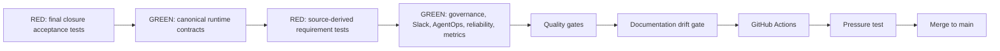
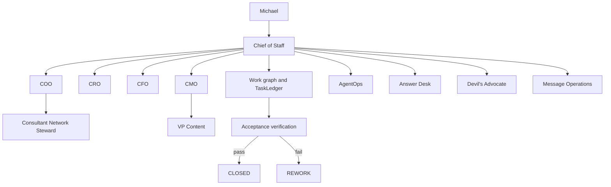
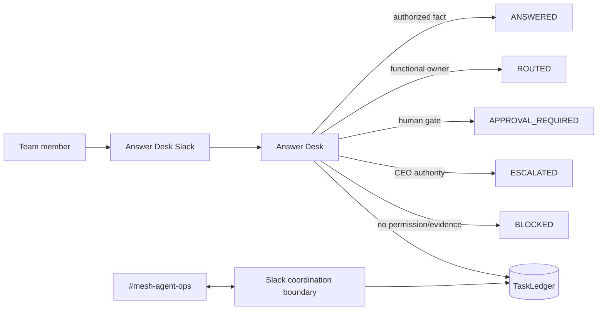

# Phase 1 Final Closure - 2026-08-17

## Status

This record closes the remaining requirement-to-runtime gaps identified after the post-remediation audit. Phase 1 implements the operating-control capabilities required for the Chief of Staff to manage a bounded executive agent organization while preserving explicit human authority and functional source truth.

External business systems and credentials remain deployment dependencies. Their absence is not represented as a live integration.

A subsequent role-model pressure test on the same date hardened organizational naming and functional capability coverage. Canonical organizational identities are stable and implementation versions are separate registry metadata. The hardening expanded executable capability vocabulary inside already-approved Phase 1 domains and did not expand autonomous authority.

## TDD and loop-engineering sequence

## Operating capability now implemented

### Chief of Staff control plane

`ChiefOfStaffService` and `ChiefOfStaffWorkforceManager` provide durable intake, work decomposition, dependency-aware child work packages, lifecycle control, check-ins, delegation, reassignment, stalled-work remediation, escalation, governed functional invocation, acceptance verification, closure, supersession, and agent-portfolio recommendations.

The CoS manages the work graph. It does not replace CRO, CFO, COO, CMO, Revenue Intelligence, Message Operations, or other functional truth owners.

### Canonical functional model

- **CRO:** commercial strategy, opportunity qualification, pipeline health, pursuits, buyer dynamics, proposal commercial architecture, next-best commercial action, expansion, and commercial-risk framing within delegated scope.
- **CFO:** Engagement Finance / FP&A only, including economics, cost-to-serve, contribution economics, margins, supported working-capital implications, forecast-versus-actual, assumptions, scenario comparison, and financial-risk recommendations.
- **COO:** delivery feasibility/configuration, capacity, POD/resource composition, dependency readiness, partner capacity, delivery-risk sensing, operational constraints, and staffing recommendations.
- **Consultant Network Steward:** consultant identification/matching and readiness evidence under COO authority.
- **CMO:** marketing strategy, audience/ICP, category positioning, campaign/demand architecture, distribution, brand governance, optimization, and marketing-commercial feedback.
- **VP Content:** editorial planning, evidence assembly, production, adaptation, reuse, inventory, QA, and performance feedback under CMO authority.

Role names do not encode implementation version. Agent implementation versions remain in the registry `version` field. Source authority, approvals, and L0-L5 boundaries remain unchanged.

### Canonical contracts and state

All Phase 1 JSON contracts are versioned and closed to undeclared fields. Runtime TaskRecord, Delegation, AgentRecord, and AuditEvent shapes are validated directly against canonical schemas. AgentRecord includes lifecycle timestamps, and the event envelope includes `event_version` in addition to the schema-facing `version`.

`TaskLedger` remains canonical for tasks, events, approvals, delegations, conflicts, decisions, verification records, performance records, Slack mappings, execution failures, replays, human overrides, and operational metrics inputs. Slack remains non-canonical.

### Slack and Answer Desk

`#mesh-agent-ops` uses channel ID `C0BRL4GCL3A`. The Slack boundary includes HMAC signature verification, five-minute replay/freshness rejection, durable event deduplication, structured rendering/parsing, one-task/one-thread persistence, approval notifications, and inbound-event recording.

The Answer Desk has a separate configurable Slack boundary. It supports `ANSWERED`, `ROUTED`, `RECOMMENDATION_PROVIDED`, `APPROVAL_REQUIRED`, `ESCALATED`, `BLOCKED_BY_ACCESS`, and `BLOCKED_BY_EVIDENCE`, plus correction and resolution telemetry.

### AgentOps

AgentOps supports durable performance events, rolling windows, versioned scorecards, stalled work, missed deadlines, workload/concurrency observations, rework, rejection reasons, execution error taxonomy, repeated tool failures, evidence defects, high-cost/low-value signals, governed health changes, and the complete recommendation vocabulary:

`CONTINUE`, `INCREASE_ROUTING`, `DECREASE_ROUTING`, `WATCH`, `RESTRICT`, `RETRAIN_OR_REVISE`, `QUARANTINE`, `RETIRE`, `BUILD_NEW_SPECIALIST`.

AgentOps remains advisory to the CoS. Material authority expansion remains human-gated.

### Reliability and auditability

Runtime controls include idempotent intake, durable Slack dedupe, bounded retries, timeout handling, execution leases, stalled-work remediation, execution-failure records, explicit replay, human override, task supersession, and the emergency kill switch.

Consequential CoS lifecycle changes, delegations, conflicts, approvals, Answer Desk dispositions, agent health changes, reassignments, functional invocations, verification, and supersession generate durable audit events.

### Metrics

The runtime instruments the full Phase 1 measurement set without inventing baselines or targets: work resolved without Michael, questions deflected from Michael, CEO touches, first-pass acceptance, rework, correct/false/missed escalation, cycle time, stalled work, verified outcomes, agent failures, approval cycle time, cross-agent conflicts, conversation loops, contributors, and cost per verified outcome where cost telemetry exists.

## Production configuration still required

- Slack bot token and signing secret.
- Separate Answer Desk Slack channel ID.
- Credentials and permissions for approved Mesh authoritative sources and existing Mesh skills.
- Production approval-owner mapping.
- Production runtime/deployment infrastructure.
- Any future monetary thresholds only after explicit approval.

## Non-goals preserved

Phase 1 still does not autonomously approve pricing or discounts, make contractual commitments, hire or fire, make legal/regulatory/security/privacy conclusions, create autonomous recursive agent trees, create agents without approval, or expand its own authority.
