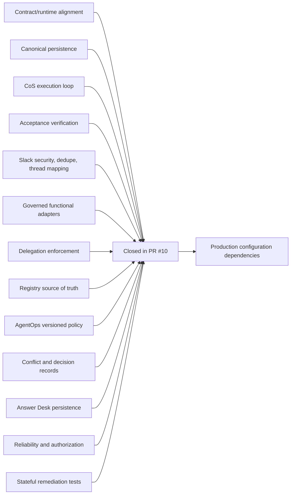

# Phase 1 Gap Assessment - 2026-08-17

**Status:** Historical assessment, superseded by the remediation merged in PR #10.  
**Use:** Preserve the original gap analysis and show current disposition.  
**Current closure record:** `phase-1-remediation-completion-2026-08-17.md`

## Original conclusion

The initial Phase 1 repository had a strong constitutional and documentation foundation, but several critical requirements existed primarily as helper functions and test scaffolding rather than durable end-to-end runtime behavior. The prioritized remediation plan focused first on canonical contracts and state, then CoS orchestration, Slack coordination, functional adapters, AgentOps, reliability, security, and stateful evaluations.

## Current disposition

| Original priority | Area | Original gap | Current disposition |
|---|---|---|---|
| P0 | Runtime CoS orchestration | No durable intake-to-verification service loop | **Closed.** `ChiefOfStaffService` now persists intake, lifecycle transitions, completion, acceptance execution, verification, rework, and audit events. |
| P0 | Contract/runtime alignment | Registry/runtime normalization and contract alignment incomplete | **Closed for the prioritized Phase 1 remediation.** Runtime registry loading now uses the canonical JSON registry and remediation tests exercise the normalization path. |
| P0 | Canonical persistence | Tasks/events/idempotency only | **Closed.** Durable consequential record storage, Slack thread mapping, Answer Desk dispositions, verification records, and other control-plane records are supported through the ledger boundary. |
| P0 | Outcome verification | Evidence presence without explicit acceptance result | **Closed.** Acceptance execution produces a durable pass/fail verification record, with failure routed to `REWORK`. |
| P0 | Slack integration controls | Rendering/in-memory guard only | **Closed at the code boundary.** Request signatures, durable event dedupe, task/thread mapping, structured messages, and Web API client boundary are implemented. Live calls still require credentials. |
| P0 | Functional agents and skills | Definitions without governed execution boundary | **Closed at the adapter boundary.** Thin functional adapters can compose approved Mesh skills and sources without reimplementation. External credentials remain configuration-dependent. |
| P1 | Delegation enforcement | Partial validation | **Closed for defined Phase 1 rules.** Persistence plus authority, ownership, depth, circularity, measurable acceptance, approval inheritance, and action-boundary checks are implemented. |
| P1 | Agent Registry control plane | Duplicate hardcoded runtime registry | **Closed.** `agents/registry.json` is loaded as the canonical runtime registry. |
| P1 | AgentOps | Helper functions and hardcoded policy | **Closed for the prioritized increment.** Versioned policy/evaluator behavior was added alongside stalled-work and coordination-loop controls. |
| P1 | Performance configuration | Hardcoded weights and thresholds | **Closed.** `config/performance-policy.v1.json` is the versioned policy input. |
| P1 | Conflict/decision management | Formatting without durable service | **Closed.** Conflict and decision records are durable and include reversal conditions. |
| P1 | Answer Desk | Disposition helper only | **Closed at the service/persistence layer.** Dispositions are persisted. Live team-facing Slack awaits a channel ID. |
| P1 | Reliability | Incomplete retry and duplicate-effect controls | **Closed for bounded Phase 1 retry/idempotency scope.** Transient retries are bounded and Slack dedupe is durable. |
| P1 | Security enforcement | Policy documented but invocation enforcement incomplete | **Closed.** Source/tool/action authorization is enforced from registry policy, with Slack signature verification at the collaboration boundary. |
| P1 | Workflow evaluations | Mostly helper-level assertions | **Materially remediated.** Stateful remediation tests exercise the principal durable flows and failure paths. |
| P1 | Success metrics | Raw fields without deterministic aggregations | **Remediated for implemented metrics.** Verified outcomes, CEO deflection, and methodologically supported CEO-time-avoided calculations are available. |
| P2 | CI quality gates | Contract validation, pytest, compileall only | **Not part of the prioritized code closure.** Additional lint/type/dependency/coverage gates remain an engineering-quality enhancement rather than a Phase 1 operating-control blocker. |
| P2 | Documentation/runtime accuracy | Documentation stronger than runtime | **Closed by this documentation refresh.** Documentation now reflects post-remediation behavior and separates live code from production configuration. |

## Production dependencies that remain

The following should not be treated as unresolved design or control-plane code gaps:

- Slack bot token and signing secret.
- Separate team-facing Answer Desk Slack channel ID.
- Credentials and permissions for approved Mesh sources and skills.
- Production approval-owner mapping.
- Deployment infrastructure.
- Any monetary thresholds that Michael later chooses to define explicitly.

## Follow-on engineering quality work

Potential next hardening increments include static typing, linting, dependency/security scanning, coverage thresholds, database migration tooling, and production persistence evolution. These improve engineering maturity but are separate from the completed prioritized Phase 1 remediation plan.
