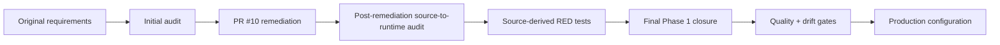

# Phase 1 Gap Assessment - 2026-08-17

**Status:** Historical audit record.  
**Final closure record:** `phase-1-final-closure-2026-08-17.md`.

## Audit history

The first audit found a strong architectural and governance foundation but material gaps between documented intent and executable runtime behavior. PR #10 closed the first remediation set. A second source-to-runtime audit then identified remaining issues in contract parity, work-graph management, Slack inbound behavior, Answer Desk dispositions, AgentOps depth, reliability, metrics, audit coverage, and CI quality gates.

Those second-audit findings became the acceptance criteria for the final TDD closure.

## Final disposition

| Area | Final disposition |
|---|---|
| Canonical contracts | Runtime `TaskRecord`, `Delegation`, `AgentRecord`, and `AuditEvent` are validated directly against versioned closed schemas. All nine contracts retain examples and validation tests. |
| CoS execution loop | `ChiefOfStaffService` implements intake, decomposition, dependencies, lifecycle, check-ins, reassignment, stalled remediation, escalation, governed invocation, verification, and closure. `ChiefOfStaffWorkforceManager` adds durable delegation, management cycles, supersession, and portfolio recommendations. |
| Canonical persistence | `TaskLedger` persists tasks, events, typed consequential records, idempotency, Slack mappings, failures, replays, overrides, verification, performance, and metrics inputs. |
| Delegation | One accountable owner, bounded depth, no authority widening, no approval removal, no circular delegation, measurable acceptance, persistent visibility, and explicit supersession are enforced. |
| Functional agents and skills | `GovernedAdapterRegistry` binds only capabilities declared for the acting agent and composes existing Mesh skills without rebuilding them. Live skill execution still requires the external executors and credentials. |
| Slack | `#mesh-agent-ops` uses `C0BRL4GCL3A`; inbound signature verification, freshness defense, durable dedupe, structured parsing, task/thread persistence, and approval notifications are implemented. |
| Answer Desk | Separate configurable Slack boundary, full disposition set, permission checks, routing, approval handling, correction tracking, and resolution telemetry are implemented. |
| Conflict and decisions | Material conflicts preserve fact/source authority, options, positions, confidence, reversibility, CoS recommendation, reversal condition, and explicit decision ownership. |
| AgentOps | Durable rolling windows, versioned scorecards, workload/SLA observations, stalls, deadlines, rework, rejection reasons, error taxonomy, repeated tool/evidence defects, cost/value signals, health changes, and all required recommendation types are implemented. |
| Reliability | Idempotency, retries, timeouts, execution leases, stalled-work handling, durable failure records, replay, human override, supersession, and kill-switch enforcement are implemented. |
| Auditability | Consequential lifecycle, delegation, reassignment, conflict, approval, verification, Answer Desk, functional invocation, health-state, and supersession actions generate audit events. |
| Metrics | The full original Phase 1 measurement set is exposed without fabricated baselines or targets. |
| Evaluation | Source-derived stateful tests exercise the management services and operating boundaries, while the original 13 scenarios remain represented. |
| CI / documentation drift | CI now adds dependency integrity, runtime/documentation drift, critical lint, coverage, high-severity security scanning, schema validation, pytest, and compileall. |

## Remaining production dependencies

The remaining items are external configuration or future production-hardening decisions, not missing Phase 1 operating logic:

- Slack bot token and signing secret.
- Separate team-facing Answer Desk Slack channel ID.
- Credentials and permissions for approved Mesh authoritative sources and existing skills.
- Production approval-owner mapping.
- Deployment/runtime infrastructure.
- Future monetary thresholds only if explicitly approved.
- Persistence evolution before multi-instance/high-availability operation.

No live external integration is claimed until its credentials and connectivity are configured and verified.
