# Phase 1 Remediation Completion - 2026-08-17

The prioritized code-level remediation plan from `phase-1-gap-assessment-2026-08-17.md` was completed using test-first acceptance criteria and CI feedback loops and merged to `main` in PR #10.

## Closure summary

```mermaid
flowchart LR
    RED[Acceptance tests / RED] --> GREEN[Minimum implementation / GREEN]
    GREEN --> CI1[CI feedback]
    CI1 --> FIX1[Registry normalization correction]
    FIX1 --> CI2[CI feedback]
    CI2 --> FIX2[Advisory authority normalization correction]
    FIX2 --> PASS[Contracts + pytest + compileall PASS]
    PASS --> MERGE[PR #10 merged to main]
    MERGE --> DOCS[Documentation reconciled]
```

## Closed in the remediation increment

- Canonical runtime registry loads from `agents/registry.json`; duplicate hardcoded registry state was removed.
- SQLite persistence supports consequential typed records, task/thread mappings, durable idempotency, Answer Desk dispositions, verification records, and atomic audit/event writes through the ledger boundary.
- `ChiefOfStaffService` drives intake, lifecycle advancement, completion, explicit acceptance-test execution, verification, rework, and audit events.
- Delegations are persisted and enforce owner, depth, authority, circularity, measurable acceptance, approval inheritance, and action-boundary rules.
- Conflicts and decisions are durable first-class records with decision owners and reversal conditions.
- Slack coordination includes request-signature verification, durable event dedupe, durable one-task/one-thread mapping, structured messages, and a live-capable Web API client boundary for `#mesh-agent-ops` (`C0BRL4GCL3A`).
- Functional agents use thin governed adapter boundaries so existing Mesh skills and sources can be composed without reimplementation.
- Invocation-time source/tool/action authorization is enforced from registry policy.
- AgentOps uses a versioned performance policy and evidence-backed scorecards in addition to stalled-work and coordination-loop detection.
- Reliability includes bounded retry handling for transient failures.
- Deterministic operating metrics include verified outcomes, CEO deflection, and methodologically supported CEO time avoided.
- Stateful remediation tests exercise orchestration, acceptance failure/rework, persistence, delegation, conflicts, Answer Desk, Slack security/idempotency, AgentOps policy, reliability, metrics, and adapter boundaries.

## Documentation closure

All repository documentation was reconciled after the code remediation. Mermaid diagrams now document the system architecture, task lifecycle, delegation flow, conflict/decision flow, Agent Registry control path, AgentOps loop, Slack coordination, Answer Desk, testing flow, and operating runbook.

The historical gap assessment is retained for traceability and now maps each prior gap to its current disposition.

## Remaining production configuration

Production execution still requires values that must not be fabricated or committed:

- Slack bot token and signing secret.
- Separate team-facing Answer Desk Slack channel ID.
- Credentials/permissions for approved Mesh authoritative sources and skills.
- Explicit production approval-owner configuration.
- Deployment infrastructure and any future monetary thresholds explicitly approved by Michael.

These are configuration and integration dependencies, not open Phase 1 operating-control gaps.
