# Phase 1 Remediation Completion - 2026-08-17

This document records the remediation merged in PR #10. It is an intermediate historical record, not the final Phase 1 closure statement.

A later source-to-runtime audit found additional gaps that were not fully closed by PR #10. Those findings and their final remediation are documented in `phase-1-gap-assessment-2026-08-17.md` and `phase-1-final-closure-2026-08-17.md`.

## PR #10 loop

```mermaid
flowchart LR
    RED[Acceptance tests / RED] --> GREEN[Minimum implementation / GREEN]
    GREEN --> CI1[CI feedback]
    CI1 --> FIX1[Registry normalization correction]
    FIX1 --> CI2[CI feedback]
    CI2 --> FIX2[Advisory authority normalization correction]
    FIX2 --> PASS[Contracts + pytest + compileall PASS]
    PASS --> MERGE[PR #10 merged]
    MERGE --> AUDIT[Source-to-runtime re-audit]
    AUDIT --> FINAL[Final Phase 1 closure]
```

## What PR #10 established

- Canonical runtime registry loading from `agents/registry.json`.
- SQLite persistence for typed control-plane records, task/thread mappings, idempotency, Answer Desk dispositions, verification records, and audit events.
- `ChiefOfStaffService` intake, lifecycle, completion, acceptance execution, verification, and rework.
- Persistent delegation checks for owner, depth, authority, circularity, measurable acceptance, approval inheritance, and action boundaries.
- Durable conflict and decision records.
- Slack request-signature verification, event dedupe, task/thread mapping, structured messages, and a Web API client boundary for `#mesh-agent-ops` (`C0BRL4GCL3A`).
- Governed functional adapter boundaries.
- Invocation-time source/tool/action authorization.
- Versioned AgentOps performance policy and scorecards.
- Bounded transient retries.
- Initial operating metrics and stateful remediation tests.

## Why another closure increment was required

The later audit found that the original requirements demanded deeper runtime-contract parity, a broader CoS work-management loop, a complete Slack inbound and Answer Desk boundary, richer AgentOps signal management, partial-failure replay and human override, complete Phase 1 metrics, fuller audit coverage, and stronger CI quality/drift checks.

These items are addressed in `phase-1-final-closure-2026-08-17.md`.

## Production configuration remains external

No remediation increment fabricates credentials or live connectivity. Slack secrets, the separate Answer Desk channel ID, authoritative-source credentials, production approval owners, and deployment infrastructure remain environment-specific configuration.
