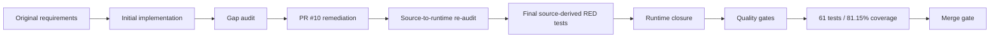

# Pressure Test

This document preserves the independent pressure-test history for the Phase 1 implementation.

## Audit sequence

## Final challenge questions

The final closure was challenged against the original operating intent rather than documentation quality alone:

- Is the CoS an operating control plane rather than a routing chatbot? **Yes.** It now manages a durable work graph, dependencies, delegation, check-ins, remediation, reassignment, escalation, verification, closure, and supersession.
- Are functional truth boundaries preserved? **Yes.** Governed adapters bind only declared Mesh skills/tools and do not let the CoS rewrite CFO, Revenue Intelligence, COO, or CMO source authority.
- Can delegated work disappear after handoff? **No.** Tasks/delegations remain canonical until terminal or explicitly superseded.
- Can an agent widen authority or remove approval gates through delegation? **No.** Delegation validation fails closed.
- Can Slack become the system of record? **No.** It remains observable collaboration with durable mappings/idempotency in `TaskLedger`.
- Can duplicate or stale Slack delivery create duplicate effects? **No at the Slack boundary.** Event IDs are durable and signed requests outside the freshness window are rejected.
- Can consequential approvals be inferred from chat? **No.** Formal approval records are explicit and human-owned.
- Can completion substitute for outcome verification? **No.** Acceptance execution controls `VERIFIED`; failure routes to `REWORK`.
- Can a failed effect be silently abandoned? **No at the managed reliability boundary.** Failure records support explicit replay or named human override.
- Can a critical agent defect be hidden in an average score? **No.** Critical defects recommend quarantine.
- Does AgentOps have the full required action vocabulary and signal set? **Yes.** Rolling evidence, workload/SLA, deadline/rework, error/tool/evidence/cost signals and all nine recommendation types are implemented.
- Does the Answer Desk expose sensitive content merely because a connector can access it? **No.** Requester/source permissions are checked before answering, and the team interface is separate from agent ops.
- Can retrieved content change system policy through prompt injection? **No.** Retrieved content remains untrusted data.
- Is documentation allowed to drift ahead of runtime? **No.** CI runs the runtime/documentation drift gate.

## Final CI evidence

The final pre-merge PR head passed:

- dependency integrity (`pip check`),
- all 9 contract fixture validations,
- runtime/documentation drift validation,
- critical Ruff lint checks,
- **61 pytest tests**,
- **81.15% total branch-aware coverage** against a 55% minimum gate,
- high-severity Bandit scanning,
- Python `compileall`.

The coverage threshold is a floor, not a target. Untested low-level helper paths remain visible in the coverage report and should be strengthened as production integrations are added.

## Residual boundaries

Remaining items are environment configuration or production scaling decisions: Slack secrets, Answer Desk channel ID, approved source/skill credentials, production approval owners, deployment infrastructure, and persistence evolution before multi-instance/high-availability operation. No live external integration is claimed until configured and verified.
