# Pressure Test

This document preserves the independent pressure-test history for the Phase 1 implementation and remediation.

## Pre-remediation pressure test

The initial implementation was challenged against its own operating contract rather than accepted on documentation quality alone. The pressure test identified defects in verification state handling and performance routing semantics. Those defects were corrected before the initial Phase 1 merge.

## Gap-audit pressure test

A subsequent audit compared `main` against the original Phase 1 requirements and found that several policies were implemented only as isolated helpers rather than durable end-to-end runtime behavior. The resulting prioritized remediation plan is preserved in `phase-1-gap-assessment-2026-08-17.md`.

## TDD remediation pressure test

```mermaid
flowchart LR
    A[Original requirements] --> G[Gap assessment]
    G --> T[Failing acceptance tests]
    T --> I[Implementation]
    I --> CI[CI]
    CI -->|registry normalization defect| F1[Fix]
    F1 --> CI2[CI]
    CI2 -->|advisory authority defect| F2[Fix]
    F2 --> PASS[Final green]
    PASS --> M[PR #10 merged]
```

The remediation used tests first. CI surfaced registry-normalization defects that were not hidden or bypassed. The defects were fixed and the final PR head passed contract validation, the complete pytest suite, and compileall.

## Current conclusion

The prioritized Phase 1 code-level gaps are closed. The remaining dependencies are production configuration and external integration values, including Slack credentials, Answer Desk channel ID, approved source/skill credentials, approval-owner mapping, and deployment infrastructure.

Engineering-quality enhancements such as static typing, linting, dependency scanning, coverage gates, and future production persistence remain valid follow-on work but are not open Phase 1 constitutional gaps.
