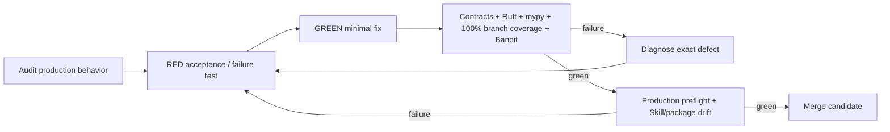

# Production hardening loop - 2026-08-17

## Objective

Raise the Phase 1 control plane from the prior 79.71% branch-aware release coverage toward complete executable coverage while using TDD and loop engineering to identify and remove production defects rather than merely adding line coverage.

## Loop method

## Gaps found and remediated

| Priority | Production gap found | Resolution |
|---|---|---|
| P0 | Workspace MCP contract described Python method bindings but did not provide a serialized production composition root. | Added `mesh_cos.mcp_runtime.MCPRuntime`, fixed handler dispatch, exact tool-surface validation, deny-by-default agent/human principal paths, and production-preflight composition checks. |
| P0 | Agent callers could conceptually impersonate human approval/override actors. | `approval.record_decision` and `reliability.human_override` are now human-only MCP tools. Authenticated human principal identity is injected server-side and persisted as `decided_by` / override actor. |
| P0 | MCP replay could not safely accept a remote callable. | Added server-owned `ReplayExecutorRegistry`; canonical failures may carry a stable `replay_key`; client code/import paths are never executed. |
| P0 | Remote workers could not persist outcome/evidence and move QA work to `COMPLETED` before CoS verification. | Added governed `task.complete` for accountable owners and preserved separate `task.verify` acceptance verification. |
| P0 | Governance MCP calls trusted client-provided actor identity and could claim authority beyond the role. | Agent identity/version are derived from the canonical registry; authority is checked server-side; L4 requires approval evidence and L5 requires Michael as approver/decision owner. |
| P0 | Slack idempotency could be claimed before canonical event persistence, creating a crash window. | Added atomic idempotency-key + record persistence and moved Slack inbound ingestion onto that transaction. |
| P0 | Governance v2 event idempotency and record persistence had the same split-write risk. | Governance events now atomically claim idempotency and persist the canonical audit record. |
| P1 | Consequential generic records were listed by semantic/random record ID rather than canonical insertion order. | `TaskLedger.list_records()` now preserves SQLite insertion order, protecting rolling evidence windows and audit-chain predecessor selection. |
| P1 | Runtime/staffing/AgentOps/metrics timestamp handling could fail on legacy naive timestamps. | Normalized runtime comparisons to UTC while preserving compatibility with legacy records. |
| P1 | Explicit empty source allowlists could be widened by fallback logic. | Explicit empty `allowed_sources` remains fail closed. |
| P1 | Replay and human override were not fully represented in audit evidence. | Replay/failure/override paths now produce durable audit events and preserve actor/disposition/reason. |
| P1 | CoS decomposition could partially persist children before rejecting a later invalid work package. | Full decomposition is validated before persistence, preserving atomic intent. |
| P1 | Production activation had no single fail-closed readiness command. | Added `ProductionPreflight` and `scripts/production-preflight.py` for kill switch, HTTPS MCP URL, registry/health, MCP bindings/composition, optional Slack/Answer Desk, and optional audit-chain checks. |
| P2 | CI coverage gate was 55% and source lint was limited to critical parse/error rules. | Raised to 100% branch-aware `mesh_cos` coverage, strict source Ruff, mypy, dependency integrity, contracts/drift checks, Bandit, and compileall. |
| P2 | Dependency update hygiene was manual. | Added weekly Dependabot configuration for Python quality dependencies and GitHub Actions. |
| P2 | Role Skills did not carry a common production-readiness contract. | Added `references/production-readiness.md` to all 11 Skills and made Workspace Agent Builder configuration require it before publication. |

## Production semantics

Coverage is a release gate, not the production-readiness claim by itself. Production readiness also requires the runtime and environment conditions in `docs/production-readiness.md`.

The repository intentionally does **not** claim the following are live until separately configured and exercised:

- a deployed remote HTTPS `mesh-cos-mcp` endpoint;
- production Workspace app authentication;
- live Slack bot/signing credentials;
- the separate Answer Desk Slack channel;
- production approval-owner mapping;
- production source/skill credentials;
- deployment infrastructure or automated Google Sheets mirroring.

These remain explicit external dependencies and are checked or reported by the production activation process rather than fabricated in code.
