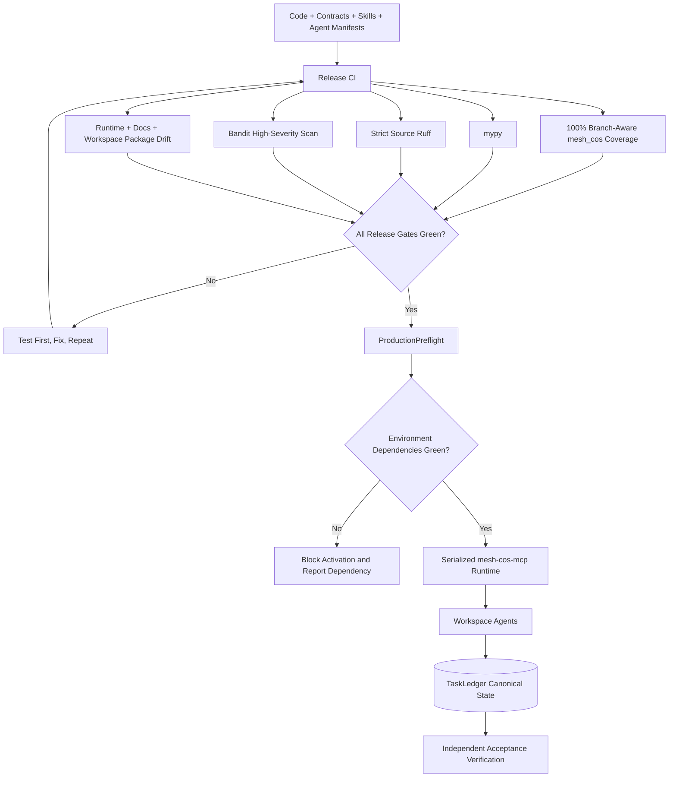
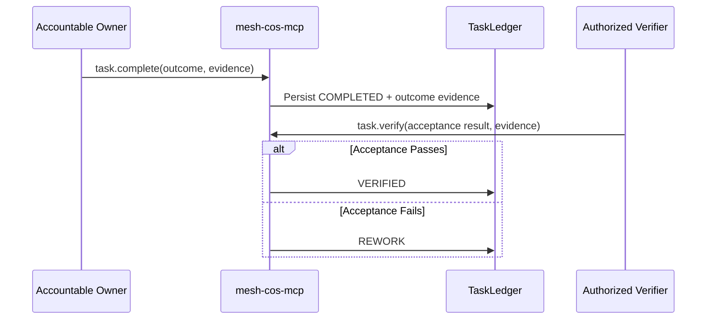
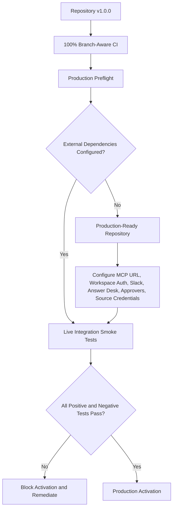

# Production Readiness

## Release status

Release **`v1.0.0 Production Readiness`** is the first stable semantic release for which the repository, runtime contracts, 11 Skills, 11 Workspace Agent manifests, MCP control plane, CI gates, production preflight, and operating documentation are treated as production-ready.

Production readiness is a fail-closed operating condition, not a coverage percentage and not a claim that the target environment is already live. Production activation still requires environment-specific dependencies, live smoke tests, and private-preview acceptance tests.

## Production control path



## Release gates

The GitHub Actions release path must pass all of the following without weakening a gate to make a build green:

```bash
python -m pip check
python scripts/validate-contracts.py
python scripts/check-runtime-doc-drift.py
python scripts/check-chatgpt-packages.py
ruff check src
ruff check tests scripts --select E9,F63,F7,F82
mypy src --check-untyped-defs
pytest --cov=mesh_cos --cov-report=term-missing --cov-report=xml --cov-fail-under=100
bandit -q -r src -lll
python -m compileall -q src
```

The 100% threshold applies to branch-aware coverage for `mesh_cos`. Coverage is paired with negative authorization, failure-path, state-machine, contract, security, idempotency, replay, approval, source-authority, and integration tests.

## Serialized MCP boundary

`chatgpt/mcp/mesh-cos-mcp.v1.json` projects the control plane through `mesh_cos.mcp_runtime.MCPRuntime`.

Production invariants:

- the transport supplies an authenticated principal identity, tool name, and JSON arguments only;
- agent tool access is deny-by-default and checked server-side;
- `approval.record_decision` and `reliability.human_override` are human-only and require an authenticated human principal;
- agent identity, role name, and implementation version in governance records are derived from the canonical Agent Registry;
- L4/L5 actions require explicit approval evidence and L5 remains Michael-exclusive;
- replay uses a server-registered replay executor named by canonical failure state, never client-supplied executable code or import paths;
- task writes require the accountable owner or Chief of Staff where the operation permits CoS control;
- `task.complete` persists the accountable owner's outcome and evidence;
- `task.verify` remains a separate acceptance action and cannot substitute for missing completion evidence;
- consequential Slack and governance-event idempotency claims are atomic with canonical persistence.

## Production preflight

Run before production activation:

```bash
python scripts/production-preflight.py
```

Use stricter flags when those surfaces are in scope:

```bash
python scripts/production-preflight.py --require-slack --require-answer-desk --require-ledger
```

Preflight checks the kill switch, HTTPS MCP URL, canonical 11-agent registry and routable health, MCP contract/runtime bindings, exact serialized runtime composition, optional Slack configuration, optional Answer Desk channel, and optional canonical audit-chain integrity. It reports credential presence without echoing secret values.

A failed preflight blocks production activation.

## Outcome integrity



`COMPLETED` is never treated as `VERIFIED`. The verifier identity and acceptance evidence are persisted canonically.

## Skill and Workspace Agent readiness

Every role Skill contains `references/production-readiness.md`. Every Workspace Agent manifest declares repository release `1.0.0` and must exactly match the per-agent MCP allowlist in the release contract. The Builder handoff requires negative authority, missing-evidence, human-spoofing, kill-switch, replay-safety, permission-denial, and completion-versus-verification tests before publication.

Workspace Agents remain private until preview tests and production preflight pass. Connector write actions remain `Always ask` unless a narrower exception is explicitly approved and documented.

## Production readiness versus activation



## External production dependencies

The following are not fabricated by the repository and must be configured and tested in the target environment:

- deployed HTTPS `mesh-cos-mcp` endpoint and `MESH_COS_MCP_SERVER_URL`;
- Workspace/agent authentication and least-privilege app permissions;
- Slack bot token and signing secret when Slack is enabled;
- dedicated Answer Desk Slack channel before that channel is enabled;
- production approval-owner mappings;
- approved source/Skill credentials and access controls;
- authenticated Google Sheets mirroring if optional governance mirrors are automated;
- deployment/runtime infrastructure, secrets management, monitoring, and operational ownership.

See `release-1.0.0-production-readiness.md` for the semantic release record and `../RELEASE.md` for GitHub release notes.
