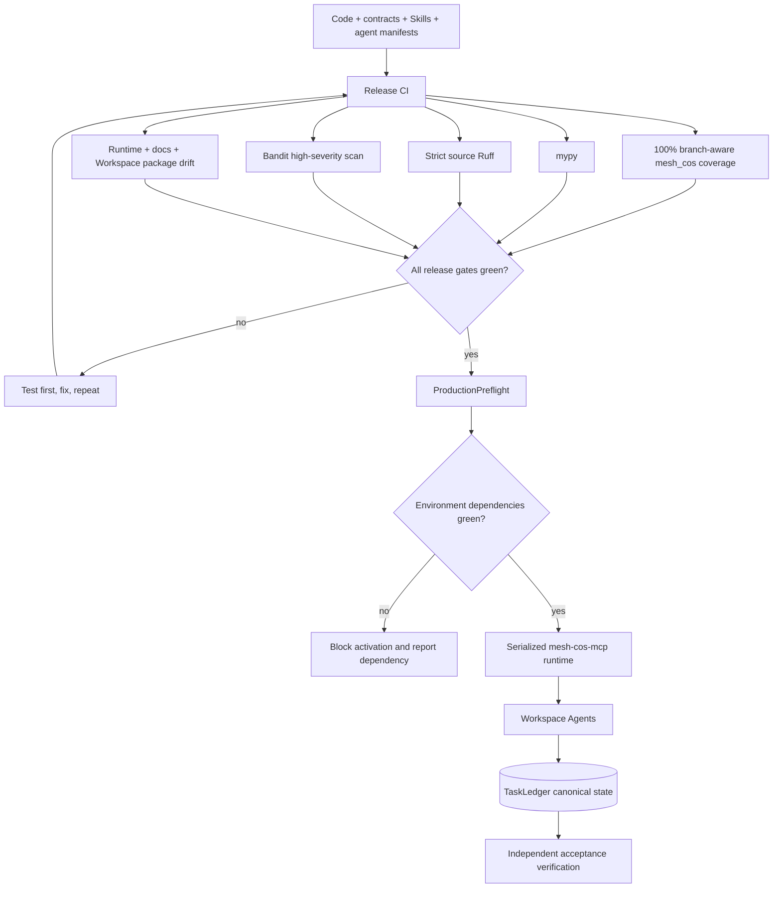
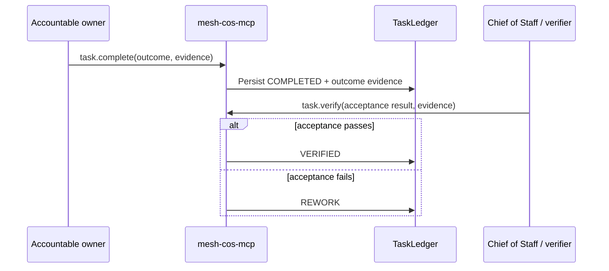

# Production Readiness

## Purpose

Production readiness is a fail-closed operating condition, not a coverage percentage. The release gate combines complete executable branch coverage with static checks, contract/runtime drift controls, serialized MCP authority enforcement, production preflight, least-privilege Workspace Agent configuration, evidence-backed outcome verification, and explicit external dependencies.

## Production control path



## Release gates

The GitHub Actions release path must pass all of the following without weakening a gate to make a build green:

```bash
python -m pip check
python scripts/validate-contracts.py
python scripts/check-runtime-doc-drift.py
python scripts/check-chatgpt-packages.py
ruff check src
ruff check tests scripts --select E9,F63,F7,F82
mypy src --check-untyped-defs
pytest --cov=mesh_cos --cov-report=term-missing --cov-report=xml --cov-fail-under=100
bandit -q -r src -lll
python -m compileall -q src
```

The 100% threshold applies to branch-aware coverage for `mesh_cos`. It does not claim that tests prove every production condition. Coverage is paired with negative authorization, failure-path, state-machine, contract, security, idempotency, replay, approval, source-authority, and integration tests.

## Serialized MCP boundary

`chatgpt/mcp/mesh-cos-mcp.v1.json` projects the control plane through `mesh_cos.mcp_runtime.MCPRuntime`.

Production invariants:

- the transport supplies an authenticated principal identity and JSON arguments only;
- agent tool access is deny-by-default and checked server-side;
- `approval.record_decision` and `reliability.human_override` are human-only and require an authenticated human principal;
- agent identity, role name, and implementation version in governance records are derived from the canonical Agent Registry, not trusted from client arguments;
- L4/L5 actions require explicit approval evidence and L5 remains Michael-exclusive;
- replay uses a server-registered replay executor named by canonical failure state, never client-supplied executable code or import paths;
- task writes require the accountable owner or the Chief of Staff where the specific operation permits CoS control;
- `task.complete` persists the accountable owner's outcome and evidence;
- `task.verify` remains a separate acceptance action and cannot substitute for missing completion evidence.

The repository does not claim that the remote HTTPS MCP endpoint is deployed. Deployment and workspace authentication remain environment-specific dependencies.

## Production preflight

Run before production activation:

```bash
python scripts/production-preflight.py
```

Use the stricter flags when those surfaces are in scope:

```bash
python scripts/production-preflight.py --require-slack --require-answer-desk --require-ledger
```

Preflight checks the kill switch, HTTPS MCP URL, canonical 11-agent registry and routable health, MCP contract/runtime bindings, exact serialized runtime composition, optional Slack configuration, optional Answer Desk channel, and optional canonical audit-chain integrity. It reports credential presence without echoing secret values.

A failed preflight blocks production activation.

## Outcome integrity



`COMPLETED` is never treated as `VERIFIED`. The verifier identity and acceptance evidence are persisted canonically.

## Skill and Workspace Agent readiness

Every role Skill contains `references/production-readiness.md`. The Workspace Agent Builder handoff requires the Builder to load that reference together with the role contract and to run negative authority, missing-evidence, human-spoofing, kill-switch, replay-safety, permission-denial, and completion-versus-verification preview tests before publication.

Workspace Agents remain private until preview tests and production preflight pass. Connector write actions remain `Always ask` unless a narrower exception is explicitly approved and documented.

## External production dependencies

The following are not fabricated by the repository and must be configured and tested in the target environment:

- deployed HTTPS `mesh-cos-mcp` endpoint and `MESH_COS_MCP_SERVER_URL`;
- workspace/agent authentication and least-privilege app permissions;
- Slack bot token and signing secret when Slack is enabled;
- a dedicated Answer Desk Slack channel before that channel is enabled;
- production approval-owner mappings;
- approved source/skill credentials and access controls;
- authenticated Google Sheets mirroring if the optional governance mirrors are automated;
- deployment/runtime infrastructure and operational ownership.

Production readiness is not declared until repository gates, environment preflight, Workspace preview tests, and required external dependencies are all green.
