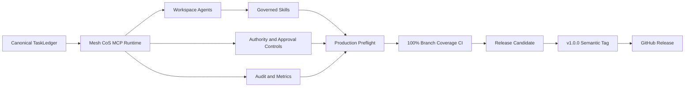
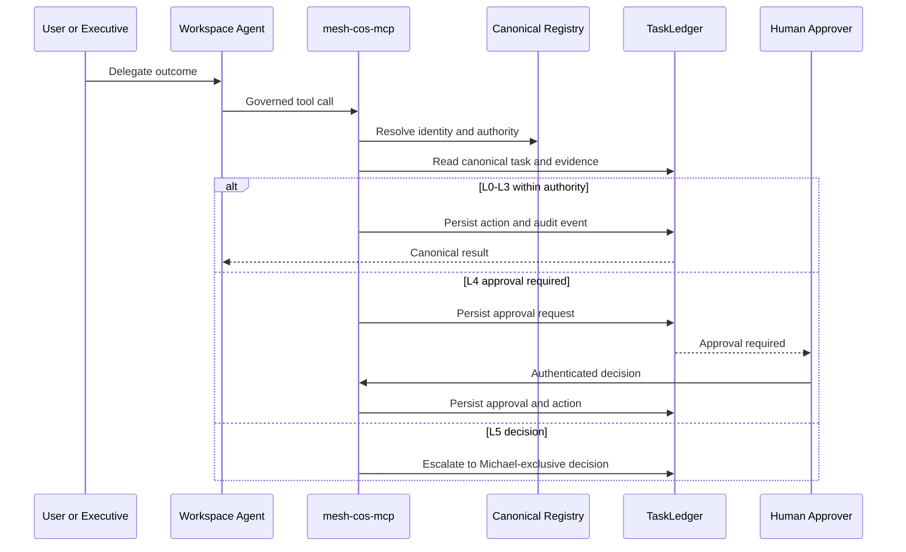
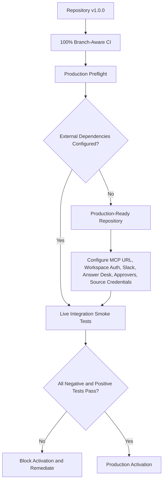

# v1.0.0 Production Readiness

Release `v1.0.0` is the first semantic production-readiness release of the Mesh AI Chief of Staff operating core. It marks the repository, runtime contracts, governed Skills, Workspace Agent deployment packages, MCP control plane, release gates, and operating documentation as production-ready for activation when environment-specific dependencies pass preflight.

Production readiness is not the same as production activation. This release does not claim that a remote MCP endpoint, Workspace authentication, Slack credentials, Answer Desk channel, production approver mapping, source credentials, or deployment infrastructure have already been configured.

## Release flow

## Governed execution path

## Production readiness versus activation

## v1.0.0 release invariants

- `mesh_cos` branch-aware coverage is release-gated at 100%.
- Contract validation, runtime/documentation drift, Workspace Agent package drift, strict source Ruff, mypy, dependency integrity, high-severity Bandit, and compileall are release gates.
- `mesh_cos.mcp_runtime.MCPRuntime` is the serialized execution boundary.
- Agent identity, role, implementation provenance, and authority are derived server-side from the canonical Agent Registry.
- Human-only approval and reliability-override operations require authenticated human principals.
- L4 fails closed without qualified human approval. L5 remains Michael-exclusive.
- Remote replay uses only server-registered replay executors named by canonical failure state. Client-supplied code or import paths are never executed.
- `task.complete` persists accountable-owner outcome evidence. `task.verify` remains separate acceptance verification.
- Slack and governance-event idempotency are atomic with canonical persistence.
- `TaskLedger` remains canonical. ChatGPT conversations, Slack, and governance Sheets remain non-canonical surfaces.
- Every one of the 11 Workspace Agent manifests declares repository release `1.0.0` and is checked against the MCP allowlist and canonical registry.

## Required production activation dependencies

Before live activation, configure and test the approved HTTPS `mesh-cos-mcp` endpoint, `MESH_COS_MCP_SERVER_URL`, Workspace authentication and app permissions, Slack bot/signing credentials where used, a dedicated Answer Desk Slack channel, production approval-owner mapping, approved source/Skill credentials, secrets management, runtime deployment ownership, and optional authenticated governance-Sheets mirroring.

Run `python scripts/production-preflight.py` before activation. Use `--require-slack`, `--require-answer-desk`, and `--require-ledger` when those surfaces are in scope.

## Release identity

- Repository release: `1.0.0`
- Git tag: `v1.0.0`
- Release title: `v1.0.0 Production Readiness`
- Release class: stable semantic production-readiness milestone
- Activation status: environment-dependent and fail-closed until preflight and live smoke tests pass

Historical Phase 1 closure and remediation records remain historical snapshots and are intentionally not rewritten to pretend they were authored against v1.0.0.
