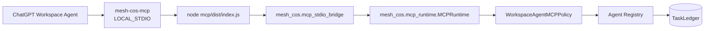

# v1.1.0 Local ChatGPT MCP

## Release purpose

Release `v1.1.0` moves the Mesh CoS MCP execution surface into the ChatGPT environment through a bundled `LOCAL_STDIO` runtime. The implementation follows the established Mesh Revenue Intelligence local-MCP pattern while retaining the existing CoS Python control plane as canonical execution logic.

## Architecture



The TypeScript MCP is transport only. Authority, task lifecycle, approvals, governance, replay safety, verification, and canonical persistence remain in Python.

## Runtime binding

Each agent process is bound by:

```text
MESH_COS_AGENT_ID=<registered agent id>
MESH_COS_LEDGER_PATH=.mesh-cos/task-ledger.sqlite3
MESH_COS_PYTHON_BIN=python
```

All 11 agents in one operating universe use the same approved ledger path.

## TDD and loop engineering record

The enhancement began with acceptance tests on branch `enhancement/local-chatgpt-mcp` before implementation. Early RED CI identified missing local-MCP artifacts and later surfaced implementation defects including tool-catalog ordering, outdated release drift expectations, remote-endpoint assumptions, and dependency security findings.

The loop then:

1. added the bundled MCP package and Python bridge;
2. added exact agent tool projection and safe local identity binding;
3. added real stdio MCP certification and persistence checks;
4. removed an unnecessary dependency after npm reported high/moderate vulnerabilities;
5. reconciled the release/version, Workspace Agent, Skill, preflight, and documentation contracts;
6. repeated CI until all release gates passed.

No release gate is intentionally weakened to make the build green.

## Security and governance invariants

- `TaskLedger` remains canonical.
- Per-agent tool authorization remains deny-by-default.
- Agent identity comes from `MESH_COS_AGENT_ID`, not prompt or retrieved content.
- `approval.record_decision` and `reliability.human_override` remain human-only.
- L4 requires qualified human approval.
- L5 remains Michael-exclusive.
- Private chain-of-thought, credentials, tokens, and raw secrets are not governance payloads.
- Client-supplied code, import paths, shell commands, and replay callables are never executable behavior.
- `task.complete` is separate from `task.verify`.
- Local MCP errors do not return raw Python stderr.

## Release verification

```bash
python -m pip check
cd mcp
npm ci
npm run check
cd ..
python scripts/validate-contracts.py
python scripts/check-runtime-doc-drift.py
python scripts/check-chatgpt-packages.py
ruff check src
ruff check tests scripts --select E9,F63,F7,F82
mypy src --check-untyped-defs
pytest --cov=mesh_cos --cov-report=term-missing --cov-report=xml --cov-fail-under=100
bandit -q -r src -lll
python -m compileall -q src
```

`npm run check` includes TypeScript compilation, Node tests, a real local stdio MCP smoke path, canonical persistence across calls, human-only exclusion, safe denial behavior, and npm audit.

The Python release threshold remains 100% branch-aware `mesh_cos` coverage.

## Production activation boundary

ChatGPT-local operation does not require an HTTPS MCP endpoint or `MESH_COS_MCP_SERVER_URL`. Workspace app authentication, Slack credentials where applicable, the dedicated Answer Desk Slack channel, production approval-owner mappings, approved source credentials, Google Sheets write authentication for automatic mirrors, secrets management, monitoring, and publication/RBAC configuration remain target-environment dependencies.

A managed remote MCP may be added separately as an optional transport, but it must preserve the same canonical runtime and governance controls.

## Semantic Tag

The semantic release tag for this release is `v1.1.0` and the GitHub Release title is `v1.1.0 Local ChatGPT MCP`.

<!-- mesh-cos-v2-shared-da -->
## v2.0.0 current architecture

The live Phase 1 runtime is a **10-agent** organization. The former repository-local Devil's Advocate agent and duplicate role Skill are removed. **Mesh Devil's Advocate** is an external **shared Skill** available only to Chief of Staff and CRO through governed Skill invocation. It is **advisory** only, cannot overwrite **canonical facts**, cannot execute external actions, and returns decision authority to the owning role or qualified human. `TaskLedger` remains canonical state; ChatGPT uses `LOCAL_STDIO` through `MCPRuntime` with deny-by-default allowlists, human-only approval/override paths, `check-chatgpt-packages.py` drift enforcement, and the 100% branch-aware coverage gate. Historical references to an 11-agent roster or a local Devil's Advocate role describe superseded releases only.

