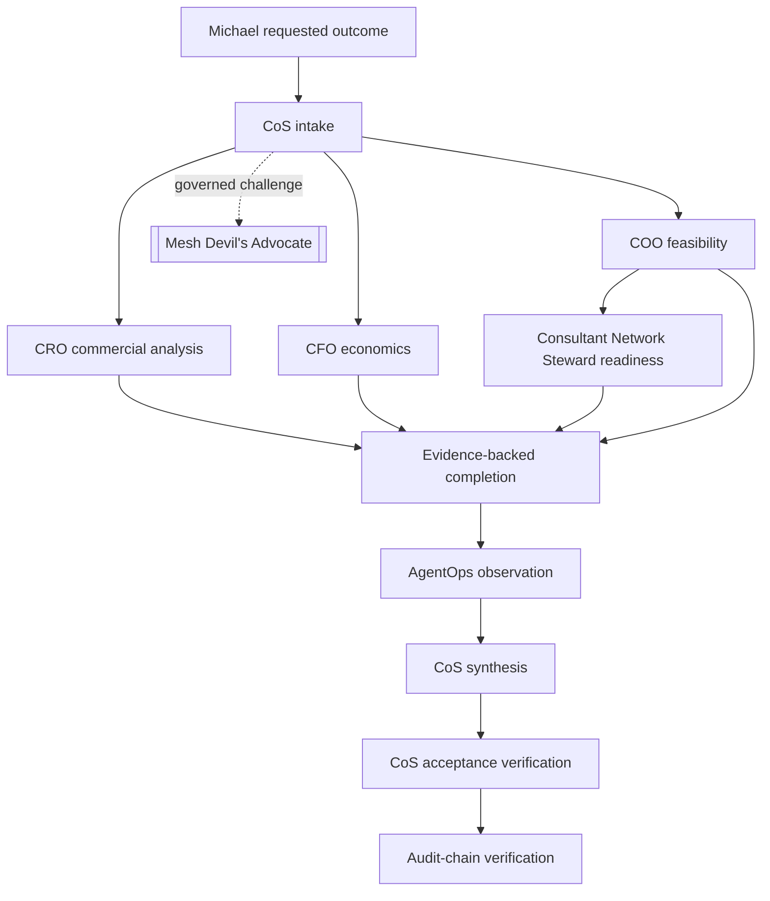

# v4.0.0 Chief of Staff Delegation Contract Remediation

**Status:** release candidate  
**Semantic tag:** `v4.0.0`  
**Issue:** #30  
**Pull request:** #31

## Requirements trace

| Requirement | Authoritative implementation | Verification |
|---|---|---|
| Current Phase 1 contains 10 agents | `agents/registry.json`, 10 role Skills, 10 Workspace manifests, 10 MCP principals | package drift gate, MCP smoke, roster tests |
| Devil's Advocate is not an agent | external `mesh-devils-advocate`, consumers `cos` and `cro`, advisory only | registry tests, MCP principal denial, governed Skill integration test |
| Human-only operations never enter agent catalogs | `human_tool_allowlist`, `MCPRuntime.call_human`, `call_agent` denial | all-agent negative tests plus positive human-path tests |
| Identity cannot be prompt-spoofed | process-bound `MESH_COS_AGENT_ID`, server-derived governance identity | spoofed identity regression test, Node MCP identity tests |
| Delegation cannot expand authority | direct-child runtime check plus `validate_delegation` authority/depth/approval rules | authority widening, gate dropping, depth-3 negative tests |
| Owner completion is canonical | `task.complete`, owner-or-CoS write authorization, lifecycle evidence guard | owner completion and duplicate/missing evidence tests |
| Completion is separate from verification | `COMPLETED -> VERIFIED` only through `task.verify` | non-CoS self-verification denial, CoS acceptance verification tests |
| CoS -> COO -> Steward path is legal | registry hierarchy plus depth 2 delegation | synthetic end-to-end certification |
| Stale consultant data cannot become ready | `staffing.readiness` freshness rule | stale-readiness negative test |
| Child failure cannot verify parent | separate task states and explicit parent verification | child failure / parent bypass negative test |
| Audit chain is intact | `GovernanceJournal` hash chain | runtime drift certification and E2E audit-chain check |
| Documentation matches runtime | current docs and Mermaid diagrams use v4 topology and lifecycle | `check-chatgpt-packages.py`, review audit |

## Root-cause analysis

### DEFECT 1: roster-count drift

Root cause was duplicated architecture facts across role-Skill production-readiness references and release-era documentation without a strong current-state roster regression gate. The remediation establishes the registry as the canonical roster and adds CI equality checks across registry, Skills, manifests, MCP principals, role contracts, and current documentation. Historical roster references remain only in explicitly historical release records.

### DEFECT 2: human-only operations in CoS role contract

Root cause was documentation/catalog drift. Runtime policy already separated human-only operations correctly, but the CoS role contract manually listed the full runtime surface rather than the actual agent projection. The remediation makes role-contract MCP allowlists exact projections of canonical per-agent allowlists and tests every agent for human-only exclusion.

### DEFECT 3: completion contract mismatch

Root cause was the same projection drift in role contracts. The runtime already implemented `task.complete` and distinct `task.verify`, while multiple role documents described only general `task.transition`. Runtime tracing selected `task.complete` as authoritative. The lifecycle was additionally hardened so completion itself requires non-empty outcome and evidence.

## BDD/TDD loop evidence

The first remediation commit added failing acceptance tests before implementation. CI failed for the intended baseline reasons: 9-agent roster, stale 11-agent production-readiness wording, CoS human-only role-contract exposure, and missing owner `task.complete` role-contract declarations.

Subsequent loops restored the intended 10-agent topology, reconciled agent/Workspace/MCP projection, hardened completion evidence, corrected role contracts, updated Node MCP tests, expanded package/runtime drift certification, and added synthetic end-to-end delegation coverage.

Each loop retained dependency, lint, type, schema, security, coverage, MCP, and documentation gates. No quality gate was reduced.

## Synthetic end-to-end scenario

## Security invariants

- L4 remains qualified-human gated.
- L5 remains Michael-exclusive.
- Human-only MCP operations are disjoint from every agent catalog.
- Agent identity is immutable at runtime.
- Delegation cannot widen authority or drop parent approval obligations.
- Mesh Devil's Advocate cannot mutate canonical facts or execute external actions.
- Message Operations cannot decide its own approval.
- Completion cannot create verification.
- Replay remains server-registered and fail closed.

## Release readiness

The final candidate must have the complete CI suite green on the PR head. A separate requirements audit and independent verification record must then confirm zero known defects before merge. After merge, `main`, tag `v4.0.0`, and the GitHub Release must each be independently verified before completion is reported.