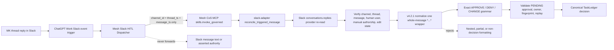

# Mesh CoS MCP v4.2.1 Slack Rendered Decision Compatibility

## Release identity

- Deployment release: `4.2.1`
- Canonical MCP runtime contract: `4.0.0`
- Production predecessor: `4.2.0`
- Workforce: exactly 10 registered agents
- Public MCP catalog: exactly 27 governed CoS tools
- Remote transport: OpenAI Secure MCP Tunnel

## Patch objective

v4.2.1 fixes the first live production-acceptance defect found in the v4.2.0 ChatGPT-native Slack HITL path.

The ChatGPT Work dispatcher successfully fired for the synthetic approval reply and reached Mesh CoS MCP. Slack provider evidence showed the human reply text as `*APPROVE*`. The v4.2.0 server parser accepted only the bare exact token `APPROVE`, so the MCP reconciliation path failed closed with `INVALID_ARGUMENT / execution_failed` and left the canonical approval PENDING.

v4.2.1 preserves that fail-closed authority model while adding a narrowly scoped compatibility rule: when Slack returns exactly one whole-message `*...*` wrapper, the server removes that single wrapper and then applies the existing exact APPROVE / DENY / CHANGE grammar. It does not perform general Markdown stripping or fuzzy interpretation.

## Authority flow

The Mermaid source above was validated through Mermaid Chart before release preparation.

## Behavioral changes

1. Bare `APPROVE`, `DENY`, `CHANGE`, existing case-insensitive forms, and `CHANGES: <detail>` remain supported.
2. Provider text exactly wrapped once as `*APPROVE*`, `*DENY*`, `*CHANGE*`, or `*CHANGES: <detail>*` is normalized before the exact grammar is applied.
3. Nested or ambiguous formatting such as `**APPROVE**`, partial formatting such as `*APPROVE* extra`, and non-decision text remain rejected.
4. The ChatGPT Work dispatcher remains locator-only and non-authoritative.
5. No new MCP tool is added and no existing human-only operation is widened.
6. Slack identity, thread binding, immutable fingerprint, edit-state, replay/idempotency, and canonical TaskLedger checks are unchanged.
7. QNAP remains Socket Mode free. No `xapp-` credential or Slack WebSocket listener is reintroduced.
8. The v4.2.0 stale deployment completion text referring to `/mesh-approval Socket Mode ingress` is corrected to the native dispatcher acceptance path.

## Dispatcher impact

The existing trigger configuration remains valid:

- Slack channel `#mesh-agent-ops` / `C0BRL4GCL3A`
- author MK / `U01KG3CNYHK`
- event `New messages and thread replies`
- prompt rejects top-level messages and passes only `thread_ts` and `message_ts`

Only the prompt's release label should be updated from `v4.2.0` to `v4.2.1`. No trigger, channel, sender, locator, or authority-boundary change is required.

## Security posture

Security applicability remains **FULL REVIEW** because the patch changes decision parsing at a consequential human-approval boundary. The patch deliberately normalizes only the observed Slack whole-message bold wrapper and then reuses the existing exact grammar. It does not trust the ChatGPT trigger text, widen sender authority, or weaken provider/state checks.

See `docs/security-review-v4.2.1.md`.

## Release artifacts

The immutable QNAP release unit must contain:

- `mesh-cos-mcp-qnap-v4.2.1.zip`
- `mesh-cos-mcp-qnap-v4.2.1.zip.sha256`
- `slack-app-manifest.v4.2.1.json`
- `native-slack-event-hitl-v4.2.1.feature`
- `security-review-v4.2.1.md`
- `chatgpt-native-slack-dispatcher-v4.2.1.md`
- `chatgpt-published-app-production-acceptance-v4.2.1.md`
- release metadata bound to the exact merge SHA

## Production acceptance

Repository CI can prove the parser regression, packaging, security gates, and runtime build. It cannot prove the production Work event trigger and live Slack provider path. After deployment, rerun the same synthetic approval and require the provider-retrieved `*APPROVE*` incident shape to produce one canonical APPROVED decision and READY_FOR_ACTION task state. Then complete replay, DENY, CHANGE, wrong-user, root-message, edited/unavailable-message, and audit-chain cases before declaring production acceptance.

## Rollback

Rollback restores the complete prior immutable v4.2.0 release unit and leaves the dispatcher disabled until the defect is understood. Do not combine v4.2.1 source with a prior release bundle or re-enable Socket Mode.
